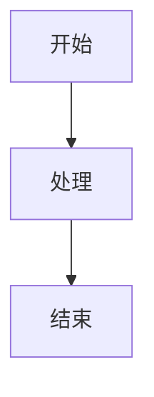
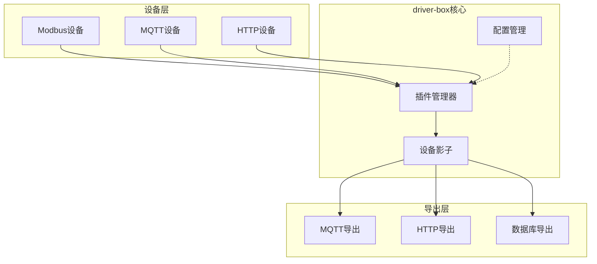
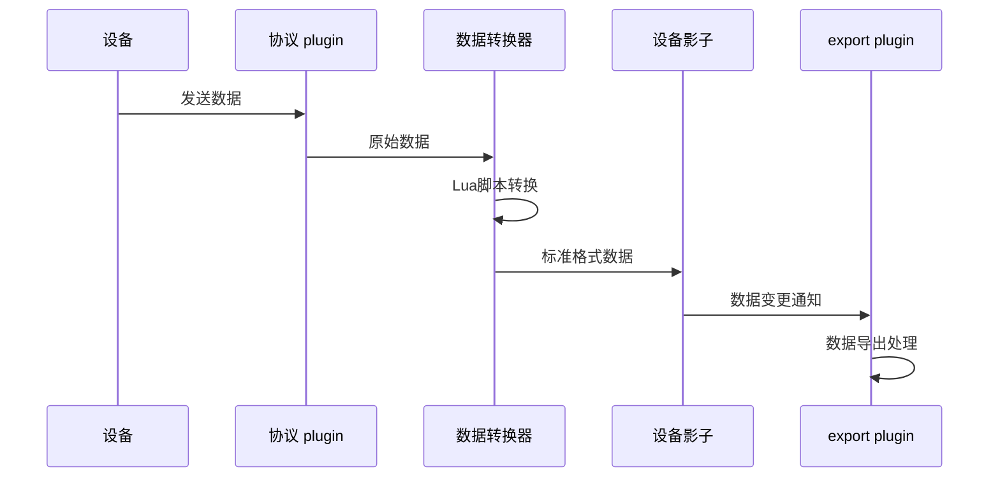
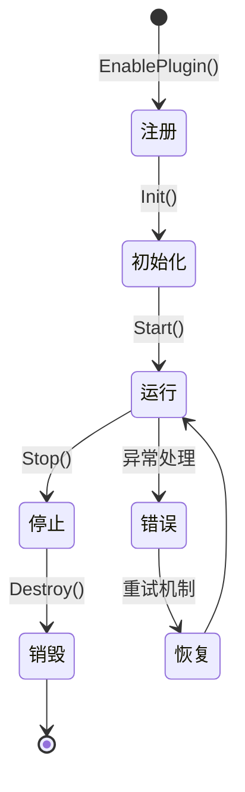
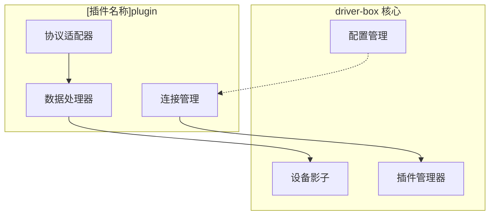

# driver-box 文档写作指南与大纲设计

## 概述

本文档为 driver-box 项目的新版本文档重构提供完整的写作指南和大纲设计。基于项目核心架构（plugin系统、export系统、设备影子、配置化接入），设计了一套结构化、易维护的文档体系。

:::important[二次开发重点]
driver-box 框架的核心价值在于其高度可扩展的plugin机制和export机制。框架的二次开发主要围绕以下两个方面展开：

**🔌 Plugin开发**：通过开发新的协议plugin，支持接入更多类型的设备和通信协议
**📤 Export开发**：通过开发新的export plugin，实现设备数据向不同平台和系统的集成

因此，plugin机制和export机制的文档将成为开发者最重要的参考资料。
:::

## 文档架构设计

### 1. 导航结构

```
📚 文档首页 (index.mdx)
├── 🚀 快速开始 (guides/getting-started.mdx)
├── 🏗️ 核心概念 (concepts/)
│   ├── 架构概述 (architecture.mdx)
│   ├── 设备影子 (device-shadow.mdx)
│   ├── 配置化接入 (configuration-driven.mdx)
│   ├── 🔌 Plugin机制 (plugin-system.mdx)
│   └── 📤 Export机制 (export-system.mdx)
├── ⚙️ 配置指南 (guides/)
│   ├── 接入配置 (config.mdx)
│   ├── 设备模型 (device-model.mdx)
│   └── 连接配置 (connection-config.mdx)
├── 🔌 Plugin系统 (plugins/)
│   ├── Plugin概述 (index.mdx)
│   ├── Modbus plugin (modbus.mdx)
│   ├── Bacnet plugin (bacnet.mdx)
│   ├── MQTT plugin (mqtt.mdx)
│   ├── HTTP服务端 plugin (httpserver.mdx)
│   ├── HTTP客户端 plugin (httpclient.mdx)
│   ├── WebSocket plugin (websocket.mdx)
│   ├── TCP服务端 plugin (tcpserver.mdx)
│   ├── TCP客户端 plugin (tcpclient.mdx)
│   ├── DL/T645 plugin (dlt645.mdx)
│   ├── 网关 plugin (gateway.mdx)
│   └── 镜像 plugin (mirror.mdx)
├── 📤 Export系统 (exports/)
│   ├── Export概述 (index.mdx)
│   ├── 网关 export (gateway.mdx)
│   ├── MQTT export (mqtt.mdx)
│   ├── LinkEdge集成 (linkedge.mdx)
│   ├── 历史数据 export (history.mdx)
│   ├── Modbus服务器 export (modbusserver.mdx)
│   ├── MCP export (mcp.mdx)
│   ├── 镜像 export (mirror.mdx)
│   └── 设备发现 export (discover.mdx)
├── 📚 资源库 (library/)
│   ├── 库概述 (index.mdx)
│   ├── 设备驱动 (drivers/)
│   ├── 物模型 (models/)
│   ├── 协议模板 (protocols/)
│   └── 联动模板 (linkage-templates/)
├── 💻 开发者指南 (developer/)
│   ├── 开发环境搭建 (setup.mdx)
│   ├── API集成 (api-integration.mdx)
│   ├── 🔌 自定义 plugin 开发 (custom-plugin.mdx)
│   ├── 📤 自定义 export 开发 (custom-export.mdx)
│   └── 调试与测试 (debugging.mdx)
├── 🎯 最佳实践 (best-practices/)
│   ├── 部署指南 (deployment.mdx)
│   ├── 性能优化 (performance.mdx)
│   ├── 故障排除 (troubleshooting.mdx)
│   └── 安全配置 (security.mdx)
└── 📖 参考资料 (reference/)
    ├── REST API (api-reference.mdx)
    ├── 配置参数 (config-reference.mdx)
    ├── 错误码 (error-codes.mdx)
    └── 更新日志 (changelog.mdx)
```

### 2. 文档类型定义

#### 2.1 概述类文档
- **目标读者**：新用户、决策者
- **内容重点**：产品特性、架构优势、使用场景
- **写作风格**：简洁明了，配以图表和示例

#### 2.2 指南类文档
- **目标读者**：开发者、运维人员
- **内容重点**：步骤化指导、配置示例、常见问题
- **写作风格**：任务导向，包含前后对比

#### 2.3 参考类文档
- **目标读者**：高级用户、开发者
- **内容重点**：API详情、参数说明、错误处理
- **写作风格**：精确详细，结构化表格

#### 2.4 开发类文档（核心）
- **目标读者**：二次开发工程师
- **内容重点**：🔌 **plugin开发机制**、📤 **export开发机制**、自定义扩展
- **写作风格**：实战导向，包含完整示例和最佳实践
- **重要性**：driver-box框架的主要价值体现，需作为文档建设的重点

## 写作规范

### 3. 视觉化内容设计

#### 3.1 架构图规范
架构相关文档必须包含相应的架构图，**优先使用Mermaid构建**：

**系统架构图：**
- 使用Mermaid flowchart或graph展示核心组件关系
- 使用subgraph清晰划分功能模块层次
- 用箭头标注数据流向和调用关系

**Plugin架构图：**
- 使用graph TB展示plugin系统的层次结构
- subgraph区分微内核、plugin层、协议适配层
- 明确标注plugin生命周期和集成接口

**数据流图：**
- 使用sequenceDiagram展示时序关系
- 使用flowchart展示处理流程
- 标注关键的数据转换和处理节点

**状态图：**
- 使用stateDiagram展示plugin生命周期
- 标注状态转换条件和异常处理

#### 3.2 流程图规范
流程相关文档必须包含流程图：

**文档写作流程：**
```
需求分析 → 内容规划 → 初稿编写 → 技术审核 → 编辑修改 → 用户测试 → 发布上线 → 反馈收集
```

**设备接入流程：**
```
设备发现 → 配置解析 → 连接建立 → 数据转换 → 影子更新 → 数据导出
```

**故障排除流程：**
```
问题识别 → 日志分析 → 配置检查 → 网络诊断 → 代码调试 → 问题定位 → 解决方案 → 验证修复
```

#### 3.3 图表制作标准

**优先级排序：**
1. **Mermaid代码块**（优先使用）：使用标准的 ```mermaid 代码块语法
2. **SVG图表**：专业的矢量图表文件

**代码块使用规范：**


**SVG图表规范：**
- 使用专业工具（如Draw.io、Illustrator）制作
- 导出为SVG格式
- 放置在 `pages/src/assets/` 目录下
- 在文档中通过 `` 标签引用

**风格统一要求：**
- 使用一致的颜色方案（推荐使用driver-box品牌色）
- 字体统一（推荐使用系统默认中文字体）
- 图标风格一致（推荐使用Material Design图标）
- 图表布局清晰，逻辑流向明确

**标注要求：**
- 重要组件必须有清晰的文字标注
- 箭头要有明确的方向说明
- 数据流向要用不同颜色区分
- 复杂图表要有图例说明

#### 3.4 Mermaid代码块使用示例

**系统架构图（flowchart）：**


**数据流图（sequenceDiagram）：**




**SVG图表使用示例：**
```mdx


*图1: driver-box系统架构图*

**状态图（stateDiagram）：**
```

### 4. 文档格式标准

#### 3.1 Frontmatter 规范
```yaml
---
title: 文档标题
description: 简短描述，用于SEO和预览
sidebar:
  order: 数字 # 侧边栏排序
  label: 显示名称 # 可选，自定义侧边栏显示
---
```

#### 3.2 内容结构规范

**标准文档结构：**
1. **引言段** - 说明文档目的和适用场景
2. **前置条件** - 需要的环境或知识准备
3. **主体内容** - 分层组织的详细说明
4. **示例代码** - 实际可运行的代码片段
5. **常见问题** - FAQ部分
6. **相关链接** - 指向其他相关文档

#### 3.3 组件使用规范

**Tabs 组件使用：**
```mdx
import { Tabs, TabItem } from '@astrojs/starlight/components';

<Tabs>
  <TabItem label="配置文件" icon="seti:json">
    ```json
    // JSON配置内容
    ```
  </TabItem>
  <TabItem label="脚本文件" icon="seti:lua">
    ```lua
    // Lua脚本内容
    ```
  </TabItem>
</Tabs>
```


**Admonitions 使用：**
```mdx
:::tip[提示]
重要提示信息
:::

:::note[注意]
需要特别注意的事项
:::

:::caution[警告]
可能导致问题的操作
:::

:::danger[危险]
严重警告，可能导致数据丢失
:::
```

### 4. 内容写作规范

#### 4.1 MDX语法规范
- **HTML实体转义**：在MDX文本中使用`<`时必须转义为`&lt;`，如：`&lt;100ms`
- **代码块例外**：在代码块（```）中无需转义，引擎会自动处理
- **标签使用**：HTML标签需正确闭合，属性值必须用引号包围

#### 4.2 语言风格
- **中文优先**：所有文档使用中文撰写
- **专业术语**：首次出现时提供英文对照
- **简洁明了**：避免冗长句子，保持段落简短
- **一致性**：术语使用保持一致

#### 4.1.1 产品名称规范
- **driver-box**：产品名称统一使用全小写格式
- **保持一致性**：在同一文档中统一使用全小写格式

#### 4.2 代码示例规范
- **可运行性**：所有代码示例应可直接运行
- **注释充足**：关键代码行要有注释说明
- **错误处理**：包含适当的错误处理逻辑
- **版本标记**：标注适用的版本范围

#### 4.3 配置示例规范
- **完整性**：提供完整的配置文件
- **参数说明**：每个配置项要有详细说明
- **默认值**：标注默认值和可选性
- **验证方式**：说明如何验证配置正确性

### 5. 文档质量保证原则

#### 核心原则
- **技术准确性优先**：所有技术描述必须基于实际代码实现，不得杜撰或夸大功能
- **实事求是**：只描述存在且验证过的功能，避免使用"完美"、"最佳"等绝对化表述
- **可验证性**：提供的示例代码必须可实际运行，配置必须有效
- **持续验证**：文档内容需要与代码实现保持同步，发现不一致立即更新

#### 内容真实性要求
- **功能描述**：准确反映代码实际提供的功能，不添加不存在的特性
- **环境要求**：只列出实际必需的依赖和工具
- **性能数据**：基于实际测试结果，不使用估算或假设数据
- **错误处理**：描述真实的错误情况和处理方式
- **兼容性说明**：基于实际测试的版本兼容性信息

#### 验证机制
- **代码审查**：技术内容须经开发团队审核确认
- **示例测试**：所有代码示例在实际环境中验证通过
- **配置验证**：配置文件在实际系统中测试有效
- **同行评审**：多轮审核确保内容准确性和完整性

### 7. 质量保证标准

#### 5.1 内容完整性检查
- [ ] 文档标题准确反映内容
- [ ] 前置条件清晰说明
- [ ] 步骤顺序逻辑正确
- [ ] 示例代码经过测试
- [ ] 常见问题覆盖全面
- [ ] 架构图/流程图完整且准确
- [ ] 图表标注清晰，易于理解

#### 5.2 格式一致性检查
- [ ] Frontmatter 格式统一
- [ ] 标题层级正确
- [ ] 代码块语法高亮正确
- [ ] 表格格式规范
- [ ] 链接指向有效

#### 5.3 技术准确性检查
- [ ] API 调用方式正确
- [ ] 配置参数名准确
- [ ] 错误信息表述准确
- [ ] 版本兼容性说明
- [ ] 技术功能基于实际代码实现，不杜撰不存在的功能
- [ ] 工具和环境要求准确反映实际依赖
- [ ] 示例代码经过验证，可以实际运行
- [ ] 性能数据和配置建议基于真实测试结果
- [ ] **MDX语法正确**：`<`符号在文本中必须转义为`&lt;`，代码块中无需转义

## 写作流程

### 8. 文档创作流程

#### 6.1 规划阶段
1. **需求分析**：明确文档目标读者和使用场景
2. **内容大纲**：制定详细的文档结构
3. **资源准备**：收集代码示例、截图等素材

#### 6.2 撰写阶段
1. **初稿编写**：按照规范完成初稿
2. **技术审核**：开发团队审核技术准确性
3. **示例测试**：验证所有代码示例可运行

#### 6.3 审核阶段
1. **同行评审**：其他技术作家审核
2. **用户测试**：目标用户测试文档可用性
3. **格式检查**：使用工具检查格式一致性

#### 6.4 发布阶段
1. **版本标记**：标注适用的产品版本
2. **发布部署**：推送到文档站点
3. **反馈收集**：建立反馈收集机制

## 文档维护机制

### 9. 版本管理
- **版本同步**：文档版本与产品版本保持同步
- **变更记录**：记录每次更新的内容和原因
- **兼容性标注**：标注不同版本间的差异

### 10. 更新频率
- **新版本发布**：同步发布对应文档
- **定期审查**：每季度审查文档时效性
- **用户反馈**：根据用户反馈及时更新

### 11. 质量监控
- **阅读统计**：监控文档访问量和停留时间
- **用户反馈**：收集用户的改进建议
- **错误报告**：及时修复文档中的错误

## 实施计划

### 12. 分阶段实施计划

#### 11.1 第一阶段：基础框架搭建（1-2周）
- [ ] 完成文档架构设计和导航结构
- [ ] 搭建文档站点和CI/CD流程
- [ ] 创建核心文档模板
- [ ] 编写首页和快速开始指南

#### 11.2 第二阶段：核心文档编写（2-3周）
- [ ] 编写核心概念文档（重点：plugin机制和export机制）
- [ ] 完成配置指南系列
- [ ] 🏆 编写核心 plugin 文档（Modbus、MQTT、HTTP、TCP系列） - **二次开发重点**
- [ ] 🏆 编写核心 export 文档（网关、MQTT、LinkEdge、历史数据） - **二次开发重点**
- [ ] 创建API参考文档

#### 11.3 第三阶段：扩展内容完善（2-3周）
- [ ] 🏆 编写扩展 plugin 文档（Bacnet、DL/T645、网关、镜像、WebSocket） - **二次开发重点**
- [ ] 🏆 编写扩展 export 文档（Modbus服务器、MCP、镜像、设备发现） - **二次开发重点**
- [ ] 完善资源库文档
- [ ] 编写最佳实践和故障排除
- [ ] 创建开发者指南（包含插件和导出开发教程）

#### 11.4 第四阶段：审核发布（1-2周）
- [ ] 技术审核和内容审查
- [ ] 用户测试和反馈收集
- [ ] 文档发布和上线
- [ ] 维护机制建立

### 13. 团队分工建议

#### 12.1 文档架构师（1人）
- 负责整体文档架构设计
- 制定写作规范和模板
- 审核文档质量和一致性

#### 12.2 技术写作者（2-3人）
- 负责具体文档编写，**优先编写 plugin 和 export 相关文档**
- 与开发团队密切配合，确保 plugin/export 开发文档的准确性和实用性
- 验证技术准确性，特别关注二次开发示例的完整性

#### 12.3 内容编辑（1人）
- 负责文档审阅和编辑
- 统一术语和语言风格
- 优化文档可读性

#### 12.4 开发支持人员（按需）
- 提供技术细节和代码示例
- 验证文档中配置的正确性
- 支持文档自动化工具开发

### 14. 工具和资源需求

#### 13.1 文档工具
- **Starlight**：文档站点框架
- **Markdown**：文档编写格式
- **VSCode**：编辑器，支持预览
- **Git**：版本控制
- **Mermaid**：流程图和图表生成（集成到Markdown中）
- **Draw.io**：专业图表制作工具
- **PlantUML**：UML图表生成工具

#### 13.2 质量保证工具
- **Markdown linter**：格式检查
- **Link checker**：链接有效性验证
- **Spell checker**：拼写检查
- **Accessibility checker**：可访问性检查

#### 13.3 协作工具
- **GitHub/GitLab**：代码托管和审查
- **项目管理工具**：任务跟踪和进度管理
- **反馈收集系统**：用户反馈收集

### 15. 风险识别与应对

#### 14.1 技术风险
**风险：** 文档与代码版本不一致
**应对：** 建立自动化检查机制，文档版本与代码版本绑定

**风险：** 代码示例过时
**应对：** 建立示例代码测试机制，CI/CD中包含文档验证

#### 14.2 内容风险
**风险：** 文档质量不均
**应对：** 制定详细的写作规范，多轮审核机制

**风险：** 用户找不到所需信息
**应对：** 完善导航结构，添加搜索功能，用户测试验证

#### 14.3 进度风险
**风险：** 开发团队配合度不足
**应对：** 提前沟通，纳入开发计划，设置检查点

**风险：** 内容更新不及时
**应对：** 建立文档更新流程，设置提醒机制

### 16. 成功衡量标准

#### 15.1 质量指标
- 文档完整性：覆盖95%以上的功能点，**plugin/export文档完整性达到100%**
- 准确性：技术错误率低于1%，**plugin/export开发示例100%可运行**
- 可读性：用户满意度超过85%，**开发者对 plugin/export 文档满意度超过90%**

#### 15.2 使用指标
- 页面访问量：目标日均访问量1000+
- 搜索成功率：用户搜索成功率超过90%
- 停留时间：平均页面停留时间超过3分钟

#### 15.3 维护指标
- 更新及时性：新版本发布后7天内更新文档
- 反馈响应：用户反馈72小时内响应
- 错误修复：发现错误24小时内修复

## 附录

### 17. 常用模板

#### 10.1 Plugin文档模板
```mdx
---
title: [插件名称] plugin
description: [插件名称] 协议 plugin 的使用指南
sidebar:
  order: [序号]
---

import { Tabs, TabItem } from '@astrojs/starlight/components';

# [插件名称] plugin

[Plugin简介和适用场景]

## 功能特性

- 特性1
- 特性2
- 特性3

## 配置说明

### 连接配置

| 参数名 | 类型 | 必填 | 说明 |
|--------|------|------|------|
| host | string | 是 | 服务器地址 |
| port | number | 是 | 端口号 |

### 设备配置

[Tabs 示例]

## 使用示例

[完整的使用示例]

## 常见问题

[FAQ]
```

#### 10.2 API 文档模板
```mdx
---
title: [API名称]
description: [API功能描述]
sidebar:
  order: [序号]
---

# [API名称]

[API功能详细描述]

## 请求信息

**请求方式：** [GET/POST/PUT/DELETE]
**请求路径：** [API路径]
**认证方式：** [认证说明]

## 请求参数

| 字段名 | 字段类型 | 是否必填 | 字段描述 |
|--------|----------|----------|----------|
| param1 | string | 是 | 参数说明 |

## 响应参数

| 字段名 | 字段类型 | 字段描述 |
|--------|----------|----------|
| data | object | 响应数据 |

## 请求示例

[Tabs with request/response examples]

## 错误码

[错误码说明表格]
```

### 10.3 Plugin文档完整模板

```mdx
---
title: [插件名称] plugin
description: [插件名称] 协议 plugin 的完整使用指南
sidebar:
  order: [序号]
---

import { Tabs, TabItem } from '@astrojs/starlight/components';

# [插件名称] plugin

## 架构概述

[Plugin的简要介绍，说明其用途和适用场景。1-2段文字。]

### 工作原理

[Plugin工作原理的流程图]


### 系统集成

[Plugin在系统中的位置图]



## 功能特性

- 特性名称1：特性详细描述，说明这个特性如何帮助用户解决问题
- 特性名称2：特性详细描述，说明这个特性如何帮助用户解决问题
- 特性名称3：特性详细描述，说明这个特性如何帮助用户解决问题

## 适用场景

:::tip[推荐使用场景]
- 场景1：详细描述何时使用此plugin
- 场景2：详细描述何时使用此plugin
:::

:::caution[使用限制]
- 限制1：说明plugin的限制条件
:::

## 快速开始

### 前置条件

在开始使用 [插件名称] plugin 之前，请确保您已满足以下条件：
- 条件1：具体的环境要求
- 条件2：具体的环境要求

### 基础配置

[Tabs 组件展示配置文件和目录结构]

## 配置详解

### 连接配置参数

| 参数名 | 类型 | 必填 | 默认值 | 说明 |
|--------|------|------|--------|------|
| host | string | 是 | - | 服务器主机地址 |
| port | number | 是 | - | 服务器端口号 |

### 高级配置

[Tabs 展示不同配置选项]

## 数据转换

如果协议数据格式需要转换，请提供 converter.lua 文件：

[Lua 代码示例]

## 使用示例

### 基本读写操作

[Go 代码示例]

### REST API 调用

[Shell 命令示例]

## 故障排除

### 常见问题

#### 连接失败

**问题描述：** 连接到设备时出现超时错误

**解决方案：**
1. 检查网络连接是否正常
2. 确认设备IP地址和端口配置正确
3. 调整超时时间配置

**配置示例：**
[JSON 配置示例]

#### 数据格式错误

**问题描述：** 接收到的数据无法正确解析

**解决方案：**
1. 检查 converter.lua 文件语法
2. 验证数据格式与协议规范一致

### 调试技巧

启用调试日志以获取更多信息：

[Shell 命令示例]

查看设备影子状态：

[Shell 命令示例]

## 性能优化

### 连接池配置

[JSON 配置示例]

### 批量操作建议

- 对于大量点位读写，建议使用批量API
- 合理设置上报间隔，避免频繁数据更新

## 相关链接

- [配置化接入指南](/guides/config/)
- [设备影子说明](/concepts/device-shadow/)
```

---

**文档版本：** v1.0
**最后更新：** 2024-01-22
**维护人员：** [文档团队]