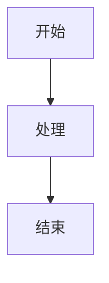
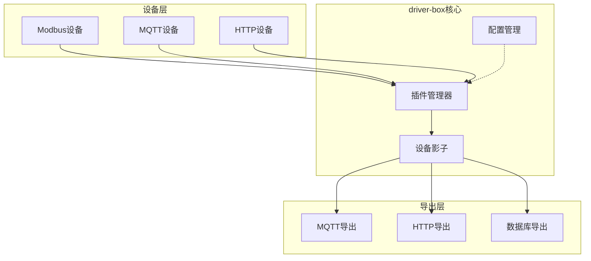
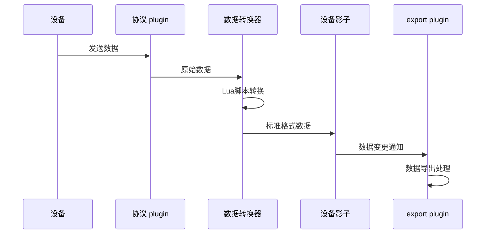
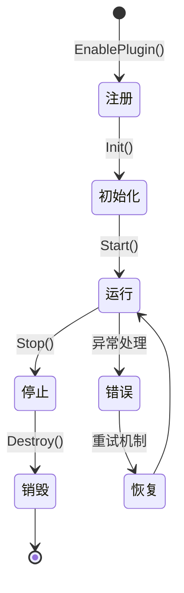

# driver-box 文档写作指南

## 项目信息

- **产品名称**：driver-box（统一使用全小写格式）
- **核心架构**：plugin系统、export系统、设备影子、配置化接入
- **重点文档**：plugin机制和export机制的开发文档

## 写作规范

### 1. 导航结构

```
📚 文档首页 (index.mdx)
├── 🚀 快速开始 (guides/getting-started.mdx)
├── 🏗️ 核心概念 (concepts/)
│   ├── 架构概述 (architecture.mdx)
│   ├── 设备影子 (device-shadow.mdx)
│   ├── 配置化接入 (configuration-driven.mdx)
│   ├── 🔌 Plugin机制 (plugin-system.mdx)
│   └── 📤 Export机制 (export-system.mdx)
├── ⚙️ 配置指南 (guides/)
│   ├── 接入配置 (config.mdx)
│   ├── 设备模型 (device-model.mdx)
│   └── 连接配置 (connection-config.mdx)
├── 🔌 Plugin系统 (plugins/)
│   ├── Plugin概述 (index.mdx)
│   ├── Modbus plugin (modbus.mdx)
│   ├── Bacnet plugin (bacnet.mdx)
│   ├── MQTT plugin (mqtt.mdx)
│   ├── HTTP服务端 plugin (httpserver.mdx)
│   ├── HTTP客户端 plugin (httpclient.mdx)
│   ├── WebSocket plugin (websocket.mdx)
│   ├── TCP服务端 plugin (tcpserver.mdx)
│   ├── TCP客户端 plugin (tcpclient.mdx)
│   ├── DL/T645 plugin (dlt645.mdx)
│   ├── 网关 plugin (gateway.mdx)
│   └── 镜像 plugin (mirror.mdx)
├── 📤 Export系统 (exports/)
│   ├── Export概述 (index.mdx)
│   ├── 网关 export (gateway.mdx)
│   ├── MQTT export (mqtt.mdx)
│   ├── LinkEdge集成 (linkedge.mdx)
│   ├── 历史数据 export (history.mdx)
│   ├── Modbus服务器 export (modbusserver.mdx)
│   ├── MCP export (mcp.mdx)
│   ├── 镜像 export (mirror.mdx)
│   └── 设备发现 export (discover.mdx)
├── 📚 资源库 (library/)
│   ├── 库概述 (index.mdx)
│   ├── 设备驱动 (drivers/)
│   ├── 物模型 (models/)
│   ├── 协议模板 (protocols/)
│   └── 联动模板 (linkage-templates/)
├── 💻 开发者指南 (developer/)
│   ├── 开发环境搭建 (setup.mdx)
│   ├── API集成 (api-integration.mdx)
│   ├── 🔌 自定义 plugin 开发 (custom-plugin.mdx)
│   ├── 📤 自定义 export 开发 (custom-export.mdx)
│   └── 调试与测试 (debugging.mdx)
├── 🎯 最佳实践 (best-practices/)
│   ├── 部署指南 (deployment.mdx)
│   ├── 性能优化 (performance.mdx)
│   ├── 故障排除 (troubleshooting.mdx)
│   └── 安全配置 (security.mdx)
└── 📖 参考资料 (reference/)
    ├── REST API (api-reference.mdx)
    ├── 配置参数 (config-reference.mdx)
    ├── 错误码 (error-codes.mdx)
    └── 更新日志 (changelog.mdx)
```

### 2. 文档类型定义

#### 2.1 概述类文档
- **目标读者**：新用户、决策者
- **内容重点**：产品特性、架构优势、使用场景
- **写作风格**：简洁明了，配以图表和示例

#### 2.2 指南类文档
- **目标读者**：开发者、运维人员
- **内容重点**：步骤化指导、配置示例、常见问题
- **写作风格**：任务导向，包含前后对比

#### 2.3 参考类文档
- **目标读者**：高级用户、开发者
- **内容重点**：API详情、参数说明、错误处理
- **写作风格**：精确详细，结构化表格

#### 2.4 开发类文档（核心）
- **目标读者**：二次开发工程师
- **内容重点**：🔌 **plugin开发机制**、📤 **export开发机制**、自定义扩展
- **写作风格**：实战导向，包含完整示例和最佳实践
- **重要性**：driver-box框架的主要价值体现，需作为文档建设的重点
- 
### 3. 视觉化内容设计

#### 3.1 架构图规范
架构相关文档必须包含相应的架构图，**优先使用Mermaid构建**：

**系统架构图：**
- 使用Mermaid flowchart或graph展示核心组件关系
- 使用subgraph清晰划分功能模块层次
- 用箭头标注数据流向和调用关系

**Plugin架构图：**
- 使用graph TB展示plugin系统的层次结构
- subgraph区分微内核、plugin层、协议适配层
- 明确标注plugin生命周期和集成接口

**数据流图：**
- 使用sequenceDiagram展示时序关系
- 使用flowchart展示处理流程
- 标注关键的数据转换和处理节点

**状态图：**
- 使用stateDiagram展示plugin生命周期
- 标注状态转换条件和异常处理

#### 3.2 Mermaid图表设计原则

为确保Mermaid生成的图表清晰易懂、能够有效传达主要信息，需遵循以下设计原则：

**简洁性原则：**
- **节点数量限制**：单个图表节点数量不超过15个，避免信息过载
- **层次简化**：使用subgraph合理分组，控制子图嵌套不超过2层
- **箭头优化**：尽量避免箭头交叉，箭头数量应与节点数量成比例（建议箭头数 ≤ 节点数 × 1.5）

**清晰性原则：**
- **文字精炼**：节点和边标签文字简洁明了，单个标签不超过10个字符
- **颜色适度**：使用颜色区分不同类别，但不超过3种主要颜色
- **布局逻辑**：图表布局应从左到右或从上到下符合阅读习惯

**重点突出原则：**
- **主线明确**：突出主要数据流和核心组件，次要信息使用虚线或浅色表示
- **信息分层**：重要信息放在图表中心位置，辅助信息置于边缘
- **避免冗余**：不重复展示相同信息，相同概念使用一致的节点样式

**一致性原则：**
- **风格统一**：在同一文档系列中保持图表风格一致
- **命名规范**：节点和边命名使用统一术语，首次出现时可添加注释说明
- **格式标准化**：使用统一的缩进和换行，代码块格式整齐

#### 3.3 图表制作标准

**优先级排序：**
1. **Mermaid代码块**（优先使用）：使用标准的 ```mermaid 代码块语法
2. **SVG图表**：专业的矢量图表文件

**代码块使用规范：**


**SVG图表规范：**
- 使用专业工具（如Draw.io、Illustrator）制作
- 导出为SVG格式
- 放置在 `pages/src/assets/` 目录下
- 在文档中通过 `` 标签引用

**风格统一要求：**
- 使用一致的颜色方案（推荐使用driver-box品牌色）
- 字体统一（推荐使用系统默认中文字体）
- 图标风格一致（推荐使用Material Design图标）
- 图表布局清晰，逻辑流向明确

**标注要求：**
- 重要组件必须有清晰的文字标注
- 箭头要有明确的方向说明
- 数据流向要用不同颜色区分
- 复杂图表要有图例说明

#### 3.4 Mermaid代码块使用示例

**系统架构图（flowchart）：**


**数据流图（sequenceDiagram）：**




### 4. 文档格式标准

#### 3.1 Frontmatter 规范
```yaml
---
title: 文档标题
description: 简短描述，用于SEO和预览
sidebar:
  order: 数字 # 侧边栏排序
  label: 显示名称 # 可选，自定义侧边栏显示
---
```

#### 3.2 内容结构规范

**标准文档结构：**
1. **引言段** - 说明文档目的和适用场景
2. **前置条件** - 需要的环境或知识准备
3. **主体内容** - 分层组织的详细说明
4. **示例代码** - 实际可运行的代码片段
5. **常见问题** - FAQ部分
6. **相关链接** - 指向其他相关文档

#### 3.3 组件使用规范

**禁用组件：**
- ❌ **CardGrid组件**：禁止使用 `CardGrid` 和 `Card` 组件，所有信息应使用标准markdown格式展示

**允许组件：**

**Tabs 组件使用：**
```mdx
import { Tabs, TabItem } from '@astrojs/starlight/components';

<Tabs>
  <TabItem label="配置文件" icon="seti:json">
    ```json
    // JSON配置内容
    ```
  </TabItem>
  <TabItem label="脚本文件" icon="seti:lua">
    ```lua
    // Lua脚本内容
    ```
  </TabItem>
</Tabs>
```

**Aside 组件使用规范：**
Aside 组件用于显示简洁的侧边栏提示信息，适合突出显示重要信息而不打断文档流。

**使用场景：**
- 简短的提示信息（建议不超过3行）
- 重要的注意事项或警告
- 关键配置提醒
- 最佳实践建议

**语法规范：**
```mdx
import { Aside } from '@astrojs/starlight/components';

<Aside type="tip" title="小贴士">
  这是一个简洁的提示信息。
</Aside>

<Aside type="note" title="注意事项">
  需要特别关注的信息点。
</Aside>

<Aside type="caution" title="警告">
  可能导致问题的操作提示。
</Aside>

<Aside type="danger" title="危险">
  严重警告信息。
</Aside>
```

**最佳实践：**
- **标题精炼**：title属性应简短明了（建议2-5个字符）
- **内容简洁**：正文内容应控制在1-3句话内
- **类型选择**：根据信息重要程度选择合适的type
- **位置合理**：放置在相关内容的附近，避免过度分散注意力


### 4. 内容写作规范

#### 4.1 MDX语法规范
- **HTML实体转义**：在MDX文本中使用`<`时必须转义为`&lt;`，如：`&lt;100ms`
- **代码块例外**：在代码块（```）中无需转义，引擎会自动处理
- **标签使用**：HTML标签需正确闭合，属性值必须用引号包围

#### 4.2 语言风格
- **中文优先**：所有文档使用中文撰写
- **专业术语**：首次出现时提供英文对照
- **简洁明了**：避免冗长句子，保持段落简短
- **一致性**：术语使用保持一致

#### 4.1.1 产品名称规范
- **driver-box**：产品名称统一使用全小写格式
- **保持一致性**：在同一文档中统一使用全小写格式

#### 4.2 代码示例规范
- **可运行性**：所有代码示例应可直接运行
- **注释充足**：关键代码行要有注释说明
- **错误处理**：包含适当的错误处理逻辑
- **版本标记**：标注适用的版本范围

#### 4.3 配置示例规范
- **完整性**：提供完整的配置文件
- **参数说明**：每个配置项要有详细说明
- **默认值**：标注默认值和可选性
- **验证方式**：说明如何验证配置正确性

### 5. 文档质量保证原则

#### 核心原则
- **技术准确性优先**：所有技术描述必须基于实际代码实现，不得杜撰或夸大功能
- **实事求是**：只描述存在且验证过的功能，避免使用"完美"、"最佳"等绝对化表述
- **可验证性**：提供的示例代码必须可实际运行，配置必须有效
- **持续验证**：文档内容需要与代码实现保持同步，发现不一致立即更新

#### 内容真实性要求
- **功能描述**：准确反映代码实际提供的功能，不添加不存在的特性
- **环境要求**：只列出实际必需的依赖和工具
- **性能数据**：基于实际测试结果，不使用估算或假设数据
- **错误处理**：描述真实的错误情况和处理方式
- **兼容性说明**：基于实际测试的版本兼容性信息

#### 验证机制
- **代码审查**：技术内容须经开发团队审核确认
- **示例测试**：所有代码示例在实际环境中验证通过
- **配置验证**：配置文件在实际系统中测试有效
- **同行评审**：多轮审核确保内容准确性和完整性

## 常用模板

### 1. Plugin文档模板
```mdx
---
title: [插件名称] plugin
description: [插件名称] 协议 plugin 的使用指南
sidebar:
  order: [序号]
---

import { Tabs, TabItem } from '@astrojs/starlight/components';

# [插件名称] plugin

[Plugin简介和适用场景]

## 功能特性

- 特性1
- 特性2
- 特性3

## 配置说明

### 连接配置

| 参数名 | 类型 | 必填 | 说明 |
|--------|------|------|------|
| host | string | 是 | 服务器地址 |
| port | number | 是 | 端口号 |

### 设备配置

[Tabs 示例]

## 使用示例

[完整的使用示例]

## 常见问题（可选）

[FAQ]
```


### 2. Export文档模板

```mdx
---
title: [导出插件名称] export
description: [导出插件名称] 数据导出插件的使用指南
sidebar:
  order: [序号]
---

import { Tabs, TabItem } from '@astrojs/starlight/components';

# [导出插件名称] export

[Export插件简介和适用场景]

## 功能特性

- 特性1
- 特性2
- 特性3

## 架构概述

[Export的简要介绍，说明其用途和适用场景。1-2段文字。]

### 工作原理

[Export工作原理的流程图]

    ```mermaid
    graph LR
        A[设备影子] --> B[数据路由]
        B --> C[格式转换]
        C --> D[协议导出]
        D --> E[目标系统]
    ```

## 配置说明

### 基本配置

| 参数名 | 类型 | 必填 | 说明 |
|--------|------|------|------|
| enable | boolean | 是 | 是否启用导出插件 |
| url | string | 否 | 目标地址（如适用） |
| timeout | number | 否 | 超时时间（毫秒） |


## 使用示例（可选）

[完整的使用示例，包含配置和测试]

## 常见问题（可选）

[FAQ]

## 性能优化（可选）

- 优化建议1
- 优化建议2

## 相关链接（可选）

- [**导出机制**](/concepts/export-system/) - 导出系统详解
- [**配置指南**](/guides/config/) - 详细配置说明
```