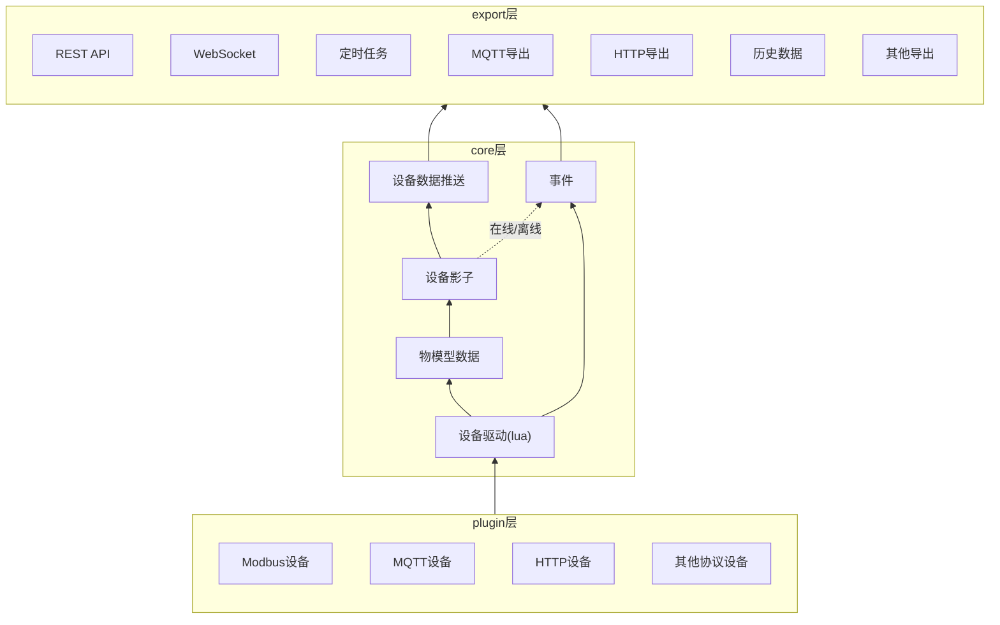
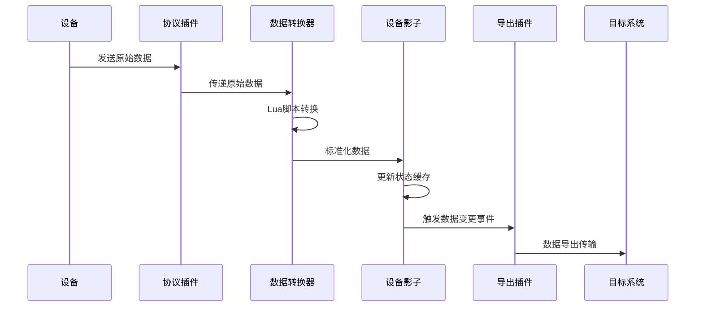

# driver-box架构概述

本文档介绍 driver-box 的核心架构设计和工作原理。作为一款基于插件机制的轻量级物联网边缘平台，driver-box采用了微内核+插件的架构，能够高效实现设备数据接入和输出。

## 适用场景

本文档适用于以下读者：
- 架构师：了解系统整体设计和技术选型
- 开发者：理解核心组件和工作流程
- 运维人员：掌握部署架构和性能指标

## 整体架构

driver-box采用分层架构设计，从下到上分为三个层次：

1. **plugin层**：负责设备接入和数据收集，包括插件管理器和各类物联网设备
2. **core层**：核心组件，如设备影子、数据转换器等；配置管理主要在启动时提供插件初始化参数，运行时为采集数据提供加工规则
3. **export层**：数据输出系统，包括REST API、WebSocket、定时任务等应用接口，以及MQTT导出、历史数据等数据导出插件



## 核心组件

### 插件系统 (Plugin System)

插件系统是driver-box架构的核心创新，通过标准化接口实现设备协议的无限扩展。

**主要特性：**
- 支持Modbus、MQTT、HTTP、WebSocket等多种通信协议
- 通过标准接口实现协议适配，无需修改核心代码
- 支持热插拔和动态加载，提高系统灵活性
- 开发者可自定义协议插件，满足特定场景需求
- 统一的插件生命周期管理，确保系统稳定性
- 配置化插件启用和禁用，便于运维管理

**数据转换机制：**
- 内置Lua脚本引擎，支持灵活的数据处理逻辑
- 支持协议数据到标准格式的双向转换
- 转换脚本可配置化，支持动态更新

### 导出系统 (Export System)

导出系统负责将设备数据以多种协议和格式输出到不同平台和系统。

**主要特性：**
- 支持MQTT、HTTP、WebSocket等多种导出协议
- 可同时启用多个导出插件，实现数据多路分发
- 灵活的数据路由配置，支持条件过滤和目标选择
- 支持数据过滤、转换和格式化处理
- 内置历史数据存储，支持时序数据查询
- 实时数据流处理，低延迟数据传输

**集成友好性：**
- 标准REST API接口，便于第三方系统集成
- WebSocket实时推送，支持双向通信
- 多种数据格式支持（JSON、InfluxDB Line Protocol等）

### 设备影子 (Device Shadow)

设备影子是driver-box内存中的设备状态缓存，提供高效的数据访问和管理能力。

**主要特性：**
- 内存缓存设备最新状态，毫秒级访问延迟
- 支持设备在线状态检测和自动清理机制
- TTL（生存时间）机制，自动清理过期数据
- 实时同步设备数据变更，保证数据一致性
- 支持变化上报和定时上报两种模式
- 线程安全的读写操作，支持高并发访问
- 支持批量数据操作，提高处理效率
- 高效的内存管理，优化资源使用

## 工作流程

### 设备接入流程

设备数据接入的完整流程如下：

1. **设备发送数据**：各类物联网设备通过各自协议发送原始数据
2. **协议插件接收**：对应的协议插件接收并初步解析原始数据
3. **数据转换处理**：数据转换器使用Lua脚本进行格式标准化转换
4. **影子状态更新**：设备影子存储最新的标准化数据状态
5. **事件通知触发**：系统触发数据变更事件，通知相关组件
6. **数据导出执行**：导出插件将数据发送到配置的目标系统



### 配置加载流程

系统启动时的配置加载流程：

1. **启动系统**：driver-box进程启动，读取命令行参数和环境变量
2. **加载配置文件**：解析JSON格式的设备模型和连接配置
3. **验证配置**：检查配置文件的语法正确性和业务逻辑合理性
4. **初始化连接**：根据配置建立与设备的网络连接
5. **加载插件**：根据协议配置启用相应的协议插件
6. **初始化导出**：配置并启动数据导出通道
7. **启动监听**：开始监听设备数据变更
8. **系统就绪**：所有组件初始化完成，进入运行状态

## 核心特性

### 高性能设计

**轻量化架构：**
- 最小128MB内存即可运行，适合资源受限的环境
- 优化的数据结构和算法，减少CPU占用
- 异步I/O处理，提高并发处理能力

**低延迟处理：**
- 毫秒级数据处理延迟，满足实时性要求
- 内存缓存机制，避免磁盘I/O开销
- 高效的数据路由和转换算法

**高并发支持：**
- 支持数千设备同时接入，满足大规模物联网场景
- 线程池和连接池优化，并发性能卓越
- 可扩展的架构设计，支持水平扩展

### 可扩展性

**插件化扩展：**
- 无限扩展新的协议和导出方式，无需修改核心代码
- 标准化插件接口，降低开发门槛
- 热插拔机制，支持运行时动态加载

**配置化驱动：**
- 纯配置文件驱动，无需编程即可适配新需求
- 灵活的配置模板，支持批量部署
- 运行时配置热更新，提高运维效率

**模块化设计：**
- 核心组件独立部署，可按需选择
- 松耦合架构，便于功能定制
- API标准化，支持微服务集成

### 高可用性

**容错设计：**
- 单点故障不影响整体系统运行
- 插件隔离机制，避免级联故障
- 自动降级策略，确保核心功能可用

**自动恢复：**
- 网络异常自动重连机制
- 数据缓冲和重发，保证数据不丢失
- 健康检查和自动修复功能

**监控预警：**
- 实时监控设备和系统状态
- 性能指标收集和告警机制
- 日志追踪和问题诊断工具

### 易集成性

**标准API：**
- RESTful API设计，符合行业标准
- OpenAPI规范，支持自动生成文档
- 多语言SDK，便于不同技术栈集成

**多语言支持：**
- Go语言原生实现，性能优异
- 通过标准API支持其他编程语言
- 跨平台兼容，Windows/Linux/macOS全支持

**轻量部署：**
- 单二进制文件部署，无复杂依赖
- Docker容器化，支持云原生部署
- 支持多种部署模式：单机、分布式、边缘计算

## 部署架构

### 单机部署架构

最简单的部署方式，适合开发测试和小型应用场景：

```
物联网设备网络 <--> driver-box单实例 <--> 应用系统/云平台
```

**适用场景：**
- 开发和测试环境
- 小型物联网项目（设备数&lt;100）
- 单点故障影响可接受的场景

### 分布式部署架构

支持多实例部署，适合大规模生产环境：

```
[设备集群A] <--> [driver-box实例1] <--> [负载均衡器] <--> [应用系统]
[设备集群B] <--> [driver-box实例2] <--> [             ]
```

**适用场景：**
- 大规模物联网项目（设备数>1000）
- 高可用性要求的生产环境
- 需要水平扩展的业务场景

### 边缘计算部署架构

部署在边缘网关，实现就近数据处理和实时响应：

```
[工业设备/传感器] <--> [边缘网关] <--> [driver-box] <--> [云平台/数据中心]
[现场网络]             [Linux系统]     [本地部署]      [远程处理]
```

**适用场景：**
- 工业互联网和智能制造
- 远程监控和现场控制
- 网络条件较差的边缘环境


## 常见问题

### 架构设计问题

**Q: driver-box为什么采用微内核+插件架构？**

A: 微内核+插件架构具有以下优势：
- 核心系统轻量化，专注于基础功能
- 插件独立开发和部署，提高开发效率
- 支持热插拔和动态扩展，无需重启系统
- 插件隔离机制，提高系统稳定性和安全性

**Q: 如何保证插件间的兼容性？**

A: 通过标准化接口和版本管理保证兼容性：
- 定义明确的插件接口契约
- 插件版本管理和兼容性检查
- 提供插件兼容性测试工具
- 文档化插件开发规范和最佳实践

### 性能调优问题

**Q: 如何优化大数据量场景下的性能？**

A: 可以从以下几个方面进行优化：
- 使用批量API减少网络往返次数
- 启用数据压缩减少传输带宽
- 配置合适的数据缓冲区大小
- 使用连接池复用网络连接
- 合理设置缓存策略和TTL值

**Q: 内存使用过高的处理方法？**

A: 内存优化策略包括：
- 调整设备影子TTL，及时清理过期数据
- 优化缓存策略，避免内存泄漏
- 监控内存使用情况，设置合理的阈值
- 使用内存分析工具定位问题代码
- 考虑分布式部署分散内存压力

## 相关链接

- [**插件机制**](/concepts/plugin-system/) - 详细了解插件系统的开发和使用
- [**导出机制**](/concepts/export-system/) - 掌握数据导出系统的配置和扩展
- [**设备影子**](/concepts/device-shadow/) - 深入理解设备状态管理和数据缓存
- [**配置化接入**](/concepts/configuration-driven/) - 了解配置驱动的设备接入方式
- [**快速开始**](/guides/getting-started/) - 立即开始使用driver-box