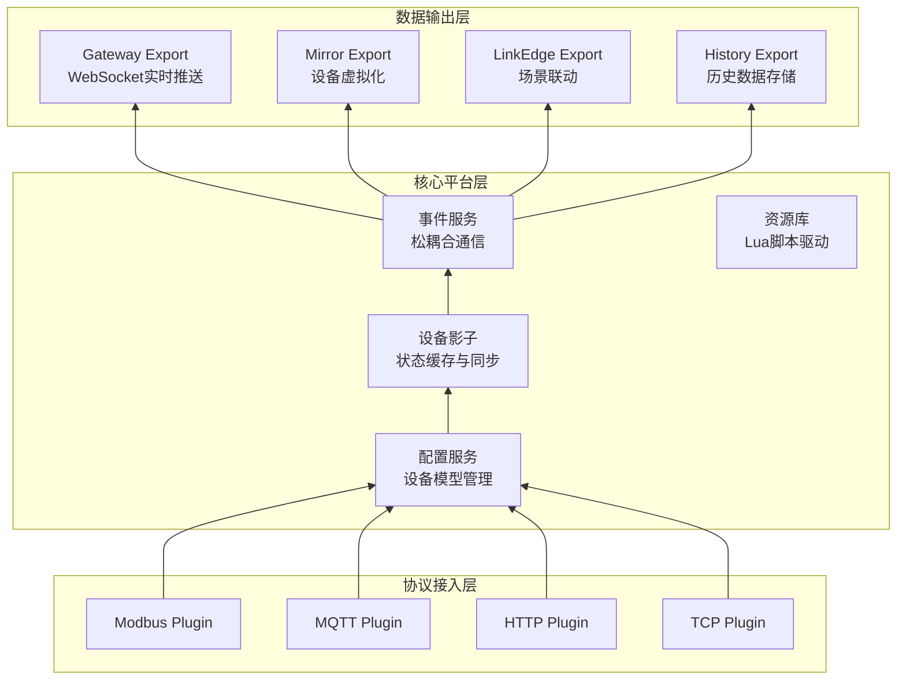
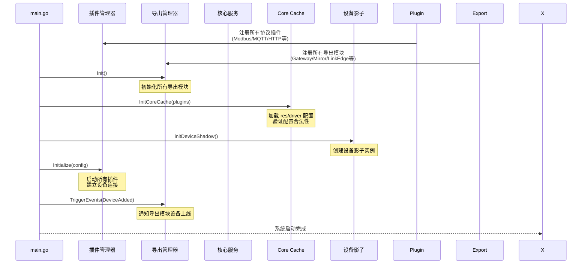

# 架构概述

driver-box 是一款基于 Go 语言开发的轻量级物联网边缘计算平台,采用**微内核 + 插件**的架构设计,专注于解决**设备数据接入、协议适配和数据输出**三大核心问题。

## 架构总览
driver-box 的架构设计遵循以下核心原则:

- **可扩展性**: 插件机制支持任意协议快速接入,无需修改核心代码
- **配置驱动**: 纯配置文件管理设备和模型,Lua 脚本实现灵活的数据转换
- **事件驱动**: 松耦合的事件系统实现数据在组件间的灵活流转
- **高内聚低耦合**: 各层职责清晰,接口标准化,易于维护和扩展

**三层架构职责**:

| 层次 | 职责 | 关键组件 |
|------|------|---------|
| **协议接入层 (Plugin)** | 负责与物理设备通信,实现各种工业协议的适配 | Modbus、MQTT、HTTP、TCP 等协议插件 |
| **核心平台层 (Core)** | 设备配置管理、状态缓存、事件调度,是系统的核心中枢 | 配置服务、设备影子、事件服务、资源库 |
| **数据输出层 (Export)** | 将设备数据分发到不同的目标系统 | Gateway、Mirror、LinkEdge、History Export |

## 启动流程

**启动关键步骤**:

1. **插件注册** - 扫描并注册所有协议插件和导出模块
2. **Export 初始化** - 初始化所有导出模块,准备接收数据
3. **配置加载** - 加载 `res/driver` 目录下的配置文件,构建设备模型缓存
4. **影子启动** - 创建设备影子实例,初始化状态管理
5. **插件启动** - 调用各插件的 `Initialize()` 方法,建立设备连接
6. **事件触发** - 触发 `DeviceAdded` 事件,通知 Export 模块设备上线

## 环境变量

| 变量名 | 说明 | 默认值 |
|-------|------|--------|
| `DRIVERBOX_RESOURCE_PATH` | 资源目录路径 | `./res` |
| `DRIVERBOX_HTTP_LISTEN` | HTTP 服务监听地址 | `:8080` |
| `DRIVERBOX_LOG_PATH` | 日志目录路径 | `./logs` |
| `LOG_LEVEL` | 日志级别 | `info` |

## driver-box API

driver-box 提供了完整的 Go SDK API,支持设备管理、数据读写、配置管理、事件处理等核心功能。开发者可以通过 Go 代码直接调用这些接口,实现与 driver-box 框架的深度集成。

详细的 API 文档请参考: [SDK API](/driver-box/concepts/sdk_api/)

driver-box 的 Go SDK 主要包含以下模块:

- **设备操作 API**: 设备点位的读取和写入
- **核心缓存 API**: 设备模型、设备实例、连接的查询和管理
- **设备影子 API**: 设备实时状态和点位值的缓存管理
- **事件处理 API**: 系统事件的触发和监听
- **定时任务 API**: 基于 cron 表达式的任务调度
- **服务管理 API**: 服务元数据和控制
- **日志 API**: 统一的日志记录接口
- **组件管理 API**: Plugin 和 Export 模块的注册和管理