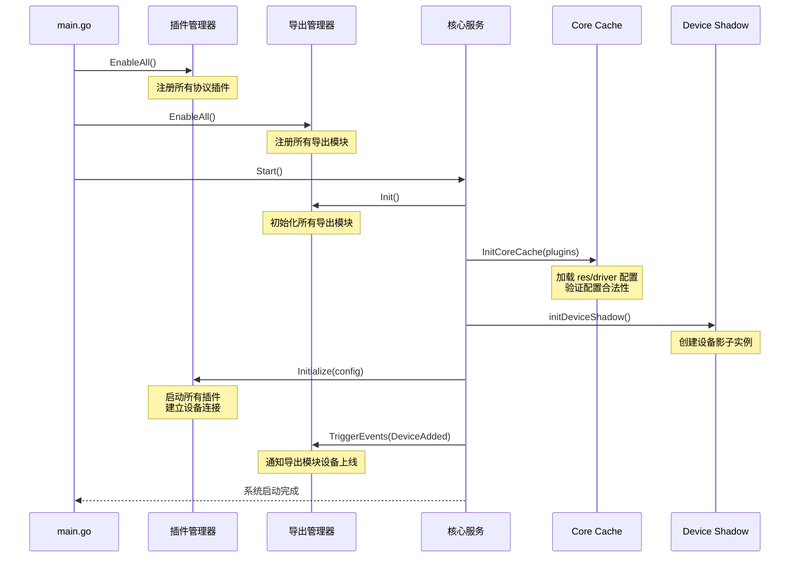
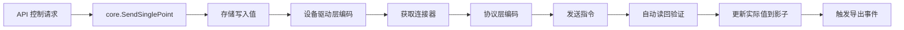
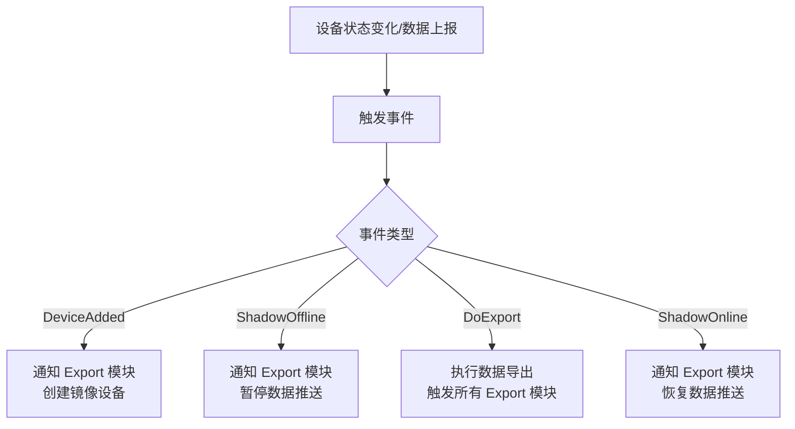

# 架构概述

driver-box 是一款基于 Go 语言开发的轻量级物联网边缘计算平台,采用微内核 + 插件的架构设计,专注于解决设备数据接入、协议适配和数据输出的核心问题。

## 设计理念

driver-box 的架构设计遵循以下核心原则:

- **可扩展性**: 插件机制支持任意协议快速接入,无需修改核心代码
- **配置驱动**: 纯配置文件管理设备和模型,Lua 脚本实现灵活的数据转换
- **事件驱动**: 松耦合的事件系统实现数据在组件间的灵活流转
- **高内聚低耦合**: 各层职责清晰,接口标准化,易于维护和扩展

## 整体架构

driver-box 采用微内核 + 插件的分层架构,分为三层:

| 层次 | 职责 | 关键组件 |
|------|------|---------|
| **Export 层** | 数据输出到业务系统 | Gateway Export、Mirror Export、LinkEdge Export、History Export |
| **核心平台层** | 数据处理和状态管理 | 配置服务、日志服务、设备影子、事件服务、资源库 |
| **Plugin 层** | 协议适配和设备接入 | Modbus Plugin、MQTT Plugin、HTTP Plugin、TCP Plugin、Gateway Plugin |

**核心服务依赖关系**:
- 配置服务 → 设备影子、事件服务、日志服务、资源库
- 日志服务 → 配置服务、设备影子、事件服务(日志记录)
- 事件服务 → Export 模块(事件通知)
- 设备影子 → Export 模块(状态同步)

### 架构层次

| 层次 | 职责 | 关键组件 |
|------|------|---------|
| **Export 层** | 数据输出到业务系统 | Gateway Export、Mirror Export、LinkEdge Export、History Export |
| **核心平台层** | 数据处理和状态管理 | 配置服务、日志服务、设备影子、事件服务、资源库 |
| **Plugin 层** | 协议适配和设备接入 | Modbus Plugin、MQTT Plugin、HTTP Plugin、TCP Plugin、Gateway Plugin |

### 设计模式

| 设计模式 | 应用场景 | 价值 |
|---------|---------|------|
| 插件模式 | 协议插件的可扩展性 | 支持热插拔、易于扩展、隔离性好 |
| 适配器模式 | 统一不同协议的数据格式 | 上层调用无需关心底层协议细节 |
| 观察者模式 | 事件通知机制 | 松耦合、易于扩展事件处理逻辑 |
| 策略模式 | 灵活的数据处理策略 | 支持Lua脚本自定义编解码逻辑 |
| 单例模式 | 全局唯一实例管理 | 资源管理集中、状态一致 |

## 启动流程

系统启动遵循严格的初始化顺序:



### 启动关键步骤

1. **插件注册**: 扫描并注册所有协议插件到插件管理器
2. **Export 注册**: 扫描并注册所有 Export 模块
3. **缓存初始化**: 加载 `res/driver` 目录下的配置文件,构建设备模型缓存
4. **影子服务启动**: 创建设备影子实例,初始化状态管理
5. **插件启动**: 调用各插件的 `Initialize()` 方法,建立设备连接
6. **事件触发**: 触发 `DeviceAdded` 事件,通知 Export 模块设备上线

## 核心组件

### 插件系统

插件系统是 driver-box 可扩展性的基石,通过标准化接口实现协议的无缝接入。

```go
type Plugin interface {
    Initialize(c config.DeviceConfig)              // 使用配置初始化插件
    Connector(deviceId string) (Connector, error)   // 获取设备连接器
    Destroy() error                                 // 销毁插件并释放资源
}

type Connector interface {
    Encode(deviceId string, mode EncodeMode, values ...PointData) (interface{}, error)
    Send(data interface{}) error
    Release() error
}
```

**核心机制**:
- 插件注册: 系统启动时,各协议插件通过 `EnablePlugin()` 注册到插件管理器
- 连接器获取: 核心服务通过 `Connector(deviceId)` 获取指定设备的连接器
- 编解码处理: `Encode()` 将点位数据编码为协议报文,`Send()` 发送至设备
- 资源释放: `Release()` 释放连接器占用的网络资源

**内置协议插件**: Modbus (TCP/RTU)、MQTT (3.1.1/5.0)、HTTP Server、TCP Server、Gateway

### 核心缓存

核心缓存是系统的配置中心,管理所有设备、模型和连接配置。

**核心能力**:
- **模型管理**: `GetModel`、`AddModel`、`DeleteModel`
- **设备管理**: `GetDevice`、`AddOrUpdateDevice`、`DeleteDevice`
- **点位管理**: `GetPointByModel`、`GetPointByDevice`、`GetPoints`
- **连接管理**: `AddConnection`、`GetConnection`、`DeleteConnection`
- **持久化**: `Flush(pluginName)`、`FlushAll()`

**关键特性**:
- 配置热加载: 监控 `res/driver` 目录变化,自动重新加载配置
- 自动持久化: 配置变更后每 5 秒自动写入磁盘
- 线程安全: 使用读写锁保护并发访问

### 设备影子

设备影子是设备状态的实时镜像,提供设备在线状态检测和点位值缓存。

**核心能力**:
- **点位值管理**: `SetDevicePoint`、`GetDevicePoint`、`GetDevicePoints`
- **写入指令管理**: `SetWritePointValue`、`GetWritePointValue`
- **状态管理**: `GetDeviceStatus`、`SetOnline`、`SetOffline`、`MayBeOffline`

**在线状态判定**:
1. **TTL 机制**: 超过配置的 TTL 时间未收到数据,判定为离线
2. **失败计数**: 60 秒内断开次数超过 3 次,判定为离线

**缓存机制**:
- 点位值缓存: 存储设备所有点位的最新值,支持快速查询
- 写入值缓存: 记录下发的控制指令,用于写后读验证
- 事件触发: 状态变化时触发 `ShadowOnline`/`ShadowOffline` 事件

### Export 系统

Export 系统负责将设备数据分发到不同的目标系统。

```go
type Export interface {
    Init() error                                                      // 初始化模块
    ExportTo(deviceData plugin.DeviceData)                            // 导出数据
    OnEvent(eventCode event.EventCode, key string, value interface{}) error  // 事件回调
    IsReady() bool                                                    // 就绪检查
    Destroy() error                                                   // 销毁模块
}
```

**内置 Export 模块**:
- **Gateway Export**: WebSocket 实时推送,支持前端实时监控
- **Mirror Export**: 创建镜像设备,实现设备虚拟化和协议转换
- **LinkEdge Export**: 场景联动引擎,支持自动化控制
- **History Export**: 历史数据存储,支持数据分析和报表

**上报模式**:
- **周期上报** (`period`): 按固定周期上报所有点位
- **变化上报** (`change`): 仅上报值发生变化的点位
- **实时上报** (`realtime`): 每次采集都上报

**点位缓存过滤**:

```go
// 变化上报模式: 比较影子中的缓存值
if point.ReportMode() == config.ReportMode_Change {
    shadowValue, _ := Shadow().GetDevicePoint(deviceId, pointName)
    if shadowValue == newValue {
        continue  // 值未变化,跳过导出
    }
}
```

### 资源库系统

资源库系统提供设备模型、设备驱动、协议驱动和镜像模板的统一管理。

| 资源库 | 配置路径 | 功能 |
|--------|---------|------|
| Model | `res/library/model/` | 设备模型定义和验证 |
| Driver | `res/library/driver/` | Lua 脚本驱动,实现灵活的数据转换 |
| Protocol | `res/library/protocol/` | 协议层驱动定义 |
| Mirror | `res/library/mirror_tpl/` | 镜像模板配置 |

**Lua 脚本驱动示例**:

```lua
-- 编码: Write 操作
function encode(deviceId, mode, points)
    local result = {}
    for _, point in ipairs(points) do
        result[#result + 1] = {
            name = point.name,
            value = point.value * point.scale
        }
    end
    return result
end

-- 解码: Read 操作
function decode(deviceId, points)
    local result = {}
    local events = {}
    for _, point in ipairs(points) do
        result[#result + 1] = {
            name = point.name,
            value = point.value / point.scale
        }
        -- 事件生成
        if point.value > threshold then
            events[#events + 1] = { code = "alarm", value = point.value }
        end
    end
    return result, events
end
```

### 事件系统

事件系统实现松耦合的组件间通信,支持事件订阅和广播。

**核心事件类型**:
- `ServiceStatus`: 服务状态变更
- `DeviceAdded` / `DeviceDeleted`: 设备添加/删除
- `ShadowOnline` / `ShadowOffline`: 设备上线/离线
- `DoExport` / `Exporting`: 导出操作

**事件机制**:
- 事件触发: `TriggerEvents(eventCode, key, value)` 广播事件到所有订阅者
- 事件订阅: 导出模块通过 `OnEvent()` 方法订阅感兴趣的事件
- 异步处理: 事件回调异步执行,避免阻塞主流程

## 数据流转

### 读操作流程


### 写操作流程



### 事件驱动流程



## 配置系统

### 配置目录结构

```
res/
├── driver/                          # 协议插件配置
│   ├── modbus/
│   │   └── config.json
│   ├── mqtt/
│   │   └── config.json
│   └── ...
└── library/                         # 资源库
    ├── model/                       # 设备模型
    │   └── sensor_model.json
    ├── driver/                      # 设备驱动 (Lua)
    │   ├── encode.lua
    │   └── decode.lua
    ├── protocol/                    # 协议驱动
    └── mirror_tpl/                  # 镜像模板
```

### 设备配置示例

```json
{
  "pluginName": "modbus",
  "deviceModels": [
    {
      "name": "sensor",
      "modelId": "sensor_001",
      "description": "温湿度传感器",
      "devicePoints": [
        {
          "name": "temperature",
          "description": "温度",
          "valueType": "float",
          "readWrite": "r",
          "reportMode": "change",
          "scale": 0.1,
          "address": 40001,
          "registerType": "holding"
        }
      ],
      "devices": [
        {
          "id": "sensor_001",
          "description": "1号传感器",
          "connectionKey": "conn_1",
          "driverKey": "sensor_driver",
          "ttl": "60s"
        }
      ]
    }
  ],
  "connections": {
    "conn_1": {
      "host": "192.168.1.100",
      "port": 502,
      "mode": "tcp"
    }
  }
}
```

### 环境变量

| 变量名 | 说明 | 默认值 |
|-------|------|--------|
| `DRIVERBOX_RESOURCE_PATH` | 资源目录路径 | `./res` |
| `DRIVERBOX_HTTP_LISTEN` | HTTP 服务监听地址 | `:8080` |
| `DRIVERBOX_LOG_PATH` | 日志目录路径 | `./logs` |
| `LOG_LEVEL` | 日志级别 | `info` |

## 关键特性

- **高性能**: 核心内存占用 50-128MB,单点数据处理延迟 < 10ms,支持数千设备同时接入
- **可靠性**: 自动重连机制、TTL + 失败计数双重离线检测、数据缓存保证一致性、插件异常隔离
- **易用性**: 纯 JSON 配置文件、Lua 脚本灵活扩展、配置热加载无需重启、RESTful API + WebSocket 接口

## 相关文档

- [Plugin 机制](/driver-box/concepts/plugin-system/) - 了解如何开发和集成协议插件
- [Export 机制](/driver-box/concepts/export-system/) - 掌握数据 Export 模块的使用和扩展
- [CoreCache](/driver-box/concepts/corecache/) - 深入理解核心缓存系统
- [Library](/driver-box/concepts/library/) - 了解资源库系统
- [设备影子](/driver-box/concepts/device-shadow/) - 深入理解设备状态管理和数据缓存
- [配置化接入](/driver-box/concepts/configuration-driven/) - 了解配置驱动的设备接入方式
- [快速开始](/driver-box/guides/getting-started/) - 立即开始使用 driver-box
