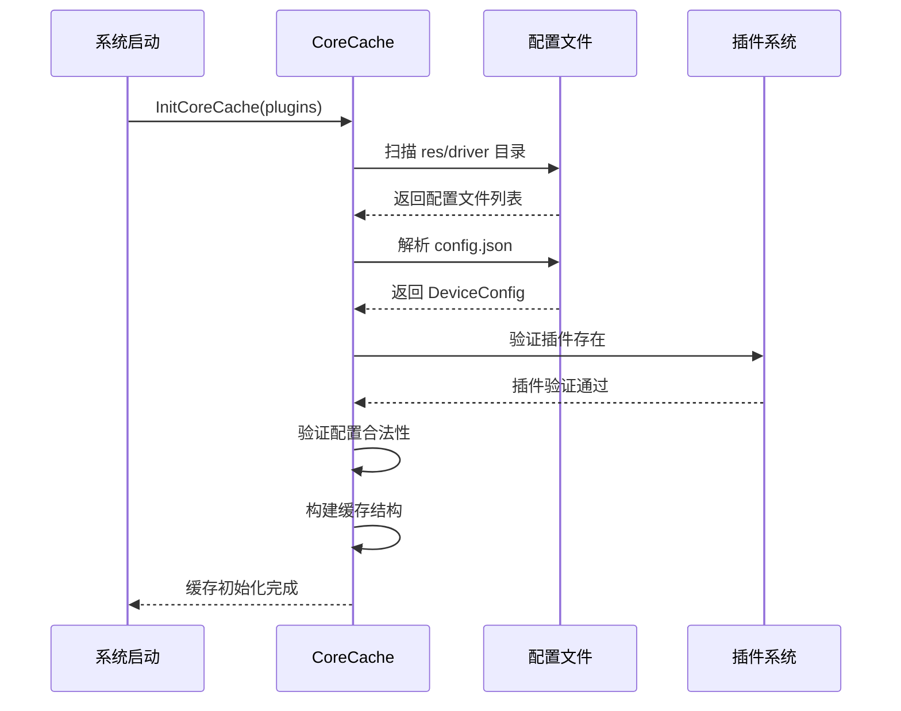

# CoreCache

CoreCache 是 driver-box 的核心缓存系统,负责管理所有设备、模型和连接配置,是整个平台的配置中心。

## 核心职责

CoreCache 承担以下核心职责:

- **配置管理**: 加载、存储和管理设备配置
- **设备管理**: 设备实例的增删改查
- **模型管理**: 设备模型的管理和验证
- **点位管理**: 设备点位的查询和管理
- **连接管理**: 协议连接的维护
- **配置持久化**: 配置变更自动写入磁盘

## 核心接口

### 模型管理

```go
// 获取模型
GetModel(modelName string) (model config.Model, ok bool)

// 添加模型
AddModel(plugin string, model config.Model) error

// 删除模型
DeleteModel(modelName string) error
```

### 设备管理

```go
// 获取设备
GetDevice(id string) (device config.Device, ok bool)

// 添加或更新设备
AddOrUpdateDevice(device config.Device) error

// 删除设备
DeleteDevice(id string)

// 批量删除设备
BatchRemoveDevice(ids []string) error
```

### 点位管理

```go
// 通过模型获取点位
GetPointByModel(modelName string, pointName string) (point config.Point, ok bool)

// 通过设备获取点位
GetPointByDevice(id string, pointName string) (point config.Point, ok bool)

// 获取模型所有点位
GetPoints(modelName string) ([]config.Point, bool)
```

### 连接管理

```go
// 添加连接
AddConnection(plugin string, key string, conn any) error

// 获取连接
GetConnection(key string) (string, any)

// 删除连接
DeleteConnection(key string) error
```

### 配置持久化

```go
// 刷新指定插件配置
Flush(pluginName string)

// 刷新所有配置
FlushAll()
```

## 缓存结构

```go
type cache struct {
    plugins     map[string]cachePlugin      // 协议插件配置
    devices     map[string]cacheDevice      // 设备缓存
    models      map[string]cacheModel       // 模型缓存
    connections map[string]cacheConnection  // 连接缓存
    mutex       *sync.RWMutex               // 读写锁保护
}
```

## 配置加载机制

### 配置目录结构

```
res/driver/
├── modbus/
│   └── config.json
├── mqtt/
│   └── config.json
└── ...
```

### 配置加载流程



### 配置验证

CoreCache 在加载配置时进行以下验证:

- **模型唯一性**: 模型名称全局唯一
- **设备唯一性**: 设备 ID 在插件内唯一
- **点位引用验证**: 设备引用的点位必须在模型中定义
- **连接引用验证**: 设备引用的连接必须在 connections 中定义

## 关键特性

### 配置热加载

- 监控 `res/driver` 目录变化
- 检测到配置文件变更时自动重新加载
- 配置变更无需重启系统

### 自动持久化

- 配置变更后每 5 秒自动写入磁盘
- 确保配置变更不丢失
- 支持手动触发持久化

### 线程安全

- 使用读写锁保护并发访问
- 读操作可以并发执行
- 写操作独占访问

### 配置完整性

- 模型、设备、点位的三级配置结构
- 配置引用关系验证
- 配置合法性检查

## 使用示例

### 获取设备配置

```go
// 获取设备配置
device, ok := cache.GetDevice("sensor_001")
if !ok {
    log.Error("设备不存在")
    return
}

// 获取设备点位
points, ok := cache.GetPoints(device.ModelName)
if !ok {
    log.Error("模型不存在")
    return
}
```

### 获取点位信息

```go
// 通过设备获取点位
point, ok := cache.GetPointByDevice("sensor_001", "temperature")
if !ok {
    log.Error("点位不存在")
    return
}

// 获取点位配置
address := point["address"]       // 寄存器地址
registerType := point["registerType"]  // 寄存器类型
```

### 配置持久化

```go
// 持久化指定插件配置
cache.Flush("modbus")

// 持久化所有配置
cache.FlushAll()
```

## 性能优化

- **内存缓存**: 所有配置加载到内存,避免频繁磁盘 I/O
- **读写锁优化**: 读操作使用读锁,提高并发性能
- **增量更新**: 配置变更时只更新变化的部分
- **延迟持久化**: 配置变更后延迟 5 秒持久化,避免频繁写入

## 相关文档

- [配置化接入](/driver-box/concepts/configuration-driven/) - 了解配置文件结构和编写规范
- [Plugin 机制](/driver-box/concepts/plugin-system/) - 了解插件与 CoreCache 的交互
- [设备影子](/driver-box/concepts/device-shadow/) - 了解设备影子如何使用 CoreCache
