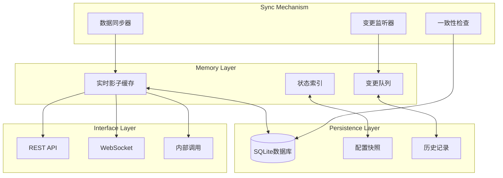
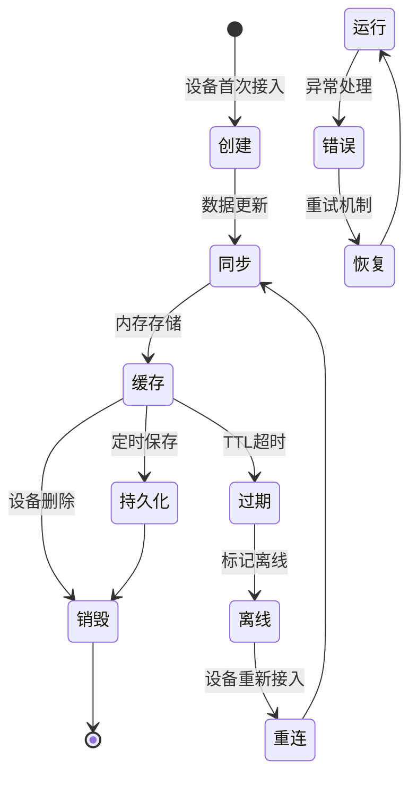

import { Tabs, TabItem } from '@astrojs/starlight/components';
import { Aside } from '@astrojs/starlight/components';

# 设备影子详解

设备影子（Device Shadow）是driver-box的核心数据存储组件，提供高效、可靠的设备状态管理和数据访问能力。本文档详细介绍设备影子的设计理念、数据结构、工作机制和最佳实践。

## 适用场景

本文档适用于以下读者：
- 开发者：理解设备影子数据模型和API使用
- 架构师：掌握影子系统的存储架构和性能优化
- 运维人员：学习影子监控、故障恢复和性能调优

## 影子系统架构

设备影子采用内存+持久化的混合存储架构，确保数据的高性能访问和可靠性。



## 数据模型

### 设备影子结构

基于实际代码实现，每个设备影子包含完整的设备状态信息：

**Device结构** ([`driverbox/shadow/shadow.go`](driverbox/shadow/shadow.go:7))
```go
type Device struct {
    ID              string                 `json:"id"`
    ModelName       string                 `json:"modelName"`
    Points          map[string]DevicePoint `json:"points"`
    Online          bool                   `json:"online"`
    TTL             string                 `json:"ttl"`
    DisconnectTimes int                    `json:"disconnectTimes"`
    UpdatedAt       time.Time              `json:"updatedAt"`
}
```

**DevicePoint结构** ([`driverbox/shadow/shadow.go`](driverbox/shadow/shadow.go:18))
```go
type DevicePoint struct {
    Name       string      `json:"name"`
    Value      interface{} `json:"value"`
    WriteValue interface{} `json:"writeValue"`
    UpdatedAt  time.Time   `json:"updatedAt"`
    WriteAt    time.Time   `json:"writeAt"`
}
```

### 数据结构说明

**设备字段说明：**
- **ID**: 设备唯一标识符
- **ModelName**: 设备模型名称
- **Points**: 设备点位映射，key为点位名称，value为点位数据
- **Online**: 设备在线状态
- **TTL**: 设备生存时间，超过该时长没有收到数据视为离线
- **DisconnectTimes**: 断开连接次数，60秒内超过3次判定离线
- **UpdatedAt**: 设备最后更新时间

**点位字段说明：**
- **Name**: 点位名称
- **Value**: 点位当前值（从设备读取的实际值）
- **WriteValue**: 点位写入值（下发的控制值）
- **UpdatedAt**: 点位值更新时间
- **WriteAt**: 点位写入时间

### 数据示例

```json
{
  "id": "device-001",
  "modelName": "temp_sensor_v1",
  "online": true,
  "ttl": "24h0m0s",
  "disconnectTimes": 0,
  "updatedAt": "2024-01-22T07:00:00Z",
  "points": {
    "temperature": {
      "name": "temperature",
      "value": 25.5,
      "writeValue": null,
      "updatedAt": "2024-01-22T07:00:00Z",
      "writeAt": "0001-01-01T00:00:00Z"
    },
    "humidity": {
      "name": "humidity",
      "value": 65.2,
      "writeValue": null,
      "updatedAt": "2024-01-22T07:00:00Z",
      "writeAt": "0001-01-01T00:00:00Z"
    }
  }
}
```

## 数据生命周期

设备影子数据从创建到销毁经历完整的生命周期管理：



### 数据更新流程

1. **数据接收**：协议插件接收到设备数据
2. **格式转换**：转换为driver-box内部标准格式
3. **影子更新**：更新内存中的设备影子状态
4. **事件通知**：触发数据变更事件给导出插件
5. **持久化**：定时将数据保存到SQLite数据库

## 存储机制

### 内存缓存设计

内存层提供高性能的数据访问：
- **实时性**：毫秒级数据访问延迟
- **并发安全**：支持高并发读写操作
- **内存效率**：优化的数据结构和索引机制

### 持久化存储

持久层确保数据可靠性：
- **SQLite数据库**：轻量级本地存储，无需额外依赖
- **自动清理**：TTL过期数据自动删除，控制存储空间
- **数据压缩**：历史数据压缩存储，节省磁盘空间
- **备份恢复**：支持数据备份和恢复功能

### 缓存策略

采用多级缓存策略优化性能：
- **LRU算法**：最近最少使用淘汰，确保热点数据常驻
- **预加载**：系统启动时预加载频繁访问的数据
- **写缓冲**：批量写入减少磁盘I/O操作
- **读缓存**：热点数据缓存，进一步提升访问速度

## 数据一致性保证

### 并发控制机制

使用乐观锁机制保证数据一致性：

```go
// 并发控制示例
func UpdatePoint(deviceId, pointName string, value interface{}) error {
    shadow := getDeviceShadow(deviceId)
    originalVersion := shadow.Version

    // 更新数据
    shadow.Points[pointName].Value = value
    shadow.Points[pointName].Timestamp = time.Now()
    shadow.Version++

    // 原子性检查和提交
    if !atomicCompareAndSet(shadow, originalVersion) {
        return errors.New("concurrent modification detected")
    }

    return nil
}
```

### 事务支持

提供完整的事务支持：
- **批量更新**：支持多点位原子更新操作
- **回滚机制**：失败时自动回滚，保证数据完整性
- **一致性保证**：强一致性数据更新，不丢失任何变更

## 查询接口

### 设备影子API接口

基于实际代码实现，设备影子提供以下核心API接口：

**DeviceShadow接口** ([`driverbox/shadow/shadow.go`](driverbox/shadow/shadow.go:27))
```go
type DeviceShadow interface {
    // AddDevice 新增设备
    AddDevice(id string, modelName string, ttl ...time.Duration)

    // GetDevice 获取设备
    GetDevice(id string) (device Device, ok bool)

    // HasDevice 是否存在设备
    HasDevice(id string) bool

    // DeleteDevice 删除设备
    DeleteDevice(id ...string) (err error)

    // SetDevicePoint 设置设备点位值
    SetDevicePoint(id, pointName string, value interface{}) (err error)

    // GetDevicePoint 获取设备点位值
    GetDevicePoint(id, pointName string) (value interface{}, err error)

    // GetDevicePoints 获取设备所有点位
    GetDevicePoints(id string) (points map[string]DevicePoint, err error)

    // GetDevicePointDetails 获取设备点位详情
    GetDevicePointDetails(id, pointName string) (point DevicePoint, err error)

    // GetDeviceUpdateAt 获取设备最后更新时间
    GetDeviceUpdateAt(id string) (time.Time, error)

    // GetDeviceStatus 获取设备在离线状态
    GetDeviceStatus(id string) (online bool, err error)

    // SetOnline 设置设备为在线状态
    SetOnline(id string) (err error)

    // SetOffline 设置设备为离线状态
    SetOffline(id string) (err error)

    // MayBeOffline 可能离线事件（60秒内超过3次判定离线）
    MayBeOffline(id string) (err error)

    // GetDevices 获取所有设备
    GetDevices() []Device

    // SetWritePointValue 存储下发控制点位值
    SetWritePointValue(id string, pointName string, value interface{}) (err error)

    // GetWritePointValue 获取下发控制点位值
    GetWritePointValue(id string, pointName string) (value interface{}, err error)
}
```

### API使用示例

**获取设备影子：**
```go
// 获取设备信息
device, ok := driverbox.Shadow().GetDevice("device-001")
if ok {
    fmt.Printf("设备ID: %s, 在线状态: %v\n", device.ID, device.Online)
    for pointName, point := range device.Points {
        fmt.Printf("点位 %s: 值=%v, 更新时间=%v\n",
            pointName, point.Value, point.UpdatedAt)
    }
}
```

**设置点位值：**
```go
// 设置设备点位值
err := driverbox.Shadow().SetDevicePoint("device-001", "temperature", 25.5)
if err != nil {
    fmt.Printf("设置点位值失败: %v\n", err)
}
```

**获取点位详情：**
```go
// 获取点位详细信息
point, err := driverbox.Shadow().GetDevicePointDetails("device-001", "temperature")
if err == nil {
    fmt.Printf("点位名称: %s\n", point.Name)
    fmt.Printf("当前值: %v\n", point.Value)
    fmt.Printf("写入值: %v\n", point.WriteValue)
    fmt.Printf("更新时间: %v\n", point.UpdatedAt)
    fmt.Printf("写入时间: %v\n", point.WriteAt)
}
```

**设备状态管理：**
```go
// 设置设备在线
err := driverbox.Shadow().SetOnline("device-001")

// 设置设备离线
err := driverbox.Shadow().SetOffline("device-001")

// 可能离线（用于网络异常场景）
err := driverbox.Shadow().MayBeOffline("device-001")

// 获取设备状态
online, err := driverbox.Shadow().GetDeviceStatus("device-001")
```

**批量操作：**
```go
// 获取所有设备
devices := driverbox.Shadow().GetDevices()
for _, device := range devices {
    fmt.Printf("设备: %s, 模型: %s, 在线: %v\n",
        device.ID, device.ModelName, device.Online)
}

// 删除设备
err := driverbox.Shadow().DeleteDevice("device-001", "device-002")
```

**写操作记录：**
```go
// 存储下发控制值
err := driverbox.Shadow().SetWritePointValue("device-001", "switch", true)

// 获取下发控制值
writeValue, err := driverbox.Shadow().GetWritePointValue("device-001", "switch")
```

## 性能优化

### 索引机制

建立多维度索引提高查询性能：
- **设备ID索引**：快速定位特定设备
- **点位名索引**：快速访问设备数据点
- **时间索引**：支持时间范围历史数据查询
- **复合索引**：多条件组合查询优化

### 缓存优化

多级缓存架构优化系统性能：
- **L1/L2缓存**：本地和分布式缓存结合
- **预热机制**：系统启动时预加载热点数据
- **智能淘汰**：基于访问频率的缓存淘汰策略

### 内存管理

高效的内存使用和管理：
- **对象池**：复用影子对象，减少GC压力
- **内存监控**：实时监控内存使用情况
- **自动清理**：过期和无效数据自动清理

## 监控和诊断

### 健康检查

系统提供全面的健康监控：

```bash
# 检查影子服务状态
GET /api/v1/health/shadow

# 查看缓存统计信息
GET /api/v1/shadow/stats
```

响应示例：
```json
{
  "memoryUsage": "45MB",
  "cacheHitRate": "95.2%",
  "totalDevices": 150,
  "onlineDevices": 148,
  "dataPoints": 1200
}
```

### 性能指标

关键性能指标监控：
- **响应时间**：平均读写操作延迟
- **吞吐量**：每秒处理的请求数量
- **缓存命中率**：缓存有效性指标
- **内存使用率**：内存资源使用情况

## 数据导出

### 影子数据导出

支持将影子数据导出到外部系统：

```json
{
  "export": {
    "shadow": {
      "enable": true,
      "format": "json",
      "interval": "30s",
      "targets": ["mqtt", "http", "file"]
    }
  }
}
```

### 历史数据查询

提供丰富的历史数据查询功能：

```bash
# 查询指定时间范围的历史数据
GET /api/v1/history?device=device-001&point=temperature&start=2024-01-01&end=2024-01-31

# 聚合查询（平均值、最大值等）
GET /api/v1/history/aggregate?device=device-001&point=temperature&function=avg&interval=1h
```

## 故障恢复

### 数据恢复机制

完善的故障恢复策略：
1. **内存丢失恢复**：重启时从数据库自动恢复
2. **数据不一致修复**：自动检测和修复不一致数据
3. **备份恢复**：支持从备份文件恢复数据

### 高可用设计

高可用性保障：
- **主从复制**：支持影子数据的主从同步
- **故障转移**：主节点故障时自动切换
- **数据分片**：大规模部署时的水平扩展

## 最佳实践

### 配置优化

影子系统配置调优建议：
1. **合理设置TTL**：根据设备类型设置合适的生存时间
2. **控制影子大小**：避免单个设备影子过大
3. **定期清理**：及时清理过期和无效数据

### 性能调优

性能优化最佳实践：
1. **索引优化**：为常用查询字段建立索引
2. **缓存配置**：根据内存情况调整缓存大小
3. **批量操作**：使用批量API提高性能

### 监控告警

监控和告警配置：
1. **内存监控**：设置内存使用阈值告警
2. **性能监控**：监控响应时间和吞吐量
3. **数据监控**：监控设备在线率和数据更新频率

## 扩展开发

### 自定义影子存储

实现自定义的影子存储后端：

```go
type CustomShadowStorage struct{}

func (s *CustomShadowStorage) Save(deviceId string, shadow *DeviceShadow) error {
    // 自定义存储逻辑
    return saveToCustomStorage(deviceId, shadow)
}

func (s *CustomShadowStorage) Load(deviceId string) (*DeviceShadow, error) {
    // 自定义加载逻辑
    return loadFromCustomStorage(deviceId)
}
```

### 影子插件开发

扩展影子功能：

```go
type ShadowPlugin interface {
    OnShadowUpdate(deviceId string, shadow *DeviceShadow) error
    OnPointChange(deviceId, pointName string, value interface{}) error
    ValidateShadow(shadow *DeviceShadow) error
}
```

## 常见问题

<Aside type="tip" title="影子大小控制">
单个设备影子的数据点不宜过多，建议控制在100个以内。大影子会影响内存使用和同步性能。
</Aside>

<Aside type="caution" title="TTL设置注意">
TTL值过短会导致频繁的数据清理和重建，过长则占用过多内存。建议根据设备更新频率设置合适的TTL值。
</Aside>

<Aside type="danger" title="并发访问保护">
影子数据支持高并发访问，但大量写操作可能导致性能下降。建议使用批量更新和合理的锁策略。
</Aside>

## 相关链接

- [**架构概述**](/driver-box/concepts/architecture/) - 系统整体架构介绍
- [**插件机制**](/driver-box/concepts/plugin-system/) - 数据接入机制详解
- [**导出机制**](/driver-box/concepts/export-system/) - 数据输出系统介绍
- [**配置化接入**](/driver-box/concepts/configuration-driven/) - 配置驱动的设备接入
- [**快速开始**](/driver-box/guides/getting-started/) - 立即开始使用