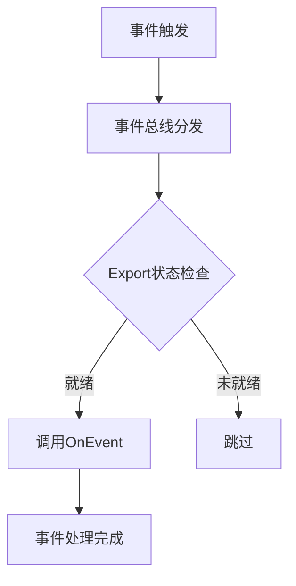

# 事件总线

driver-box 通过事件系统实现了各组件间的松耦合通信。事件总线是一个发布-订阅模式的消息传递机制,允许不同的 Export 模块订阅和响应系统事件。

## 工作原理

事件总线的核心工作流程如下:

1. **事件触发**: 系统或插件通过 `driverbox.TriggerEvents()` 方法触发事件
2. **事件分发**: 事件总线自动将事件广播给所有已注册的 Export 模块
3. **事件处理**: 每个 Export 模块的 `OnEvent()` 方法被调用,实现特定的事件处理逻辑
4. **状态检查**: 只有 `IsReady()` 返回 `true` 的 Export 模块才会接收事件通知



## 内置事件类型

driver-box 定义了以下内置事件类型:

| 事件代码 | 说明 | 触发时机 | 数据格式 |
|---------|------|---------|---------|
| `DeviceAdded` | 设备添加事件 | 插件加载完成后,对所有已存在的设备触发 | `value` 为 `nil` |
| `DeviceDeleting` | 设备删除事件 | 设备被删除前触发,此时仍可查询设备信息 | `value` 为 `nil` |
| `DeviceDiscover` | 设备自动发现事件 | 插件通过 `DeviceDiscover` 接口发现新设备 | `value` 为设备发现信息 |
| `DeviceOnOff` | 设备开关事件 | 设备开关状态变化时触发(如空调开关、灯开关) | `value` 为布尔值,表示开关状态 |
| `ServiceStatus` | 服务状态事件 | driver-box 服务状态发生变化时触发 | `value` 为 `"healthy"` 或 `"error"` |
| `Exporting` | 数据导出前事件 | 设备数据即将导出时触发,可用于数据预处理 | `value` 为 `DeviceData` |
| `DoExport` | 插件回调事件 | 数据导出完成后触发 | `value` 为 `[]DeviceData` |
| `ShadowOnline` | 设备在线状态事件 | 设备在线/离线状态变化时触发 | `value` 为设备状态信息 |

## 使用方式

### 触发事件

在任何地方都可以通过 `driverbox.TriggerEvents()` 触发事件:

```go
import "github.com/ibuilding-x/driver-box/pkg/event"

// 设备上线事件
driverbox.TriggerEvents(event.DeviceAdded, "device-001", nil)

// 设备删除事件
driverbox.TriggerEvents(event.DeviceDeleting, "device-001", nil)

// 设备开关事件
driverbox.TriggerEvents(event.DeviceOnOff, "device-001", true)

// 设备发现事件
discoverData := map[string]interface{}{
    "connectionKey": "conn-001",
    "protocolName":  "modbus",
    "modelKey":     "model-001",
    "deviceInfo": map[string]interface{}{
        "unitID": 1,
    },
}
driverbox.TriggerEvents(event.DeviceDiscover, "", discoverData)

// 服务状态事件
driverbox.TriggerEvents(event.ServiceStatus, "driver-box", "healthy")
```

### 订阅事件

Export 模块通过实现 `OnEvent()` 方法订阅和处理事件:

```go
package myexport

import (
    "github.com/ibuilding-x/driver-box/driverbox/export"
    "github.com/ibuilding-x/driver-box/driverbox/plugin"
    "github.com/ibuilding-x/driver-box/pkg/event"
    "go.uber.org/zap"
)

type MyExport struct{}

func (m *MyExport) Init() error {
    // 初始化导出模块
    return nil
}

func (m *MyExport) ExportTo(deviceData plugin.DeviceData) {
    // 处理设备数据
}

func (m *MyExport) OnEvent(eventCode event.EventCode, key string, eventValue interface{}) error {
    // 根据事件类型处理不同逻辑
    switch eventCode {
    case event.DeviceAdded:
        // 处理设备添加事件
        driverbox.Log().Info("Device added",
            zap.String("deviceId", key))

    case event.DeviceDeleting:
        // 处理设备删除事件
        driverbox.Log().Info("Device deleting",
            zap.String("deviceId", key))

    case event.DeviceDiscover:
        // 处理设备自动发现事件
        return m.handleDeviceDiscover(key, eventValue)

    case event.DeviceOnOff:
        // 处理设备开关事件
        if onOff, ok := eventValue.(bool); ok {
            status := "off"
            if onOff {
                status = "on"
            }
            driverbox.Log().Info("Device on/off changed",
                zap.String("deviceId", key),
                zap.String("status", status))
        }

    case event.ServiceStatus:
        // 处理服务状态事件
        if status, ok := eventValue.(string); ok {
            driverbox.Log().Info("Service status changed",
                zap.String("status", status))
        }

    case event.Exporting:
        // 数据导出前预处理
        if data, ok := eventValue.(plugin.DeviceData); ok {
            driverbox.Log().Debug("Data exporting",
                zap.String("deviceId", data.ID))
        }

    case event.DoExport:
        // 数据导出完成后的回调
        if dataList, ok := eventValue.([]plugin.DeviceData); ok {
            driverbox.Log().Debug("Data exported",
                zap.Int("count", len(dataList)))
        }
    }

    return nil
}

func (m *MyExport) IsReady() bool {
    // 检查模块是否就绪
    // 返回 true 表示可以接收事件
    // 返回 false 表示事件将被跳过
    return true
}

func (m *MyExport) Destroy() error {
    // 清理资源
    return nil
}

// 注册导出模块
func init() {
    driverbox.EnableExport(&MyExport{})
}
```

## 最佳实践

### 1. 错误处理

在 `OnEvent()` 方法中,应该妥善处理可能的错误:

```go
func (m *MyExport) OnEvent(eventCode event.EventCode, key string, eventValue interface{}) error {
    switch eventCode {
    case event.DeviceDiscover:
        // 类型断言时处理错误
        discoverData, ok := eventValue.(map[string]interface{})
        if !ok {
            driverbox.Log().Error("Invalid discover data format",
                zap.Any("value", eventValue))
            return fmt.Errorf("invalid discover data format")
        }

        // 处理逻辑...
    }
    return nil
}
```

### 2. 日志记录

在事件处理中记录关键信息,便于问题排查:

```go
func (m *MyExport) OnEvent(eventCode event.EventCode, key string, eventValue interface{}) error {
    driverbox.Log().Info("Event received",
        zap.String("eventCode", string(eventCode)),
        zap.String("key", key),
        zap.Any("value", eventValue))
    // ...
}
```

### 3. 异步处理

对于耗时的事件处理,建议使用异步方式:

```go
import "sync/atomic"

type MyExport struct {
    processing int32
}

func (m *MyExport) OnEvent(eventCode event.EventCode, key string, eventValue interface{}) error {
    switch eventCode {
    case event.DeviceAdded:
        // 异步处理
        go func() {
            atomic.AddInt32(&m.processing, 1)
            defer atomic.AddInt32(&m.processing, -1)

            // 耗时的处理逻辑...
        }()
    }
    return nil
}
```

### 4. 状态管理

使用 `IsReady()` 方法控制是否接收事件:

```go
type MyExport struct {
    ready bool
}

func (m *MyExport) Init() error {
    // 初始化资源
    m.ready = true
    return nil
}

func (m *MyExport) Destroy() error {
    m.ready = false
    return nil
}

func (m *MyExport) IsReady() bool {
    return m.ready
}
```

## 实际应用场景

### 场景1: 设备发现自动注册

```go
func (m *MyExport) OnEvent(eventCode event.EventCode, key string, eventValue interface{}) error {
    if eventCode == event.DeviceDiscover {
        // 自动注册发现的设备
        discoverData := eventValue.(map[string]interface{})
        deviceId := discoverData["deviceId"].(string)

        // 创建设备配置
        newDevice := config.Device{
            ID:          deviceId,
            ModelName:   discoverData["modelKey"].(string),
            ConnectionKey: discoverData["connectionKey"].(string),
        }

        // 添加设备
        err := driverbox.CoreCache().AddOrUpdateDevice(newDevice)
        if err != nil {
            return err
        }

        driverbox.Log().Info("Auto-registered discovered device",
            zap.String("deviceId", deviceId))
    }
    return nil
}
```

### 场景2: 数据导出前处理

```go
func (m *MyExport) OnEvent(eventCode event.EventCode, key string, eventValue interface{}) error {
    if eventCode == event.Exporting {
        data := eventValue.(plugin.DeviceData)

        // 在数据导出前进行数据清洗或转换
        for i := range data.Values {
            point := &data.Values[i]
            // 示例: 将温度值转换为摄氏度
            if point.PointName == "temperature" && point.Value != nil {
                if f, ok := point.Value.(float64); ok {
                    point.Value = (f - 32) * 5 / 9 // 华氏度转摄氏度
                }
            }
        }
    }
    return nil
}
```

### 场景3: 设备状态同步

```go
func (m *MyExport) OnEvent(eventCode event.EventCode, key string, eventValue interface{}) error {
    switch eventCode {
    case event.DeviceAdded:
        // 设备添加时同步到远程系统
        return m.syncDeviceToRemote(key, "add")

    case event.DeviceDeleting:
        // 设备删除时从远程系统移除
        return m.syncDeviceToRemote(key, "delete")
    }
    return nil
}

func (m *MyExport) syncDeviceToRemote(deviceId, action string) error {
    // 实现设备同步逻辑...
    return nil
}
```

## 注意事项

1. **避免阻塞**: `OnEvent()` 方法中不应执行耗时操作,否则会影响其他模块的事件处理
2. **幂等性**: 同一事件可能会被多次触发,确保处理逻辑具有幂等性
3. **错误隔离**: 单个 Export 模块的事件处理失败不应影响其他模块
4. **状态检查**: 通过 `IsReady()` 方法控制模块是否接收事件
5. **数据验证**: 处理事件前验证 `eventValue` 的类型和内容
