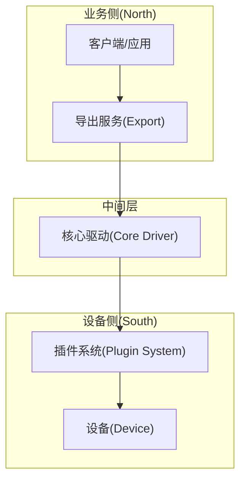
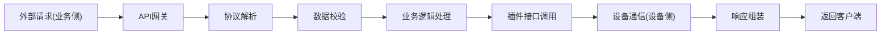
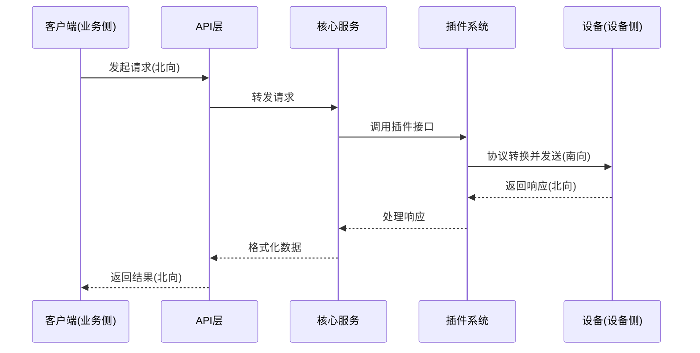
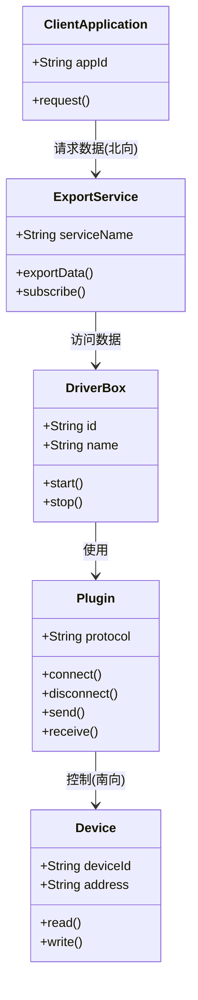
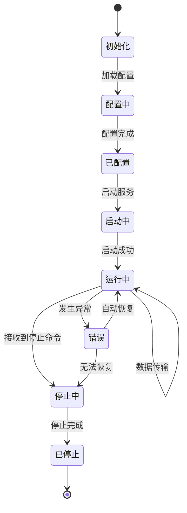

import { Aside } from '@astrojs/starlight/components';
import { Tabs, TabItem } from '@astrojs/starlight/components';

本文档为AI助手提供driver-box文档编写、改进和完善的标准，确保生成的文档质量的一致性和专业性。

## 文档结构

driver-box的文档使用Starlight主题构建，主要分为以下几个部分：

- **快速开始** (`guides/`) - 帮助用户快速上手使用driver-box
- **概念介绍** (`concepts/`) - 解释核心概念和技术原理
- **通信插件** (`plugins/`) - 各种通信插件的详细说明
- **Export** (`export/`) - Export 功能模块的使用说明
- **开发者文档** (`developer/`) - 面向开发者的高级主题
- **库参考** (`library/`) - 各种模板和配置参考

## Starlight Astro 组件使用指南

### 1. Asides（提示框）

使用Asides组件突出显示重要信息、提示或警告。

<Tabs>
<TabItem value="usage" label="使用方法">

```mdx
<Aside type="note" title="注意事项">
在此处添加重要提醒信息
</Aside>

<Aside type="tip" title="小贴士">
在此处添加有用的技巧或建议
</Aside>

<Aside type="caution" title="警告">
在此处添加潜在风险或重要警告
</Aside>

<Aside type="danger" title="危险">
在此处添加严重警告信息
</Aside>
```

</TabItem>
<TabItem value="preview" label="预览效果">

<Aside type="note" title="注意事项">
这是一条重要提醒信息
</Aside>

<Aside type="tip" title="小贴士">
这是一个有用的技巧或建议
</Aside>

<Aside type="caution" title="警告">
这是潜在风险或重要警告
</Aside>

<Aside type="danger" title="危险">
这是严重警告信息
</Aside>

</TabItem>
</Tabs>

### 2. Tabs（标签页）

使用Tabs组件将相关内容组织在不同的标签页中，节省空间。

```mdx
<Tabs>
<TabItem value="config" label="配置示例">
这里放置配置相关的示例内容
</TabItem>
<TabItem value="code" label="代码示例">
这里放置代码相关的示例内容
</TabItem>
<TabItem value="result" label="运行结果">
这里放置运行结果的相关内容
</TabItem>
</Tabs>
```

## Mermaid 图表使用指南

Mermaid是一个强大的图表和可视化工具，可以在文档中嵌入各种图表，优先用于表达系统原理和架构，配合文字和代码示例进行说明。

### 图表流向标准

在绘制系统架构图和数据流图时，请遵循以下流向标准：

- **南向（向下）**：代表设备侧方向
- **北向（向上）**：代表业务侧方向
- **流向方向**：通常采用自底向上或自左向右的方式
- **数据流向**：从设备侧（南向）流向业务侧（北向）

### 1. 系统架构图

使用流程图展示driver-box的整体架构和组件关系，遵循南向/北向标准：



### 2. 数据流向图

使用流程图展示数据在系统中的流动过程，遵循南向/北向流向标准：



### 3. 组件交互序列图

使用序列图展示各组件之间的交互过程，体现南向/北向概念：



### 4. 类关系图

使用类图展示系统架构和组件关系，体现南北向数据流向：



### 5. 状态流转图

使用状态图描述系统或对象的状态变化，通常自左向右展示：



## 代码链接规范

当文档中需要引用代码文件或特定代码行时，应使用指向GitHub仓库的链接，而不是相对路径。

### GitHub代码链接格式

```markdown
[文件名](https://github.com/ibuilding-X/driver-box/blob/main/path/to/file.go)
```

### 实际示例

- 引用整个文件: [driverbox.go](https://github.com/ibuilding-X/driver-box/blob/main/driverbox/driverbox.go)
- 引用配置文件: [main.go](https://github.com/ibuilding-X/driver-box/blob/main/main.go)

### 链接最佳实践

- 总是使用HTTPS协议
- 确保仓库名称正确（driver-box项目地址为 `https://github.com/ibuilding-X/driver-box/`）
- 仅使用指向文件的链接，不使用特定行号链接
- 如果项目有多个分支，请明确指定分支名称（通常是main或master）

## AI辅助文档写作标准

### 1. 内容组织标准

#### 信息架构
- 优先使用Mermaid图表表达系统原理和架构
- 配合文字说明解释图表中的关键概念
- 适当提供代码示例加深理解
- 每个章节应该有一个明确的目标和焦点

#### 段落结构
- 每个段落只传达一个核心思想
- 段落首句应是主题句，概括段落内容
- 使用过渡句连接不同段落，确保流畅性
- 长文档应包含摘要或要点回顾

### 2. 语言风格标准

#### 语气与语调
- 使用第二人称（你）与读者对话，建立亲切感
- 保持专业但友好的语气
- 避免过于正式或生硬的表达
- 统一使用简体中文，避免繁简混用

#### 词汇选择
- 优先使用简单直接的词汇，避免不必要的复杂术语
- 对于专业术语，首次出现时需给出明确定义
- 保持术语使用的前后一致性
- 避免使用模糊词汇如"一些"、"某些"等

### 3. 技术准确性标准

#### 代码示例
- 所有代码示例必须经过测试，确保可运行
- 提供完整的代码示例，而非片段（除非特别说明）
- 代码风格应符合Go语言标准和driver-box项目约定
- 为复杂的代码提供详细的行内注释
- 使用真实的场景和有意义的变量名

#### 图表使用
- 优先使用Mermaid图表解释系统原理和架构
- 为每个图表添加标题和说明文字
- 确保图表与正文内容紧密相关
- 保持图表的简洁性和易读性
- 图表应能独立表达核心概念
- 遵循南北向流向标准，南向代表设备侧，北向代表业务侧

### 4. 用户体验标准

#### 可访问性
- 为所有图片提供alt文本描述
- 确保文档在不同设备上的可读性
- 提供键盘导航支持
- 使用高对比度的颜色搭配

#### 导航便利性
- 在文档开头提供内容大纲
- 为长文档提供"跳转到"链接
- 使用清晰的内部链接，方便用户跳转
- 在相关文档间建立交叉引用

### 5. 视觉呈现标准

#### 格式规范
- 保持一致的标题命名模式
- 使用标准的列表格式（有序/无序）
- 表格应有明确的标题和列头
- 重要信息使用强调格式（粗体、斜体）

#### 特殊组件使用
<Tabs>
<TabItem value="aside-note" label="注意事项">

```mdx
<Aside type="note" title="注意事项">
在此处添加重要提醒信息
</Aside>
```

</TabItem>
<TabItem value="aside-tip" label="小贴士">

```mdx
<Aside type="tip" title="小贴士">
在此处添加有用的技巧或建议
</Aside>
```

</TabItem>
<TabItem value="aside-caution" label="警告">

```mdx
<Aside type="caution" title="警告">
在此处添加潜在风险或重要警告
</Aside>
```

</TabItem>
</Tabs>

### 6. 质量保证标准

#### 内容审核清单
- [ ] 技术准确性验证（通过代码测试）
- [ ] 语言表达检查（语法、拼写、标点）
- [ ] 逻辑连贯性审查
- [ ] 链接有效性验证
- [ ] 代码示例完整性检查
- [ ] 图表可用性确认
- [ ] 版本兼容性标注

#### SEO优化
- 每页使用独特的meta描述
- 合理使用关键词，避免堆砌
- 使用语义化HTML标签
- 优化页面加载速度

## 不同类型文档的写作要点

### 概念性文档
- 优先使用Mermaid图表解释"是什么"和"为什么"
- 提供理论基础和背景知识
- 使用类比和图表帮助理解
- 遵循南北向流向标准
- 避免过多实现细节
- 强调与其他概念的关系

### 教程文档
- 明确学习目标和前提条件
- 提供循序渐进的详细步骤
- 每步都有预期结果展示
- 包含故障排除和常见错误
- 提供完整的工作示例

### 参考文档
- 准确的技术规格说明
- 完整的API参数和返回值定义
- 清晰的使用限制和约束
- 提供最小可行示例
- 标注版本兼容性信息

### 故障排除文档
- 按错误类型分类整理
- 提供具体的诊断步骤
- 包含根本原因分析
- 给出多种解决方案
- 提供预防措施

## AI文档生成最佳实践

### 上下文理解
- 分析项目结构和现有文档风格
- 理解driver-box的核心功能和架构
- 遵循既定的术语和命名约定

### 内容生成策略
- 根据文档类型调整内容深度
- 保持与项目其他部分的一致性
- 优先使用图表表达原理，辅以文字和代码

### 质量控制
- 验证技术信息的准确性
- 确保代码示例符合Go语言规范
- 检查与driver-box项目的兼容性

这套标准专为AI助手设计，强调优先使用Mermaid图表表达原理，配合文字和代码辅助理解，遵循南北向流向标准，旨在帮助生成高质量的driver-box文档，提升整体用户体验。