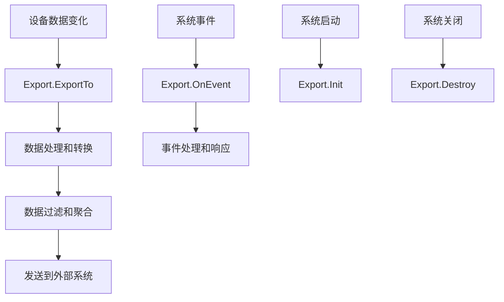

import { Tabs, TabItem } from '@astrojs/starlight/components';
import { Aside } from '@astrojs/starlight/components';

本文档详细介绍如何为driver-box开发自定义数据导出功能，实现设备数据的外部系统集成和业务流程编排。

export是driver-box的数据输出机制，负责将采集到的设备数据导出到外部系统，如云平台、数据库、消息队列等。通过开发自定义export，可以轻松扩展driver-box的数据输出能力。

## Export开发概述

### 什么是Export？
Export是driver-box的数据导出插件，主要功能包括：
- **数据接收**：接收来自设备的数据变化通知
- **数据处理**：对数据进行过滤、转换、聚合等处理
- **数据转发**：将数据发送到外部系统
- **状态管理**：维护与外部系统的连接状态
- **错误处理**：处理数据传输过程中的异常情况

### Export架构


## 开发环境准备

### 前置要求
- Go 1.18+
- 熟悉Go语言和接口编程
- 了解目标系统的API或数据格式
- 掌握HTTP、MQTT、数据库等通信协议

### 项目结构
```
exports/
├── your_export/                 # Export名称目录
│   ├── export.go                # Export入口文件
│   └── internal/                # 内部实现
│       ├── export.go            # Export接口实现
│       ├── client.go            # 外部系统客户端
│       ├── processor.go         # 数据处理器
│       └── model.go            # 数据模型定义
```

## 实现Export接口

### 基础Export结构

driver-box的export需要实现标准的生命周期接口：

<Tabs>
<TabItem label="export.go" icon="seti:go">
```go
package your_export

import (
	"github.com/ibuilding-x/driver-box/exports/your_export/internal"
)

// EnableExport 启用Export（必须导出此函数）
func EnableExport() {
	// 注册export到框架
	// 具体注册方式取决于driver-box的export管理机制
}
```
</TabItem>

<TabItem label="internal/export.go" icon="seti:go">
```go
package internal

import (
	"context"
	"fmt"
	"time"

	"github.com/ibuilding-x/driver-box/driverbox"
	"github.com/ibuilding-x/driver-box/internal/export/base"
	"github.com/ibuilding-x/driver-box/internal/logger"
	"github.com/ibuilding-x/driverbox/pkg/config"
	"github.com/ibuilding-x/driver-box/pkg/event"
	"go.uber.org/zap"
)

const (
	ExportName = "your_export"
	Version    = "1.0.0"
)

// Export 数据导出实现
type Export struct {
	base.BaseExport                    // 嵌入基础export功能
	config         *ExportConfig       // 导出配置
	client         *ExternalClient     // 外部系统客户端
	processor      *DataProcessor      // 数据处理器
	isRunning      bool                // 运行状态
	stopChan       chan struct{}       // 停止信号
	metrics        *ExportMetrics      // 导出指标
}

// NewExport 创建新的Export实例
func NewExport() *Export {
	return &Export{
		stopChan: make(chan struct{}),
		metrics:  NewExportMetrics(),
	}
}

// Init 初始化Export
func (e *Export) Init() error {
	logger.Logger.Info("initializing export", 
		zap.String("name", ExportName),
		zap.String("version", Version))
	
	// 加载配置
	if err := e.loadConfig(); err != nil {
		return fmt.Errorf("load config failed: %w", err)
	}
	
	// 创建外部系统客户端
	client, err := NewExternalClient(e.config)
	if err != nil {
		return fmt.Errorf("create client failed: %w", err)
	}
	e.client = client
	
	// 创建数据处理器
	e.processor = NewDataProcessor(e.config)
	
	// 测试外部系统连接
	if err := e.testConnection(); err != nil {
		logger.Logger.Warn("external system connection test failed", 
			zap.Error(err))
		// 根据配置决定是否继续运行
		if e.config.StrictMode {
			return fmt.Errorf("connection test failed: %w", err)
		}
	}
	
	e.isRunning = true
	logger.Logger.Info("export initialized successfully", 
		zap.String("name", ExportName))
	return nil
}

// ExportTo 导出设备数据
func (e *Export) ExportTo(deviceData driverbox.DeviceData) {
	if !e.isRunning {
		return
	}
	
	start := time.Now()
	defer func() {
		e.metrics.RecordExportDuration(time.Since(start))
	}()
	
	// 数据处理
	processedData, err := e.processor.Process(deviceData)
	if err != nil {
		e.metrics.RecordError()
		logger.Logger.Error("process device data failed", 
			zap.String("device", deviceData.ID),
			zap.Error(err))
		return
	}
	
	// 数据过滤
	if e.shouldFilter(processedData) {
		e.metrics.RecordFiltered()
		return
	}
	
	// 发送到外部系统
	if err := e.client.Send(processedData); err != nil {
		e.metrics.RecordError()
		e.handleSendError(err, processedData)
		return
	}
	
	e.metrics.RecordSuccess()
	logger.Logger.Debug("data exported successfully", 
		zap.String("device", deviceData.ID),
		zap.Duration("duration", time.Since(start)))
}

// OnEvent 处理系统事件
func (e *Export) OnEvent(eventCode event.EventCode, key string, eventValue interface{}) error {
	switch eventCode {
	case event.DeviceOnline:
		return e.handleDeviceOnline(key, eventValue)
	case event.DeviceOffline:
		return e.handleDeviceOffline(key, eventValue)
	case event.SystemStart:
		return e.handleSystemStart(key, eventValue)
	case event.SystemStop:
		return e.handleSystemStop(key, eventValue)
	default:
		logger.Logger.Debug("unhandled event", 
			zap.String("event", string(eventCode)),
			zap.String("key", key))
		return nil
	}
}

// IsReady 检查Export是否就绪
func (e *Export) IsReady() bool {
	return e.isRunning && e.client != nil && e.processor != nil
}

// Destroy 销毁Export
func (e *Export) Destroy() error {
	logger.Logger.Info("destroying export", zap.String("name", ExportName))
	
	e.isRunning = false
	close(e.stopChan)
	
	// 关闭外部系统连接
	if e.client != nil {
		if err := e.client.Close(); err != nil {
			logger.Logger.Error("close client failed", zap.Error(err))
		}
	}
	
	// 输出统计信息
	e.metrics.LogStats()
	
	logger.Logger.Info("export destroyed", zap.String("name", ExportName))
	return nil
}
```
</TabItem>
</Tabs>

## 外部系统客户端实现

### 客户端基础结构

<Tabs>
<TabItem label="internal/client.go" icon="seti:go">
```go
package internal

import (
	"bytes"
	"context"
	"encoding/json"
	"fmt"
	"net/http"
	"time"

	"github.com/ibuilding-x/driver-box/pkg/config"
	"go.uber.org/zap"
)

// ExternalClient 外部系统客户端
type ExternalClient struct {
	config     *ExportConfig
	httpClient *http.Client
	baseURL    string
	authToken  string
	retryCount int
}

// NewExternalClient 创建外部系统客户端
func NewExternalClient(config *ExportConfig) (*ExternalClient, error) {
	client := &ExternalClient{
		config: config,
		httpClient: &http.Client{
			Timeout: time.Duration(config.Timeout) * time.Millisecond,
			Transport: &http.Transport{
				MaxIdleConns:       10,
				IdleConnTimeout:    30 * time.Second,
				DisableCompression: false,
			},
		},
		baseURL:    config.Endpoint,
		retryCount: config.RetryCount,
	}
	
	// 如果需要认证，进行认证流程
	if config.AuthEnabled {
		if err := client.authenticate(); err != nil {
			return nil, fmt.Errorf("authentication failed: %w", err)
		}
	}
	
	return client, nil
}

// Send 发送数据到外部系统
type Send(ctx context.Context, data interface{}) error {
	// 序列化数据
	jsonData, err := json.Marshal(data)
	if err != nil {
		return fmt.Errorf("marshal data failed: %w", err)
	}
	
	// 构建请求
	url := fmt.Sprintf("%s/api/data", client.baseURL)
	req, err := http.NewRequestWithContext(ctx, "POST", url, bytes.NewBuffer(jsonData))
	if err != nil {
		return fmt.Errorf("create request failed: %w", err)
	}
	
	req.Header.Set("Content-Type", "application/json")
	if client.authToken != "" {
		req.Header.Set("Authorization", "Bearer "+client.authToken)
	}
	
	// 带重试机制的发送
	var lastErr error
	for i := 0; i <= client.retryCount; i++ {
		select {
		case <-ctx.Done():
			return ctx.Err()
		default:
		}
		
		resp, err := client.httpClient.Do(req)
		if err != nil {
			lastErr = err
			logger.Logger.Warn("send data failed, retrying", 
				zap.Int("attempt", i+1),
				zap.Error(err))
			time.Sleep(time.Duration(i+1) * time.Second) // 递增延迟
			continue
		}
		
defer resp.Body.Close()
		
		if resp.StatusCode >= 200 && resp.StatusCode < 300 {
			return nil // 成功
		}
		
		lastErr = fmt.Errorf("http %d: %s", resp.StatusCode, resp.Status)
		if resp.StatusCode >= 400 && resp.StatusCode < 500 {
			return lastErr // 客户端错误，不重试
		}
		}
		
		time.Sleep(time.Duration(i+1) * time.Second)
	}
	
	return fmt.Errorf("send data failed after %d attempts: %w", client.retryCount+1, lastErr)
}

// Close 关闭客户端连接
func (c *ExternalClient) Close() error {
	// 清理资源，如关闭连接池等
	c.httpClient = nil
	return nil
}

// authenticate 认证到外部系统
func (c *ExternalClient) authenticate() error {
	// 实现具体的认证逻辑
	// 例如：获取API密钥、OAuth认证等
	return nil
}
```
</TabItem>
</Tabs>

## 数据处理器

### 数据处理实现

<Tabs>
<TabItem label="internal/processor.go" icon="seti:go">
```go
package internal

import (
	"time"

	"github.com/ibuilding-x/driver-box/driverbox"
	"github.com/ibuilding-x/driver-box/pkg/config"
)

// DataProcessor 数据处理器
type DataProcessor struct {
	config    *ExportConfig
	filters   []DataFilter
	transform *DataTransformer
}

// NewDataProcessor 创建数据处理器
func NewDataProcessor(config *ExportConfig) *DataProcessor {
	processor := &DataProcessor{
		config: config,
		filters: []DataFilter{
			NewTimestampFilter(config),
			NewValueRangeFilter(config),
			NewDeviceFilter(config),
		},
		transform: NewDataTransformer(config),
	}
	return processor
}

// Process 处理设备数据
func (p *DataProcessor) Process(deviceData driverbox.DeviceData) (*ProcessedData, error) {
	// 创建处理后的数据结构
	processed := &ProcessedData{
		DeviceID:    deviceData.ID,
		Timestamp:   time.Now().UTC(),
		Original:    deviceData,
		Points:      make(map[string]interface{}),
		Metadata:    make(map[string]interface{}),
	}
	
	// 数据转换
	for pointName, pointValue := range deviceData.Points {
		// 应用转换器
		processedValue, err := p.transform.Transform(pointName, pointValue)
		if err != nil {
			return nil, fmt.Errorf("transform point %s failed: %w", pointName, err)
		}
		processed.Points[pointName] = processedValue
	}
	
	// 添加元数据
	processed.Metadata["export_version"] = Version
	processed.Metadata["processing_time"] = time.Now().UTC()
	
	return processed, nil
}

// shouldFilter 判断数据是否应该被过滤
func (p *DataProcessor) shouldFilter(data *ProcessedData) bool {
	for _, filter := range p.filters {
		if filter.ShouldFilter(data) {
			return true
		}
	}
	return false
}

// DataFilter 数据过滤器接口
type DataFilter interface {
	ShouldFilter(*ProcessedData) bool
}

// TimestampFilter 时间戳过滤器
type TimestampFilter struct {
	config *ExportConfig
}

func NewTimestampFilter(config *ExportConfig) *TimestampFilter {
	return &TimestampFilter{config: config}
}

func (f *TimestampFilter) ShouldFilter(data *ProcessedData) bool {
	// 过滤过期数据
	if f.config.MaxAge > 0 {
		age := time.Since(data.Original.Timestamp)
		if age > f.config.MaxAge {
			return true
		}
	}
	return false
}
```
</TabItem>
</Tabs>

## 配置管理

### 导出配置定义

<Tabs>
<TabItem label="internal/model.go" icon="seti:go">
```go
package internal

import (
	"time"

	"github.com/ibuilding-x/driver-box/pkg/config"
)

// ExportConfig 导出配置
 type ExportConfig struct {
	// 基本配置
	Name        string        `json:"name"`         // Export名称
	Endpoint    string        `json:"endpoint"`     // 外部系统端点
	Enabled     bool          `json:"enabled"`      // 是否启用
	Timeout     int           `json:"timeout"`      // 超时时间(毫秒)
	RetryCount  int           `json:"retryCount"`   // 重试次数
	
	// 认证配置
	AuthEnabled bool          `json:"authEnabled"`  // 是否启用认证
	Username    string        `json:"username"`     // 用户名
	Password    string        `json:"password"`     // 密码
	APIKey      string        `json:"apiKey"`       // API密钥
	
	// 数据处理配置
	MaxAge           time.Duration `json:"maxAge"`              // 最大数据年龄
	BatchSize        int           `json:"batchSize"`           // 批处理大小
	FlushInterval    time.Duration `json:"flushInterval"`       // 刷新间隔
	StrictMode       bool          `json:"strictMode"`          // 严格模式
	IncludeMetadata  bool          `json:"includeMetadata"`     // 包含元数据
	
	// 过滤器配置
	Filters          []FilterConfig `json:"filters"`             // 过滤器配置
}

// FilterConfig 过滤器配置
type FilterConfig struct {
	Type    string      `json:"type"`    // 过滤器类型
	Config  interface{} `json:"config"`  // 过滤器配置
}

// ProcessedData 处理后的数据结构
type ProcessedData struct {
	DeviceID  string                 `json:"deviceId"`
	Timestamp time.Time              `json:"timestamp"`
	Points    map[string]interface{} `json:"points"`
	Metadata  map[string]interface{} `json:"metadata,omitempty"`
	Original  driverbox.DeviceData   `json:"original"`
}
```
</TabItem>
</Tabs>

## 监控和指标

### 导出指标收集

<Tabs>
<TabItem label="internal/metrics.go" icon="seti:go">
```go
package internal

import (
	"time"

	"go.uber.org/zap"
)

// ExportMetrics 导出指标
type ExportMetrics struct {
	exportCount    int64         // 总导出次数
	successCount   int64         // 成功次数
	errorCount     int64         // 错误次数
	filteredCount  int64         // 过滤次数
	totalDuration  time.Duration // 总耗时
	maxDuration    time.Duration // 最大耗时
}

// NewExportMetrics 创建指标收集器
func NewExportMetrics() *ExportMetrics {
	return &ExportMetrics{}
}

// RecordExport 记录导出操作
func (m *ExportMetrics) RecordExport(duration time.Duration) {
	m.exportCount++
	m.totalDuration += duration
	if duration > m.maxDuration {
		m.maxDuration = duration
	}
}

// RecordSuccess 记录成功
func (m *ExportMetrics) RecordSuccess() {
	m.successCount++
}

// RecordError 记录错误
func (m *ExportMetrics) RecordError() {
	m.errorCount++
}

// RecordFiltered 记录过滤
func (m *ExportMetrics) RecordFiltered() {
	m.filteredCount++
}

// GetSuccessRate 获取成功率
func (m *ExportMetrics) GetSuccessRate() float64 {
	if m.exportCount == 0 {
		return 0
	}
	return float64(m.successCount) / float64(m.exportCount) * 100
}

// GetAverageDuration 获取平均耗时
func (m *ExportMetrics) GetAverageDuration() time.Duration {
	if m.exportCount == 0 {
		return 0
	}
	return m.totalDuration / time.Duration(m.exportCount)
}

// LogStats 输出统计信息
func (m *ExportMetrics) LogStats() {
	logger.Logger.Info("export statistics",
		zap.Int64("total_exports", m.exportCount),
		zap.Int64("success_count", m.successCount),
		zap.Int64("error_count", m.errorCount),
		zap.Int64("filtered_count", m.filteredCount),
		zap.Float64("success_rate", m.GetSuccessRate()),
		zap.Duration("avg_duration", m.GetAverageDuration()),
		zap.Duration("max_duration", m.maxDuration))
}
```
</TabItem>
</Tabs>

## 测试策略

### 单元测试示例
```go
package internal_test

import (
	"context"
	"testing"
	"time"

	"github.com/ibuilding-x/driver-box/driverbox"
	"github.com/ibuilding-x/driver-box/exports/your_export/internal"
	"github.com/stretchr/testify/assert"
	"github.com/stretchr/testify/mock"
)

func TestExport_ExportTo(t *testing.T) {
	export := internal.NewExport()
	config := createTestConfig()
	export.config = config
	
deviceData := driverbox.DeviceData{
		ID: "test-device",
		Points: map[string]interface{}{
			"temperature": 25.5,
			"humidity":    60.0,
		},
	}
	
	// 测试数据导出
	export.ExportTo(deviceData)
	
	// 验证指标是否正确记录
	assert.Greater(t, export.metrics.exportCount, int64(0))
}

func TestExternalClient_Send(t *testing.T) {
	client := internal.NewExternalClient(createTestConfig())
	
	// 创建mock上下文
	ctx := context.Background()
	testData := map[string]interface{}{
		"device": "test",
		"value":  123,
	}
	
	// 测试发送功能
	err := client.Send(ctx, testData)
	// 根据实际实现调整断言
	assert.Nil(t, err)
}
```

### 集成测试
创建完整的集成测试环境：
```go
func TestExportIntegration(t *testing.T) {
	// 启动模拟的外部系统
	mockServer := startMockServer()
	defer mockServer.Close()
	
	// 创建export实例
	export := internal.NewExport()

export.config = &internal.ExportConfig{
		Endpoint: mockServer.URL,
		Enabled:  true,
	}
	
	// 初始化
	assert.NoError(t, export.Init())
	assert.True(t, export.IsReady())
	
	// 测试数据流
	testData := driverbox.DeviceData{
		ID: "integration-test-device",
		Points: map[string]interface{}{
			"test_point": "test_value",
		},
	}
		export.ExportTo(testData)
	
	// 等待异步处理完成
	time.Sleep(100 * time.Millisecond)
	
	// 验证结果
	assert.Equal(t, int64(1), export.metrics.exportCount)
	assert.Equal(t, int64(1), export.metrics.successCount)
}
```

## 部署和配置

### 配置文件示例
```json
{
  "exports": {
    "your_export": {
      "name": "your_export",
      "endpoint": "https://api.example.com",
      "enabled": true,
      "timeout": 5000,
      "retryCount": 3,
      "authEnabled": true,
      "username": "your_username",
      "password": "your_password",
      "maxAge": "1h",
      "batchSize": 100,
      "flushInterval": "30s",
      "strictMode": false,
      "includeMetadata": true
    }
  }
}
```

### 环境变量支持
```go
// 在配置加载时支持环境变量
func (e *Export) loadConfig() error {
	// 支持从环境变量读取敏感配置
	if endpoint := os.Getenv("EXPORT_ENDPOINT"); endpoint != "" {
		e.config.Endpoint = endpoint
	}
	if apiKey := os.Getenv("EXPORT_API_KEY"); apiKey != "" {
		e.config.APIKey = apiKey
	}
	return nil
}
```

### 安全性考虑
- **数据脱敏**：敏感数据要进行脱敏处理
- **传输加密**：使用HTTPS等加密传输
- **访问控制**：实施适当的认证和授权
- **审计日志**：记录所有数据导出操作
