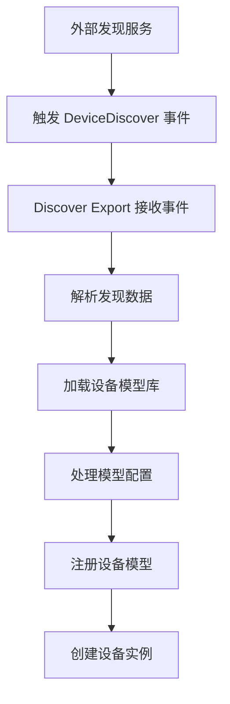
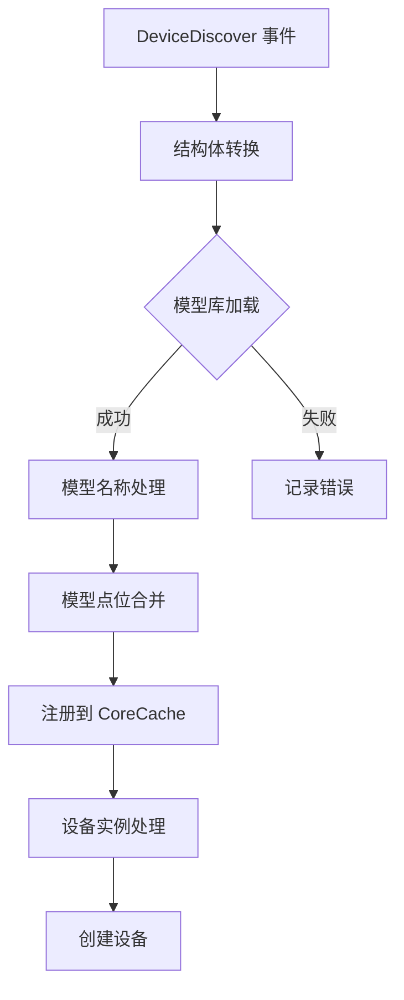
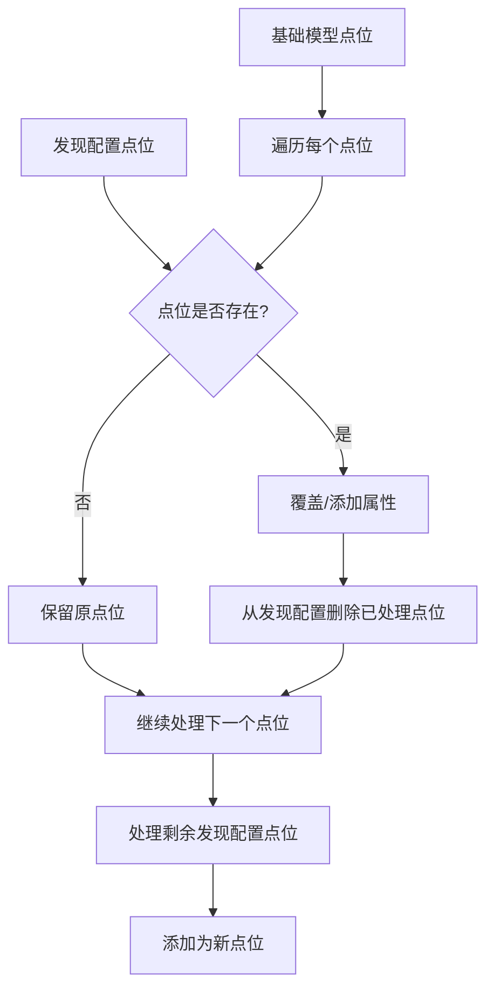
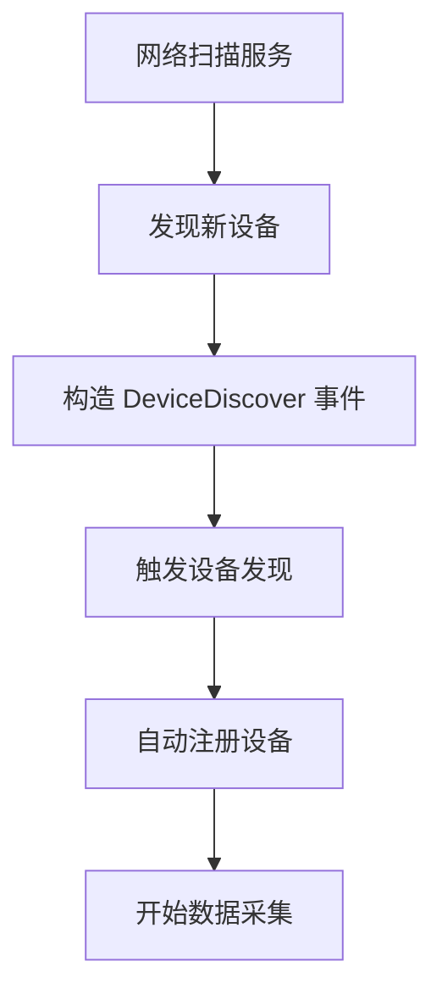

# Discover Export

Discover Export 插件提供设备自动发现功能，支持运行时动态添加和更新设备模型及设备实例。通过与设备发现事件配合，实现即插即用的设备接入体验。

## 特性

- 运行时设备模型注册
- 动态设备实例创建
- 模型点位属性覆盖和扩展
- 支持模型名称自定义
- 事件驱动的发现机制
- 模型库集成

## 配置说明

Discover Export 通过环境变量控制启用状态：

```bash
# 启用/禁用设备自动发现
export EXPORT_DISCOVER_ENABLED="true"
```

### 环境变量

| 参数 | 类型 | 默认值 | 说明 |
|------|------|--------|------|
| EXPORT_DISCOVER_ENABLED | string | `true` | 设置为 `false` 禁用发现功能 |

## 运行原理

### 事件触发机制

Discover Export 通过监听 `DeviceDiscover` 事件来触发设备发现流程：



### 发现数据处理流程



## 数据结构

### DeviceDiscover 事件结构

```go
type DeviceDiscover struct {
    ModelName     string                    `json:"modelName"`    // 模型名称后缀
    ModelKey      string                    `json:"modelKey"`     // 模型库中的模型标识
    Device        config.Device             `json:"device"`       // 设备实例配置
    Model         map[string]map[string]any `json:"model"`        // 模型自定义属性覆盖
    ProtocolName  string                    `json:"protocolName"` // 协议名称
    ConnectionKey string                    `json:"connectionKey"`// 连接配置键
}
```

### JSON 示例

```json
{
  "modelName": "custom_sensor_v1",
  "modelKey": "temperature_sensor",
  "protocolName": "modbus",
  "connectionKey": "modbus-tcp-1",
  "device": {
    "id": "sensor-001",
    "description": "自动发现的温湿度传感器",
    "properties": {
      "unitID": "1"
    }
  },
  "model": {
    "temperature": {
      "rawType": "Float32",
      "startAddress": "40001",
      "duration": "10s"
    },
    "humidity": {
      "rawType": "UInt16",
      "startAddress": "40003"
    }
  }
}
```

## 模型处理逻辑

### 1. 模型加载
- 根据 `ModelKey` 从模型库加载基础模型定义
- 支持协议特定的模型库（如 modbus、mqtt 等）
- 加载失败会终止发现流程

### 2. 模型名称确定
优先级顺序：
1. `ModelName` 字段（显式指定）
2. `{ProtocolName}_{ModelKey}`（自动生成）

### 3. 点位配置合并
Discover Export 支持灵活的点位配置覆盖：

#### 点位合并策略


#### 属性覆盖示例

**基础模型**：
```json
{
  "name": "temperature",
  "rawType": "Float32",
  "startAddress": "40001"
}
```

**发现配置覆盖**：
```json
{
  "temperature": {
    "duration": "5s",
    "byteSwap": true
  }
}
```

**合并结果**：
```json
{
  "name": "temperature",
  "rawType": "Float32",
  "startAddress": "40001",
  "duration": "5s",
  "byteSwap": true
}
```

#### 新增点位
发现配置中不存在于基础模型的点位会被添加：

```json
{
  "pressure": {
    "rawType": "UInt32",
    "startAddress": "40005"
  }
}
```

## 设备实例处理

### 设备配置
- `ModelName`: 设置为处理后的模型名称
- `ConnectionKey`: 使用发现配置指定的连接键
- 其他设备属性保持不变

### 设备注册
- 调用 `CoreCache().AddOrUpdateDevice()`
- 支持更新已存在的设备
- 自动关联到指定的连接配置

## 使用场景

### 1. 网络扫描发现


### 2. 即插即用接入
- USB 设备插入时自动发现
- 新设备加电后自动注册
- 移动设备进入网络范围时接入

### 3. 动态拓扑更新
- 设备更换 IP 地址
- 设备型号升级
- 配置参数动态调整

### 4. 批量设备部署
- 工厂预制设备信息
- 批量导入设备配置
- 自动化部署流程

## API 集成

### 触发发现事件
通过事件系统触发：

```go
// 示例：触发设备发现
eventData := discover.DeviceDiscover{
    ModelKey:      "temperature_sensor",
    ModelName:     "warehouse_sensor_v2",
    ProtocolName:  "modbus",
    ConnectionKey: "modbus-tcp-1",
    Device: config.Device{
        ID:          "wh-sensor-001",
        Description: "仓库温度传感器",
        Properties:  map[string]interface{}{ "unitID": "1" },
    },
    Model: map[string]map[string]interface{}{
        "temperature": {
            "rawType":      "Float32",
            "startAddress": "40001",
            "duration":     "5s",
        },
    },
}

// 发送发现事件
driverbox.Event().Publish(event.DeviceDiscover, "wh-sensor-001", eventData)
```

## 错误处理

| 错误场景 | 处理方式 | 说明 |
|----------|----------|------|
| 结构体转换失败 | 记录错误日志 | 检查事件数据格式 |
| 模型库加载失败 | 记录错误日志 | 验证 ModelKey 正确性 |
| 模型注册失败 | 记录错误日志 | 检查模型定义有效性 |
| 设备注册失败 | 记录错误日志 | 检查设备配置完整性 |

## 最佳实践

### 1. 模型命名规范
- 使用有意义的模型名称
- 包含版本信息便于管理
- 避免使用特殊字符

### 2. 点位配置策略
- 基础模型定义通用属性
- 发现配置覆盖环境特定参数
- 合理使用点位扩展机制

### 3. 发现时机
- 设备上线时立即发现
- 避免频繁重复发现
- 配合设备状态检测

### 4. 错误处理
- 监控发现失败事件
- 实现重试机制
- 提供手动干预接口

## 扩展建议

- 支持设备发现模板
- 添加发现结果回调通知
- 实现发现历史记录
- 支持设备发现验证
- 添加发现权限控制

## 注意事项

- 发现功能默认启用，生产环境可考虑按需启用
- 模型库需要预先加载相应协议的支持
- 设备发现不会自动启动数据采集，需要相应插件配合
- 重复发现会更新现有模型和设备的配置
- 确保事件数据格式的正确性

## 相关代码

- 主实现：`exports/discover/export.go`
- 数据模型：`exports/discover/model.go`
- 事件定义：`pkg/event/event.go`
- 模型库：`pkg/library/`