# Gateway 网关

Gateway 是 driver-box 提供的分布式网关功能，通过 WebSocket 长连接实现主网关与子网关之间的双向通信和数据同步。Gateway 功能由 **Gateway 插件** 和 **Gateway Export** 协同工作，实现设备数据的集中管理和远程控制。

## 概览

### 架构设计

Gateway 功能采用**插件 + Export**的双角色架构：

- **Gateway 插件** - 管理子网关连接，实现数据编解码
- **Gateway Export** - 提供网关服务，接收子网关连接和数据同步

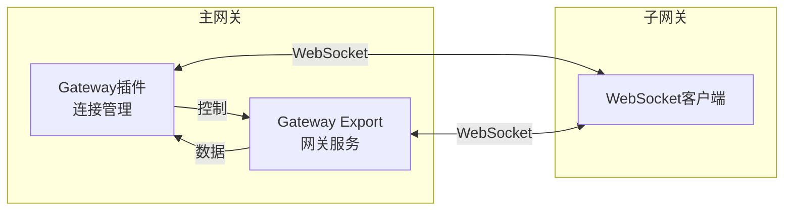

### 核心特性

| 特性 | 说明 |
|------|------|
| **双向通信** | 支持主网关和子网关之间的双向数据传输 |
| **自动重连** | 连接断开时自动重连，支持可配置重连间隔 |
| **数据同步** | 自动同步模型、设备、影子数据 |
| **远程控制** | 主网关可下发控制指令到子网关设备 |
| **心跳保活** | 定期心跳检测连接状态 |
| **并发支持** | 支持同时管理多个子网关 |

## 快速开始

### 1. 主网关配置

在主网关配置文件中添加子网关连接：

```json
{
  "plugin": "gateway",
  "connections": {
    "gateway-1": {
      "ip": "192.168.1.100",
      "timeout": "5s",
      "reconnect_interval": "30s"
    }
  }
}
```

**配置参数**：

| 参数 | 类型 | 必填 | 说明 |
|------|------|------|------|
| ip | string | 是 | 子网关 IP 地址 |
| timeout | string | 否 | 连接超时时间，默认 `5s` |
| reconnect_interval | string | 否 | 重连间隔时间，默认 `30s` |

### 2. 子网关配置

子网关需要启用 Gateway Export 功能（默认启用），无需额外配置。

### 3. 工作流程

1. 主网关启动，加载连接配置
2. 主动向子网关发起 WebSocket 连接
3. 连接成功后发送注册消息
4. 子网关返回注册响应，建立通信
5. 开始数据同步和双向通信

## 工作原理

### Gateway 插件

Gateway 插件负责管理子网关连接，实现数据编解码。

**核心结构**：

```go
type GatewayPlugin struct {
    connector *GatewayConnector
}

type GatewayConnector struct {
    plugin      *GatewayPlugin
    deviceId    string
    gatewayIP   string
    wsConn      *WebSocketClient
    msgChan     chan []byte
    destroyed   bool
    mutex       sync.Mutex
}
```

**编解码实现**：

- **Encode**: 封装点位数据，准备发送
- **Decode**: 解析 WebSocket 消息，提取设备数据

### Gateway Export

Gateway Export 作为网关服务端，接收子网关连接和数据同步。

**核心结构**：

```go
type GatewayExport struct {
    server *WSServer
}

type WSServer struct {
    upgrade http.Upgrader
    mutex  sync.Mutex
}
```

**事件处理**：

- **DeviceAdded**: 设备添加时触发
- **Exporting**: 数据导出时触发
- **DeviceOnline**: 设备在线状态变化时触发

### 通信协议

#### WebSocket URL 格式

```
ws://{主网关IP}:{HTTP端口}/gateway
```

#### 消息类型

| 消息类型 | 方向 | 说明 | 数据结构 |
|----------|------|------|----------|
| WSForRegister | 主→子 | 注册请求 | `{type: 1, gatewayKey: string}` |
| WSForRegisterRes | 子→主 | 注册响应 | `{type: 2, error?: string}` |
| WSForUnregister | 主→子 | 注销请求 | `{type: 3}` |
| WSForUnregisterRes | 子→主 | 注销响应 | `{type: 4, error?: string}` |
| WSForPing | 主→子 | 心跳请求 | `{type: 5}` |
| WSForPong | 子→主 | 心跳响应 | `{type: 6}` |
| WSForSyncModels | 子→主 | 模型同步 | `{type: 7, models: Model[]}` |
| WSForSyncModelsRes | 主→子 | 模型响应 | `{type: 8, error?: string}` |
| WSForSyncDevices | 子→主 | 设备同步 | `{type: 9, devices: Device[]}` |
| WSForSyncDevicesRes | 主→子 | 设备响应 | `{type: 10, error?: string}` |
| WSForSyncShadow | 子→主 | 影子同步 | `{type: 11, shadow: Shadow[]}` |
| WSForSyncShadowRes | 主→子 | 影子响应 | `{type: 12, error?: string}` |
| WSForReport | 子→主 | 数据上报 | `{type: 13, deviceData: DeviceData}` |
| WSForControl | 主→子 | 控制指令 | `{type: 14, deviceData: DeviceData}` |
| WSForControlRes | 子→主 | 控制响应 | `{type: 15, error?: string}` |

### 连接建立流程

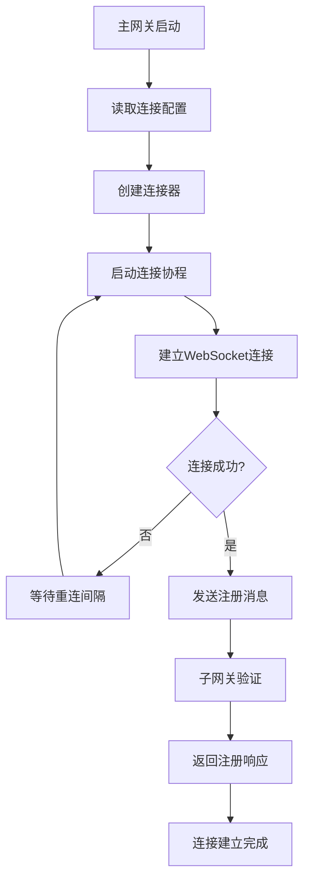

### 数据同步流程

#### 模型同步

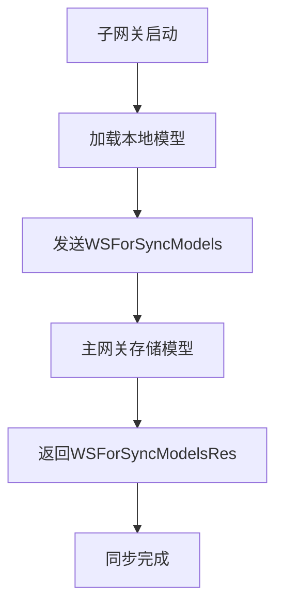

#### 设备同步

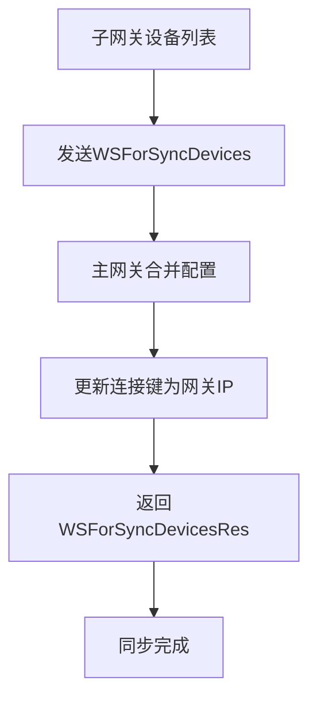

#### 影子同步

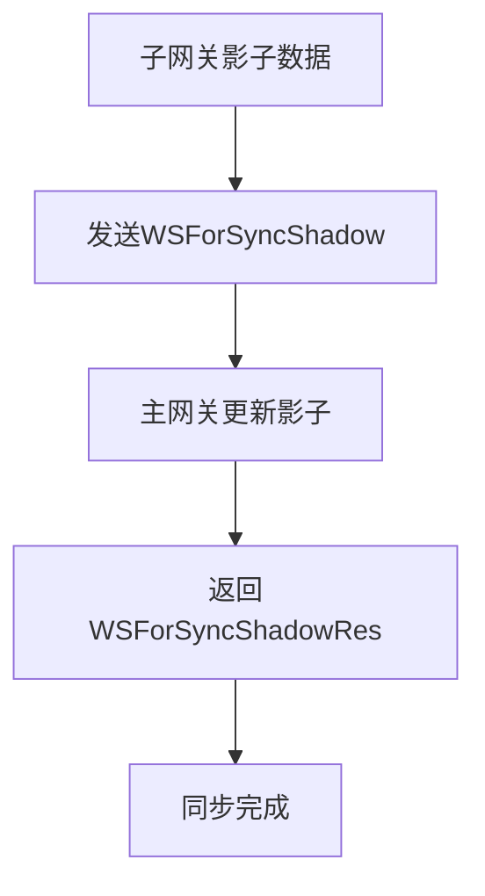

#### 数据上报

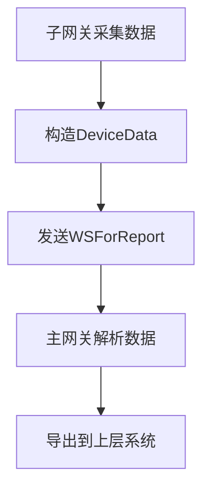

#### 控制下发

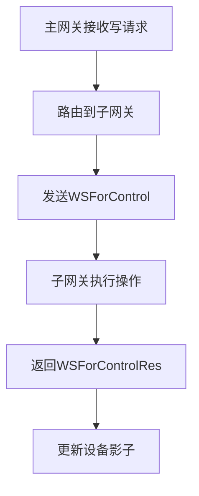

### 重连机制

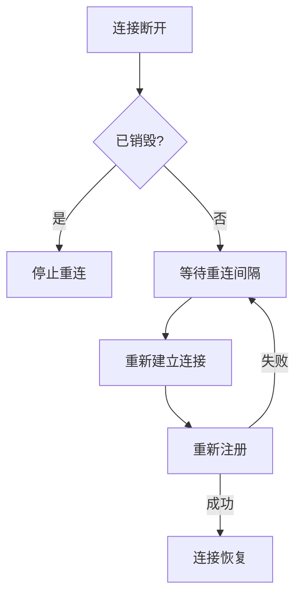

**重连特性**：
- 自动重连，无需人工干预
- 可配置重连间隔
- 销毁时优雅停止
- 指数退避策略

### 心跳保活

- **Ping 间隔**: 主网关定期发送心跳
- **Pong 响应**: 子网关立即回复
- **超时检测**: 连续失败触发重连
- **状态维护**: 通过影子系统维护在线状态

## 数据映射

### 设备 ID 映射

子网关设备同步到主网关时，设备 ID 会添加前缀：

```
原始: device_001
映射: SerialNo/device_001
```

### 模型名称映射

模型名称也会添加前缀：

```
原始: temperature_sensor
映射: SerialNo_temperature_sensor
```

### 连接键重写

设备连接键会被替换为网关 IP：

```
原始: device.ConnectionKey = modelName
重写: device.ConnectionKey = gatewayIP
```

### 配置合并

主网关会用本地配置覆盖子网关配置：

| 保留 | 覆盖 |
|------|------|
| 设备描述 | 连接键 |
| 设备属性 | 模型关联 |

## 使用场景

### 1. 分布式部署

主网关统一管理多个子网关：

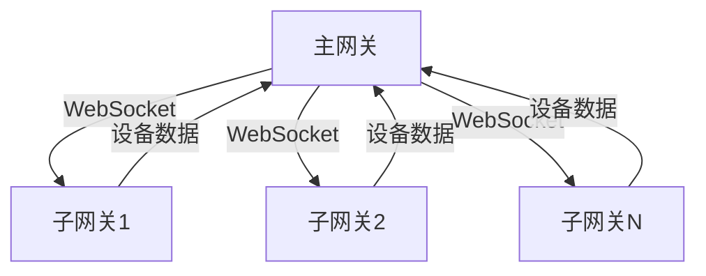

**应用场景**：
- 多楼宇统一管理
- 多园区集中监控
- 跨区域设备纳管

### 2. 边缘计算

子网关就近采集数据，主网关集中管控：

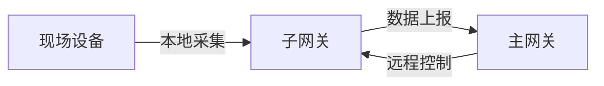

**优势**：
- 减少网络延迟
- 降低带宽消耗
- 提高可靠性

### 3. 网络隔离

不同网段的设备通过子网关接入：

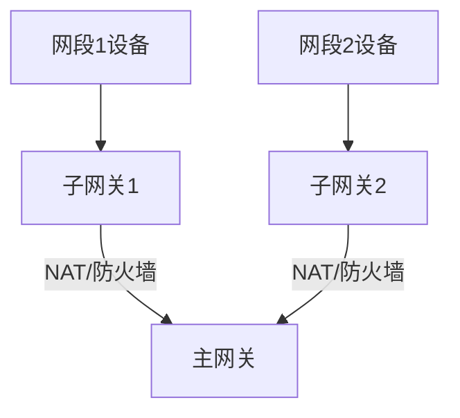

**优势**：
- 穿透网络隔离
- 简化网络拓扑
- 提高安全性

