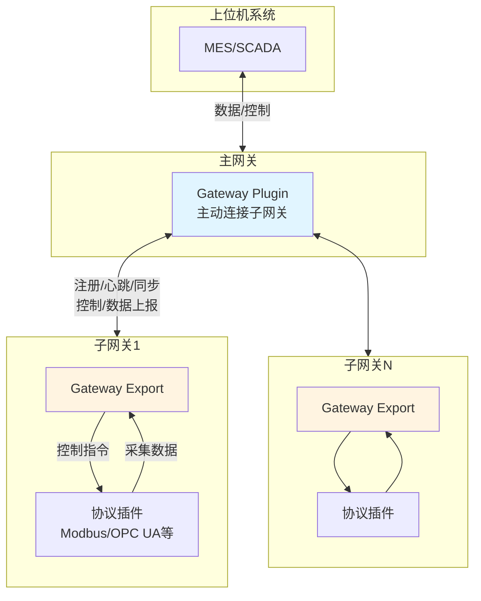
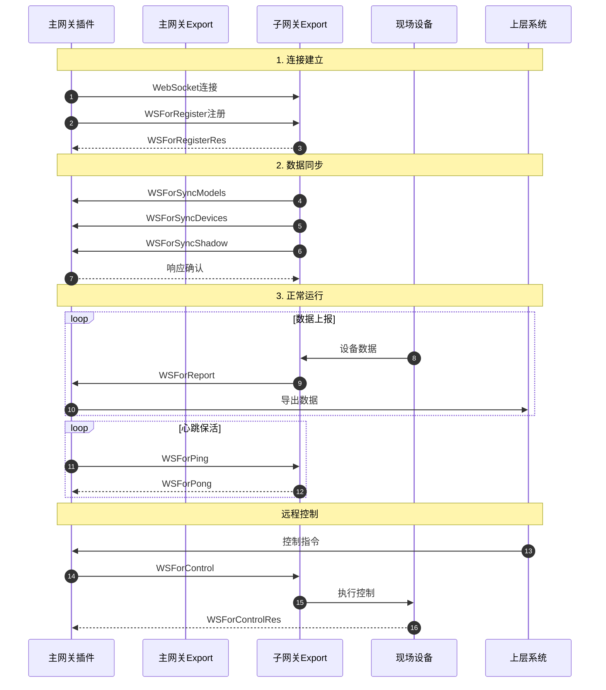

Gateway 是 driver-box 提供的分布式网关功能，通过 WebSocket 长连接实现主网关与子网关之间的双向通信和数据同步。Gateway 功能由 **Gateway Plugin** 和 **Gateway Export** 协同工作，实现设备数据的集中管理和远程控制。



**核心特性**
- **双向通信**：支持主网关和子网关之间的双向数据传输
- **自动重连**：连接断开时自动重连，支持可配置重连间隔
- **数据同步**：自动同步模型、设备、影子数据
- **远程控制**：主网关可下发控制指令到子网关设备
- **心跳保活**：定期心跳检测连接状态
- **并发支持**：支持同时管理多个子网关

## 快速开始

### 1. 主网关配置

在主网关配置文件中添加子网关连接：

```json
{
  "plugin": "gateway",
  "connections": {
    "gateway-1": {
      "ip": "192.168.1.100",
      "timeout": "5s",
      "reconnect_interval": "30s"
    }
  }
}
```

**配置参数**：

| 参数 | 类型 | 必填 | 说明 |
|------|------|------|------|
| ip | string | 是 | 子网关 IP 地址 |
| timeout | string | 否 | 连接超时时间，默认 `5s` |
| reconnect_interval | string | 否 | 重连间隔时间，默认 `30s` |

### 2. 子网关配置

子网关需要启用 Gateway Export 功能（默认启用），无需额外配置。

### 3. 启动验证

完成上述配置后，启动主网关和子网关服务。主网关将自动连接到子网关，并开始数据同步和上报。您可以通过日志查看连接状态和同步进度。

---

## 工作原理

### 架构概览

Gateway 通过主网关与子网关的 WebSocket 长连接实现分布式数据采集和远程控制，整体流程分为连接建立、数据同步、正常运行三个阶段：



### 组件职责

#### Gateway Plugin

- **连接管理**：创建并管理多个 `GatewayConnector` 实例，每个管理一个子网关连接
- **数据编解码**：Encode/Decode WebSocket 消息
- **数据转发**：在主网关 Export 和子网关之间转发数据和控制指令

#### Gateway Export

- **服务端**：接收子网关的 WebSocket 连接请求
- **注册验证**：验证 gatewayKey，管理已注册连接
- **消息分发**：根据消息类型分发到对应处理器
- **事件触发**：DeviceAdded、Exporting、DeviceOnline

### 数据同步

子网关连接成功后，自动同步三类数据：

**模型同步**：加载本地模型定义 → 添加 SerialNo 前缀 → 存储到主网关

**设备同步**：加载设备列表 → 添加 SerialNo 前缀 → 重写 ConnectionKey 为 gatewayIP → 合并主网关配置 → 注册到系统

**影子同步**：加载设备影子 → 添加前缀 → 更新主网关影子系统

### 重连机制

连接断开时，主网关自动重连：

1. 检测连接断开
2. 判断是否已销毁
3. 未销毁则等待 `reconnect_interval`
4. 重新建立 WebSocket 连接
5. 成功后重新注册并同步所有数据
6. 失败则指数退避继续重试

**特性**：自动重连、可配置间隔、指数退避、销毁时优雅停止

### 心跳保活

- **Ping 间隔**：主网关定期发送心跳（默认 30 秒）
- **Pong 响应**：子网关立即回复
- **超时检测**：连续失败触发重连

### 通信协议

#### WebSocket 连接

**URL 格式**：`ws://{主网关IP}:{HTTP端口}/gateway`

**示例**：`ws://192.168.1.10:8080/gateway`

#### 消息类型

| 消息类型 | 方向 | 说明 |
|----------|------|------|
| WSForRegister | 主→子 | 注册请求 |
| WSForRegisterRes | 子→主 | 注册响应 |
| WSForPing | 主→子 | 心跳请求 |
| WSForPong | 子→主 | 心跳响应 |
| WSForSyncModels | 子→主 | 模型同步 |
| WSForSyncModelsRes | 主→子 | 模型响应 |
| WSForSyncDevices | 子→主 | 设备同步 |
| WSForSyncDevicesRes | 主→子 | 设备响应 |
| WSForSyncShadow | 子→主 | 影子同步 |
| WSForSyncShadowRes | 主→子 | 影子响应 |
| WSForReport | 子→主 | 数据上报 |
| WSForControl | 主→子 | 控制指令 |
| WSForControlRes | 子→主 | 控制响应 |