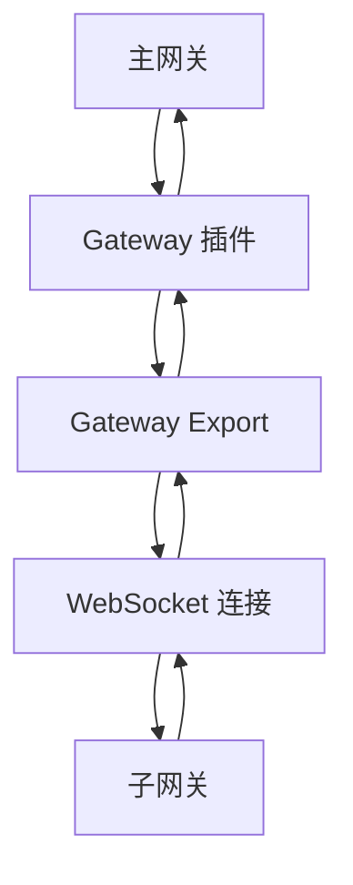
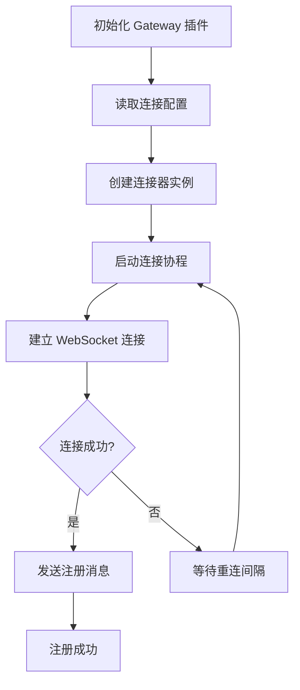
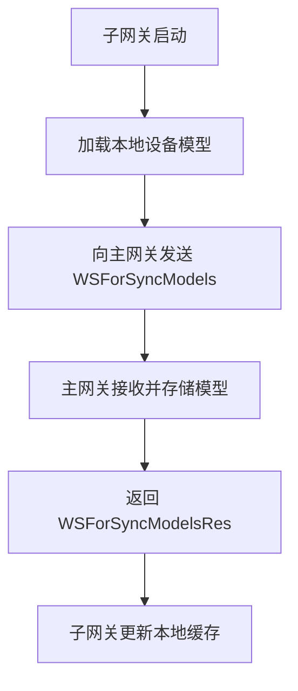
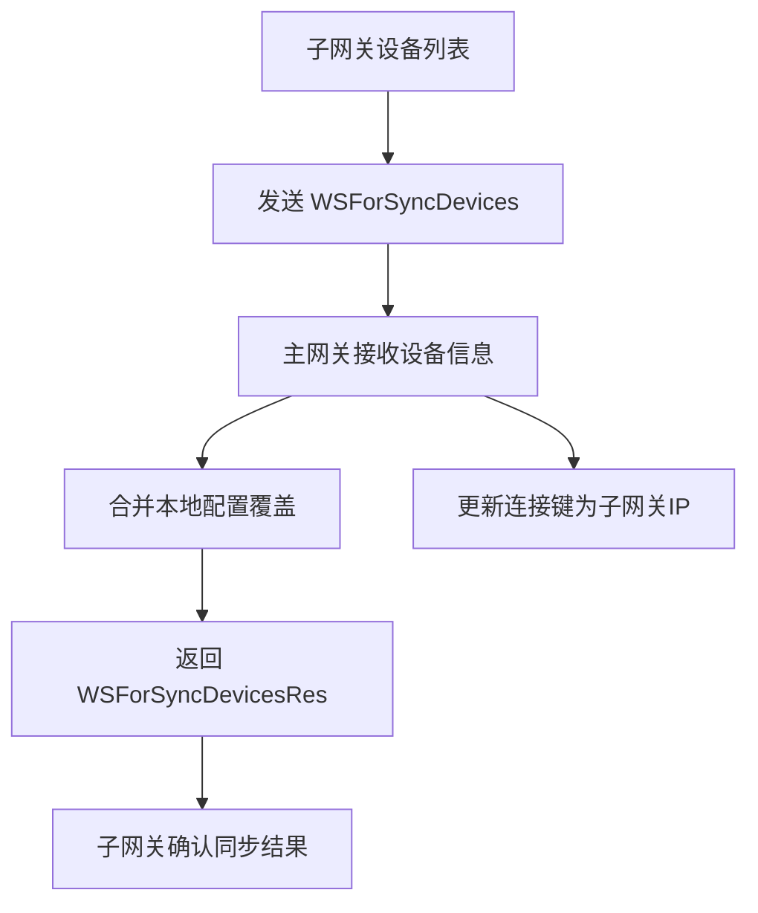
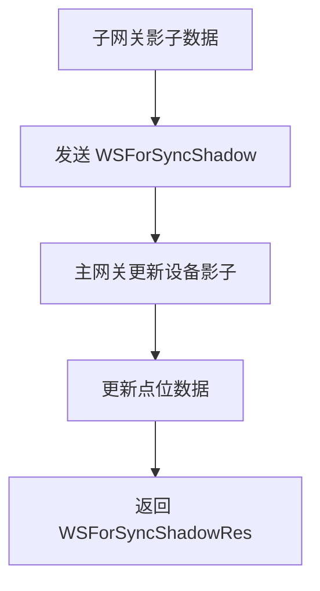
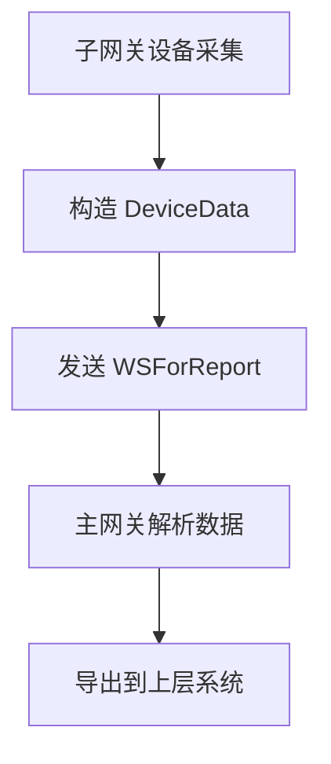
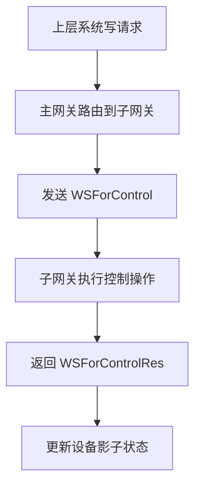
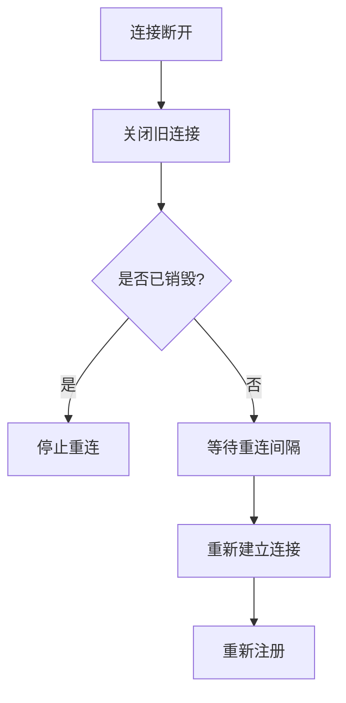

# Gateway Export

Gateway Export 是 Gateway 插件的核心组件，负责主网关与子网关之间的数据同步和设备管理。它通过 WebSocket 长连接实现双向通信，是分布式部署的关键组件。

## 特性

- 基于 WebSocket 的双向通信
- 自动重连和连接状态管理
- 设备模型、设备、影子数据同步
- 实时数据上报和控制指令下发
- 心跳保活机制
- 优雅的连接关闭

## 架构角色

Gateway Export 不是独立的导出插件，而是 Gateway 插件的内置组件：



## 连接配置

Gateway Export 使用 Gateway 插件的连接配置，在 `config.json` 中配置：

```json
{
  "plugin": "driverbox",
  "connections": {
    "gateway-1": {
      "ip": "192.168.1.100",
      "timeout": "5s",
      "reconnect_interval": "30s"
    }
  }
}
```

### 连接参数

| 参数 | 类型 | 说明 |
|------|------|------|
| ip | string | 子网关 IP 地址 |
| timeout | string | 连接超时时间 |
| reconnect_interval | string | 重连间隔时间 |

## 运行原理

### 连接建立流程



### 通信协议

#### WebSocket URL 格式
```
ws://{子网关IP}:{主网关HTTP端口}/gateway
```

#### 消息类型

| 类型 | 方向 | 说明 | 数据结构 |
|------|------|------|----------|
| WSForRegister | 主→子 | 注册请求 | `{type: 1, gatewayKey: string}` |
| WSForRegisterRes | 子→主 | 注册响应 | `{type: 2, error?: string, gatewayKey: string}` |
| WSForUnregister | 主→子 | 注销请求 | `{type: 3, gatewayKey: string}` |
| WSForUnregisterRes | 子→主 | 注销响应 | `{type: 4, error?: string}` |
| WSForPing | 主→子 | 心跳请求 | `{type: 5}` |
| WSForPong | 子→主 | 心跳响应 | `{type: 6}` |
| WSForSyncModels | 子→主 | 模型同步 | `{type: 7, models: Model[]}` |
| WSForSyncModelsRes | 主→子 | 模型同步响应 | `{type: 8, error?: string}` |
| WSForSyncDevices | 子→主 | 设备同步 | `{type: 9, devices: Device[]}` |
| WSForSyncDevicesRes | 主→子 | 设备同步响应 | `{type: 10, error?: string}` |
| WSForSyncShadow | 子→主 | 影子同步 | `{type: 11, shadow: Shadow[]}` |
| WSForSyncShadowRes | 主→子 | 影子同步响应 | `{type: 12, error?: string}` |
| WSForReport | 子→主 | 数据上报 | `{type: 13, deviceData: DeviceData}` |
| WSForControl | 主→子 | 控制指令 | `{type: 14, deviceData: DeviceData}` |
| WSForControlRes | 子→主 | 控制响应 | `{type: 15, error?: string}` |

### 数据同步流程

#### 1. 模型同步


#### 2. 设备同步


#### 3. 影子同步


#### 4. 数据上报


#### 5. 控制指令下发


### 心跳保活机制

- **Ping 间隔**: 主网关定期发送 Ping 消息
- **Pong 响应**: 子网关收到后立即回复 Pong
- **断线检测**: 连续 Ping 失败触发重连
- **连接状态**: 通过设备影子维护网关在线状态

### 重连机制



- 指数退避重连策略
- 可配置重连间隔
- 销毁时优雅停止重连

## 数据映射规则

### 设备连接键重写
子网关设备同步时，连接键会被重写：
- **原始**: `device.ConnectionKey = modelName`
- **重写后**: `device.ConnectionKey = gatewayIP`

这样主网关知道设备实际归属于哪个子网关。

### 本地配置合并
设备同步时，主网关会用本地配置覆盖子网关的配置：
- **保留**: 本地设备描述和属性配置
- **覆盖**: 连接键和模型关联

## 状态管理

### 网关设备状态
主网关会为每个子网关创建一个虚拟设备：
- **设备 ID**: 子网关 IP 地址
- **设备模型**: 通过 `SetDevicePoint` 更新序列号等信息
- **在线状态**: 通过影子系统维护

### 连接状态监控
- 连接成功: 影子状态设为在线
- 连接断开: 影子状态设为离线
- 注册失败: 记录错误日志

## 错误处理

- 连接失败: 记录错误并触发重连
- 消息解析错误: 记录详细错误日志
- 业务处理错误: 通过响应消息告知对方
- 优雅关闭: 支持取消注册和连接清理

## 性能考虑

- 并发连接: 支持同时连接多个子网关
- 消息队列: 使用互斥锁保护共享资源
- 内存管理: 及时清理断开连接的资源
- 日志优化: 调试日志分级输出

## 使用场景

1. **分布式部署**: 主网关统一管理多个子网关
2. **边缘计算**: 子网关就近采集，主网关集中管控
3. **网络隔离**: 不同网段的设备通过子网关接入
4. **负载分担**: 多子网关分担设备接入压力
5. **异地部署**: 跨地域的子网关统一纳管

## 注意事项

- 子网关需要运行对应的 driver-box 实例
- 防火墙需要开放 WebSocket 端口
- IP 地址变更需要更新配置并重启
- 网络不稳定时重连可能影响实时性
- 大量设备同步时注意内存和网络开销
- 控制指令仅支持 WriteMode

