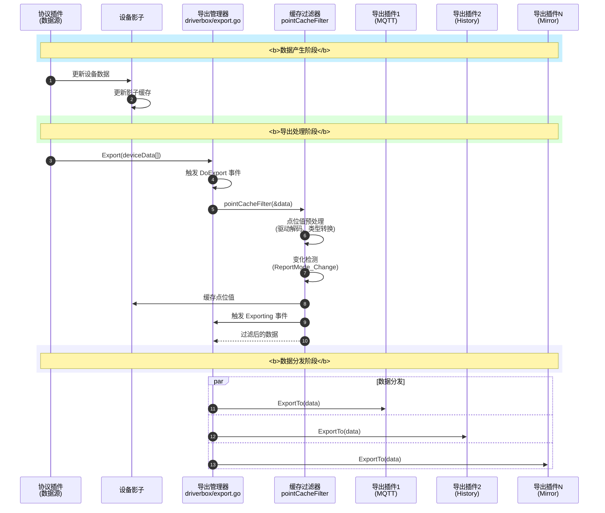

import { Aside } from '@astrojs/starlight/components';


Export 是 driver-box 与外部系统集成的核心组件，负责将设备数据分发到多个目标系统。本文档详细介绍导出系统的设计原理、接口定义和使用方法。

## 设计理念

driver-box 的导出系统采用**插件化 + 广播模式**的设计：

- **插件化设计**：每个导出目标作为独立的插件实现
- **广播模式**：数据变化时同时通知所有已注册的导出插件
- **异步处理**：每个导出插件独立处理数据，互不影响
- **事件驱动**：支持事件回调机制，响应系统状态变化

## 核心架构



## 导出流程详解

### 1. 数据产生

协议插件从设备采集数据后，通过协议库解码并构造 `DeviceData` 结构：

### 2. 导出触发

`Export()` 函数 ([`driverbox/export.go`](https://github.com/ibuilding-x/driver-box/blob/main/driverbox/export.go)) 负责数据分发：

```go title="driverbox/export.go"
func Export(deviceData []plugin.DeviceData) {
    // 1. 触发插件回调事件
    TriggerEvents(event.DoExport, "", deviceData)

    // 2. 遍历设备数据进行处理
    for _, data := range deviceData {
        // 触发设备事件
        TriggerEvents(data.Events...)

        // 3. 缓存过滤处理
        pointCacheFilter(&data)

        // 4. 分发到所有已就绪的导出插件
        if export.IsReady() {
            export.ExportTo(data)
        }
    }
}
```

### 3. 缓存过滤

`pointCacheFilter()` ([`driverbox/export.go`](https://github.com/ibuilding-x/driver-box/blob/main/driverbox/export.go)) 执行以下操作：

```go title="driverbox/export.go"
func pointCacheFilter(deviceData *plugin.DeviceData) {
    // 1. 点位值预处理（驱动解码、类型转换）
    pointValueProcess(deviceData)

    // 2. 遍历点位进行变化检测
    for _, point := range deviceData.Values {
        p, ok := CoreCache().GetPointByDevice(deviceData.ID, point.PointName)
        if !ok {
            continue
        }

        // 变化检测：对比影子缓存
        shadowValue, _ := Shadow().GetDevicePoint(deviceData.ID, point.PointName)

        // 如果是变化上报模式且值未变化，跳过
        if p.ReportMode() == config.ReportMode_Change && shadowValue == point.Value {
            continue
        }

        points = append(points, point)

        // 更新影子缓存
        Shadow().SetDevicePoint(deviceData.ID, point.PointName, point.Value)
    }

    deviceData.Values = points

    // 触发预导出事件
    TriggerEvents(event.Exporting, deviceData.ID, originalData)
}
```

### 4. 点位值预处理

`pointValueProcess()` ([`driverbox/export.go`](https://github.com/ibuilding-x/driver-box/blob/main/driverbox/export.go)) 对点位值进行加工：

```go title="driverbox/export.go"
func pointValueProcess(deviceData *plugin.DeviceData) error {
    device, ok := CoreCache().GetDevice(deviceData.ID)
    if !ok {
        return fmt.Errorf("unknown device")
    }

    // 1. 通过设备层驱动对点位值进行解码
    if len(device.DriverKey) > 0 {
        result := library.Driver().DeviceDecode(device.DriverKey, ...)
        deviceData.Values = result.Points
        TriggerEvents(result.Events...)
    }

    // 2. 对每个点位进行类型转换、精度换算、小数位数保留
    for i, p := range deviceData.Values {
        point, ok := CoreCache().GetPointByDevice(deviceData.ID, p.PointName)
        if !ok {
            continue
        }

        // 类型转换
        value, _ := convutil.PointValue(p.Value, point.ValueType())

        // 精度换算（如果未启用设备驱动）
        if point.Scale() != 0 {
            value, _ = multiplyWithFloat64(value, point.Scale())
        }

        // 小数位数保留
        if point.ValueType() == config.ValueType_Float {
            // 保留指定小数位数
            ...
        }

        deviceData.Values[i].Value = value
    }

    return nil
}
```

## 核心接口设计

### Export 接口

所有导出插件必须实现 `Export` 接口 ([`driverbox/export/export.go`](https://github.com/ibuilding-x/driver-box/blob/main/driverbox/export/export.go))：

```go title="driverbox/export/export.go"
type Export interface {
    // Init 初始化导出模块
    // 该方法在导出模块加载时被调用，用于执行必要的初始化操作
    // 如: 建立连接、加载配置、注册路由等
    // 返回值:
    //   error - 初始化过程中发生的错误，成功返回nil
    Init() error

    // ExportTo 导出设备数据
    // 该方法在设备数据发生变化时被调用，将数据推送到配置的目标
    // 参数:
    //   deviceData - 包含设备ID、点位名称和值的设备数据结构
    // 功能:
    //   将设备数据导出到配置的目标(如MQTT、HTTP等)
    //   实现时应注意处理异常情况并记录日志
    ExportTo(deviceData plugin.DeviceData)

    // OnEvent 事件回调接口
    // 当框架触发特定事件时调用此方法
    // 参数:
    //   eventCode - 事件代码，标识事件类型
    //   key - 事件关联的键值，通常是设备ID或其他标识符
    //   eventValue - 事件关联的值，类型根据事件不同而变化
    // 返回值:
    //   error - 处理事件过程中发生的错误，成功返回nil
    OnEvent(eventCode event.EventCode, key string, eventValue interface{}) error

    // IsReady 检查导出模块是否就绪
    // 该方法用于检查导出模块是否已完成初始化并准备好处理数据
    // 返回值:
    //   bool - true表示模块已就绪，false表示未就绪
    // 注意:
    //   框架会在调用ExportTo和OnEvent前检查此状态
    IsReady() bool

    // Destroy 退出服务，释放资源
    Destroy() error
}
```

### 数据结构

**DeviceData** ([`driverbox/plugin/model.go`](https://github.com/ibuilding-x/driver-box/blob/main/driverbox/plugin/model.go))：

```go title="driverbox/plugin/model.go"
type DeviceData struct {
    // ID 设备唯一标识符
    ID string `json:"id"`

    // Values 设备点位值数组
    Values []PointData `json:"values"`

    // Events 设备相关事件数组
    Events []event.Data `json:"events"`

    // ExportType 上报类型
    ExportType ExportType `json:"exportType"`
}
```

**ExportType** ([`driverbox/plugin/model.go`](https://github.com/ibuilding-x/driver-box/blob/main/driverbox/plugin/model.go))：

```go title="driverbox/plugin/model.go"
type ExportType string

const (
    // RealTimeExport 实时上报类型
    RealTimeExport ExportType = "realTimeExport"
)
```

## 事件系统

### 事件类型

导出系统支持多种事件类型 ([`pkg/event/event.go`](https://github.com/ibuilding-x/driver-box/blob/main/pkg/event/event.go))：

```go title="pkg/event/event.go"
const (
    // ShadowOnline 设备在线状态事件
    ShadowOnline = EventCode("driverbox.shadow.online")

    // ServiceStatus driver-box服务状态事件
    ServiceStatus = EventCode("driverbox.status")

    // DeviceAdded 设备添加事件
    DeviceAdded = EventCode("driverbox.device.added")

    // DeviceDeleting 即将删除设备事件
    DeviceDeleting = EventCode("driverbox.device.deleting")

    // Exporting 即将执行ExportTo事件
    Exporting = EventCode("driverbox.exporting")

    // DeviceDiscover 设备自动发现事件
    DeviceDiscover = EventCode("driverbox.device.discover")

    // DeviceOnOff 设备开关事件
    DeviceOnOff = EventCode("driverbox.device.onOff")

    // DoExport 插件回调事件
    DoExport = EventCode("driverbox.export")
)
```

### 事件触发

导出系统提供事件触发机制：

```go title="driverbox/export.go"
// TriggerEvents 触发事件通知到所有已加载的Export插件
func TriggerEvents(eventCode event.EventCode, key string, value interface{}) {
    export0.TriggerEvents(eventCode, key, value)
}
```

## 导出管理器

### 导出插件注册

`EnableExport()` ([`driverbox/export.go`](https://github.com/ibuilding-x/driver-box/blob/main/driverbox/export.go)) 注册导出插件：

```go title="driverbox/export.go"
func EnableExport(export export.Export) {
    for _, e := range export0.Exports {
        if e == export {
            return
        }
    }
    export0.Exports = append(export0.Exports, export)
}
```

**使用示例**（参考 `internal/export/base/export.go`）：

```go title="internal/export/base/export.go"
func init() {
    EnableExport(base.Get())
}
```

## 导出插件实现

### MQTT 导出插件

MQTT 导出将设备数据发布到 MQTT Broker ([`exports/mqtt/mqtt_export.go`](https://github.com/ibuilding-x/driver-box/blob/main/exports/mqtt/mqtt_export.go))：

```go title="exports/mqtt/mqtt_export.go"
type MqttExport struct {
    Broker      string
    Username    string
    Password    string
    ClientID    string
    init        bool
    client      mqtt.Client
    ExportTopic string
}

// Init 初始化MQTT连接
func (export *MqttExport) Init() error {
    options := mqtt.NewClientOptions()
    options.AddBroker(export.Broker)
    options.SetUsername(export.Username)
    options.SetPassword(export.Password)
    options.SetClientID(export.ClientID)

    // TLS设置
    if options.Servers[0].Scheme == "ssl" {
        options.SetTLSConfig(&tls.Config{
            InsecureSkipVerify: true,
        })
    }

    options.SetOnConnectHandler(export.onConnectHandler)
    export.client = mqtt.NewClient(options)
    token := export.client.Connect()

    if token.WaitTimeout(5*time.Second) && token.Error() != nil {
        return token.Error()
    }
    return nil
}

// ExportTo 导出设备数据
func (export *MqttExport) ExportTo(deviceData plugin.DeviceData) {
    bytes, _ := json.Marshal(deviceData)
    token := export.client.Publish(export.ExportTopic, 0, false, bytes)
    if token.Error() != nil {
        log.Fatal(token.Error())
    }
}

// OnEvent 处理事件
func (export *MqttExport) OnEvent(eventCode event.EventCode, key string, eventValue interface{}) error {
    if event.ShadowOnline == eventCode {
        export.client.Publish(
            "/driverbox/event/"+export.ClientID,
            0,
            false,
            map[string]any{"deviceId": key, "online": eventValue},
        )
    }
    return nil
}

// IsReady 检查是否就绪
func (export *MqttExport) IsReady() bool {
    return export.init
}
```

### History 导出插件

History 导出将设备数据存储到 SQLite 数据库 ([`exports/history/export.go`](https://github.com/ibuilding-x/driver-box/blob/main/exports/history/export.go))：

```go title="exports/history/export.go"
type Export struct {
    writeNum          int
    db                *sql.DB
    ready             bool
    realTimeDataQueue []deviceQueueData
    realTask          *crontab.Future
    snapshotTask      *crontab.Future
    clearTask         *crontab.Future
}

// Init 初始化历史数据存储
func (export0 *Export) Init() error {
    // 初始化数据库
    e := export0.initHistoryDataDB()
    if e != nil {
        return e
    }

    // 周期性写入缓冲区中的实时数据（默认5秒）
    export0.realTask, e = driverbox.AddFunc("5s", func() {
        if len(export0.realTimeDataQueue) == 0 {
            return
        }
        queue := export0.realTimeDataQueue
        export0.realTimeDataQueue = make([]deviceQueueData, 0)
        export0.writeRealTimeData(queue)
    })

    // 周期性产生设备剖面数据（默认60秒）
    export0.snapshotTask, e = driverbox.AddFunc("60s", func() {
        export0.writeDeviceSnapshotData()
    })

    // 周期性清理过期数据（默认14天）
    export0.clearTask, e = driverbox.AddFunc("1h", func() {
        export0.clearExpiredData(14)
    })

    export0.ready = true
    return nil
}

// ExportTo 接收驱动数据
func (export0 *Export) ExportTo(deviceData plugin.DeviceData) {
    if plugin.RealTimeExport == deviceData.ExportType {
        export0.realTimeDataQueue = append(export0.realTimeDataQueue, deviceQueueData{
            deviceData: deviceData,
            addTime:    time.Now(),
        })

        // 缓冲区达到阈值时立即写入
        if len(export0.realTimeDataQueue) >= export0.writeNum {
            old := export0.realTimeDataQueue
            export0.realTimeDataQueue = make([]deviceQueueData, 0)
            export0.writeRealTimeData(old)
        }
    }
}

// IsReady 检查是否就绪
func (export0 *Export) IsReady() bool {
    return export0.ready
}
```

## 上报模式

driver-box 支持两种点位上报模式：

### 变化上报 (ReportMode_Change)

- 只有当点位值发生变化时才上报
- 减少不必要的数据传输
- 适用于变化不频繁的数据

### 周期上报 (ReportMode_Cycle)

- 按固定周期上报点位值
- 即使值未变化也会上报
- 适用于需要周期性监控的场景

**变化检测逻辑**（在 `pointCacheFilter` 中）：

```go
// 获取影子缓存中的旧值
shadowValue, _ := Shadow().GetDevicePoint(deviceData.ID, point.PointName)

// 如果是变化上报模式，且值未变化，跳过
if p.ReportMode() == config.ReportMode_Change && shadowValue == point.Value {
    Log().Debug("point report mode is change, stop to trigger Export")
} else {
    // 添加到上报列表
    points = append(points, point)
}
```

## 内置导出插件

| 插件名称 | 协议/功能 | 状态 | 描述 | 目录 |
|----------|-----------|------|------|------|
| base | 基础服务 | ✅ 稳定 | UDP设备发现 | `internal/export/base/` |
| mqtt | MQTT协议 | ✅ 稳定 | MQTT Broker数据发布 | `exports/mqtt/` |
| history | 数据存储 | ✅ 稳定 | SQLite历史数据存储 | `exports/history/` |
| gateway | 网关导出 | ✅ 稳定 | WebSocket数据推送 | `exports/gateway/` |
| mirror | 数据镜像 | ✅ 稳定 | 设备数据镜像复制 | `exports/mirror/` |
| modbus-server | Modbus协议 | ✅ 稳定 | Modbus TCP从站 | `exports/modbusserver/` |
| linkedge | 阿里云Edge | ✅ 稳定 | LinkEdge边缘计算 | `exports/linkedge/` |
| discover | 设备发现 | ✅ 稳定 | 自动发现设备 | `exports/discover/` |
| mcp | AI集成 | ✅ 稳定 | MCP模型上下文协议 | `exports/mcp/` |

