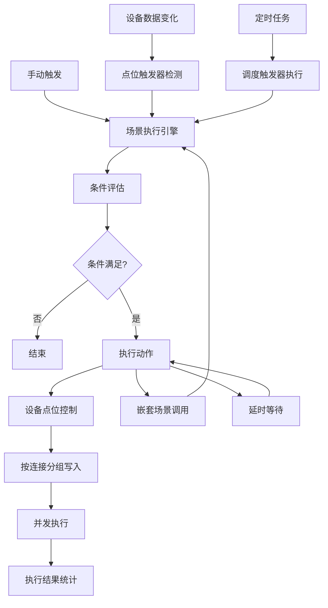
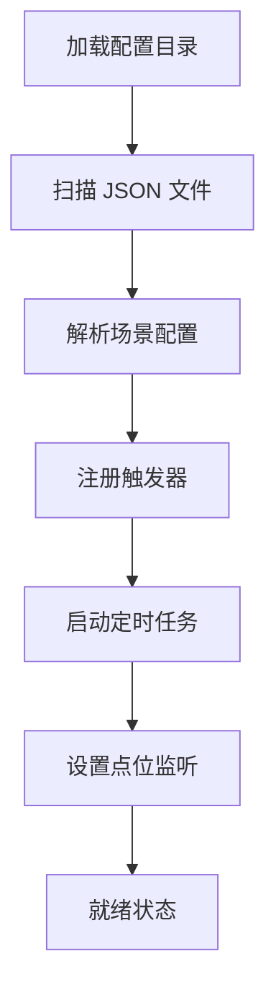
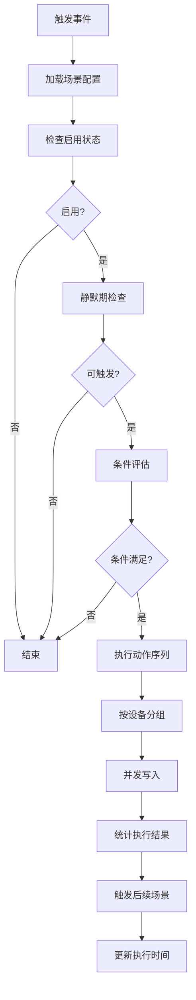

# 场景联动 Export (LinkEdge)

场景联动 Export 是 driver-box 的核心业务逻辑组件，提供强大的规则引擎功能。它支持基于设备点位、时间计划、日期条件等触发场景联动，执行设备控制、场景嵌套等动作。原名 LinkEdge，实际是通用的场景联动引擎。

## 特性

- **多类型触发器**: 支持设备点位触发、定时调度、设备事件触发
- **丰富条件判断**: 数值比较、时间窗口、日期区间、周期性条件
- **灵活动作执行**: 设备点位控制、场景嵌套调用、延时执行
- **静默期控制**: 防止场景频繁触发
- **执行状态反馈**: 全部成功/部分成功/全部失败
- **持久化配置**: JSON 文件存储场景配置
- **嵌套场景支持**: 支持最多 10 层场景嵌套

## 架构概览



## 核心概念

### 场景联动 (Scene Linkage)
一个完整的自动化规则，包含：
- **触发器**: 定义何时触发场景
- **条件**: 定义触发后需要满足的条件
- **动作**: 定义满足条件后执行的动作

### 触发器类型

#### 1. 设备点位触发器 (DevicePoint)
当指定设备的点位值满足条件时触发：

```json
{
  "type": "devicePoint",
  "deviceID": "sensor_001",
  "devicePoint": "temperature",
  "condition": ">",
  "value": "30"
}
```

#### 2. 定时调度触发器 (Schedule)
基于 Cron 表达式的定时触发：

```json
{
  "type": "schedule",
  "cron": "0 */5 * * * *"  // 每5分钟
}
```

#### 3. 设备事件触发器 (DeviceEvent)
预留的设备事件触发（当前未实现）

### 条件类型

#### 数值比较条件
支持的操作符：
- `eq`: 等于 (==)
- `ne`: 不等于 (!=)
- `gt`: 大于 (&gt;)
- `ge`: 大于等于 (&gt;=)
- `lt`: 小于 (&lt;)
- `le`: 小于等于 (&lt;=)

#### 时间条件
- **执行时间窗口**: 在指定时间范围内可执行
- **日期区间**: 在指定日期范围内可执行
- **静默期**: 防止过于频繁的触发

#### 周期性条件
- **年份**: 指定年份执行
- **月份**: 指定月份执行  
- **日期**: 指定日期执行
- **星期**: 指定星期执行
- **时间段**: 指定时间段执行

#### 持续时间条件
点位值持续满足条件一段时间后才触发：

```json
{
  "type": "devicePoint",
  "deviceID": "motion_sensor",
  "devicePoint": "detected",
  "condition": "eq",
  "value": "true",
  "duration": 30  // 持续30秒
}
```

## 配置管理

### 配置文件结构
场景配置存储在 `res/linkedge/{id}.json`：

```json
{
  "id": "scene_001",
  "name": "温度过高报警",
  "description": "温度超过30度时启动风扇",
  "enable": true,
  "silentPeriod": 60,
  "trigger": [...],
  "condition": [...],
  "action": [...],
  "executeTime": "2023-01-01T10:00:00Z"
}
```

### 配置字段说明

| 字段 | 类型 | 说明 |
|------|------|------|
| id | string | 场景唯一标识符 |
| name | string | 场景名称 |
| enable | bool | 是否启用 |
| silentPeriod | int | 静默期（秒），防止频繁触发 |
| trigger | array | 触发器列表 |
| condition | array | 执行条件列表 |
| action | array | 执行动作列表 |
| executeTime | datetime | 最后执行时间 |

## 运行原理

### 初始化流程



### 场景执行流程



### 条件评估机制

#### 1. 持续时间条件优先
```go
// 先检查持续时间条件
err := s.checkListTimeCondition(conditions)
if err != nil {
    return err
}
```

#### 2. 逐条件评估
- 设备点位条件：实时查询设备影子值
- 时间窗口条件：检查当前时间是否在范围内
- 日期区间条件：支持跨年处理
- 周期性条件：年/月/日/周/时间段匹配

#### 3. 数值比较
支持字符串和数值类型的比较：
- 字符串：仅支持 `eq` 和 `ne`
- 数值：支持所有比较操作符

### 动作执行机制

#### 设备点位控制
```go
switch action.Type {
case model.ActionTypeDevicePoint:
    // 单点位设置（兼容旧版本）
    if action.DevicePoint != "" && action.Value != "" {
        // ...
    }
    
    // 多点位设置
    if len(action.Points) != 0 {
        for _, point := range action.Points {
            actions[deviceID] = append(actions[deviceID], plugin.PointData{
                PointName: point.Point,
                Value:     point.Value,
            })
        }
    }
}
```

#### 场景嵌套
支持场景间的调用，形成复杂的自动化链：

```go
case model.ActionTypeLinkEdge:
    go s.triggerLinkEdge(action.ID, depth+1)
```

**嵌套深度限制**: 最大 10 层，防止无限递归

#### 延时执行
动作间支持延时：
```json
{
  "type": "devicePoint",
  "sleep": "5s"  // 执行后等待5秒
}
```

### 并发执行优化

1. **设备分组**: 按连接键分组，减少连接建立开销
2. **并发写入**: 每组设备使用独立 goroutine
3. **离线跳过**: 自动跳过离线设备，避免阻塞
4. **错误隔离**: 单个设备失败不影响其他设备

## API 接口

### 管理服务接口

```go
type IService interface {
    Create(model.Config) error              // 创建场景
    Update(model.Config) error              // 更新场景
    Delete(id string) error                 // 删除场景
    Trigger(id string) error                // 手动触发
    Get(id string) (model.Config, error)    // 获取场景
    GetList(tag ...string) ([]model.Config, error) // 列表查询
    Preview(model.Config) error             // 预览执行
}
```

### 事件触发

- **EVT_TRIGGER**: 场景执行结果事件
  - `ExecuteResultAllSuccess`: 全部成功
  - `ExecuteResultPartSuccess`: 部分成功  
  - `ExecuteResultAllFail`: 全部失败

## 使用场景

### 1. 温度控制
```
触发器: 温度 > 30°C
条件: 工作时间 (9:00-18:00)
动作: 启动空调制冷，设置温度为 25°C
```

### 2. 安全监控
```
触发器: 运动检测到人
条件: 夜间时段 (22:00-06:00) AND 持续30秒
动作: 开启警报灯，发送通知
```

### 3. 节能管理
```
触发器: 定时调度 (工作日 18:00)
条件: 办公室无人 (人员传感器全为0)
动作: 关闭所有非必要设备电源
```

### 4. 复杂业务流程
```
场景A: 检测到火灾 → 触发场景B和场景C
场景B: 启动消防系统
场景C: 疏散广播 + 电梯归首层
```

## 性能考虑

- **嵌套深度**: 限制 10 层防止栈溢出
- **并发控制**: 设备级并发，避免连接风暴
- **条件缓存**: 场景配置内存缓存，减少 IO
- **静默期**: 防止高频触发导致系统负载过高

## 错误处理

| 错误场景 | 处理方式 |
|----------|----------|
| 场景配置无效 | 记录错误，跳过执行 |
| 设备离线 | 跳过该设备，继续其他设备 |
| 条件评估失败 | 终止场景执行 |
| 动作执行失败 | 记录错误，统计失败数量 |
| 嵌套过深 | 抛出错误，停止嵌套 |
| 静默期内触发 | 拒绝执行，等待下次机会 |

## 最佳实践

### 1. 场景设计原则
- 单一职责：每个场景专注一个业务目标
- 合理粒度：避免过于复杂的单场景
- 命名清晰：使用有意义的场景名称

### 2. 触发器配置
- 选择最合适的触发类型
- 合理设置静默期避免抖动
- 持续时间条件用于防误触

### 3. 条件设计
- 按执行频率排序，快条件在前
- 避免过于复杂的条件组合
- 合理使用时间窗口控制执行时段

### 4. 动作编排
- 按设备分组，减少连接开销
- 合理使用延时控制执行顺序
- 谨慎使用场景嵌套，避免循环调用

## 扩展建议

- 支持更多触发器类型（如 HTTP 回调、MQTT 消息）
- 添加场景执行日志和审计
- 实现场景版本管理和回滚
- 支持条件表达式 (类似 SQL WHERE)
- 添加场景性能监控和告警
- 支持动态参数和模板

## 注意事项

- 场景配置修改需要重启生效
- 嵌套场景要注意避免循环调用
- 大量场景同时触发时注意系统负载
- 静默期设置要考虑业务需求平衡
- 设备离线处理策略需要根据场景重要性调整

## 相关代码

- 主实现：`exports/linkedge/linkedge.go`
- 导出接口：`exports/linkedge/export.go`
- 数据模型：`exports/linkedge/model/`
- 配置存储：`res/linkedge/`
- 事件定义：`exports/linkedge/linkedge.go` 中的 `EVT_TRIGGER`