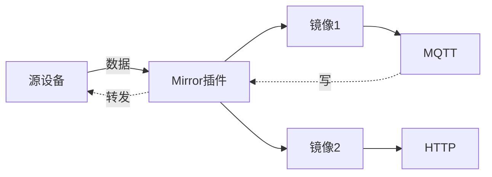
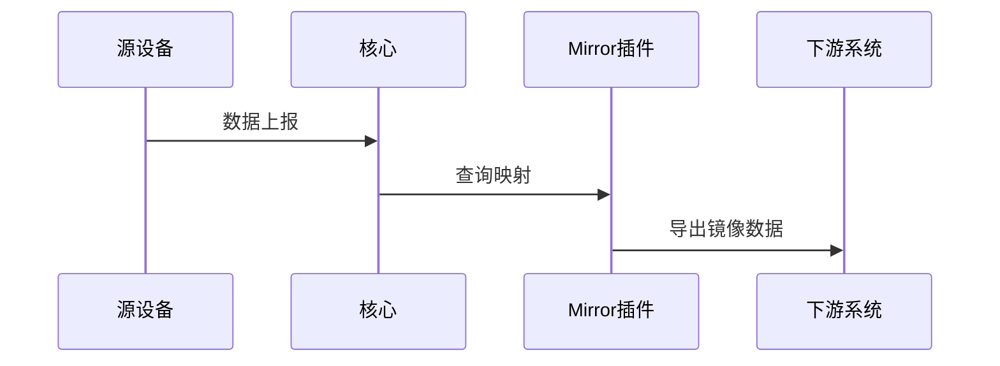
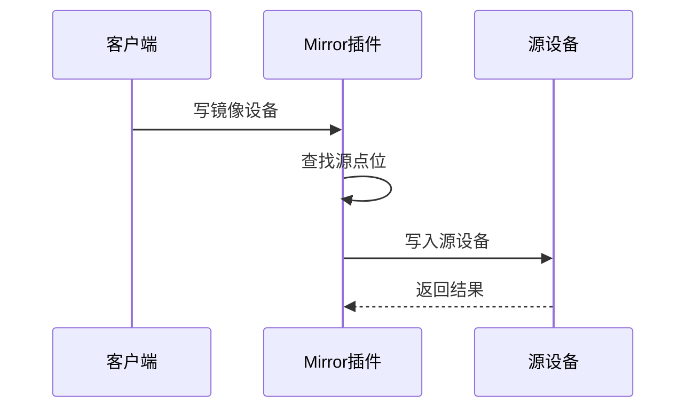
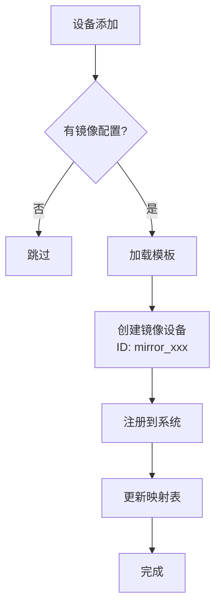
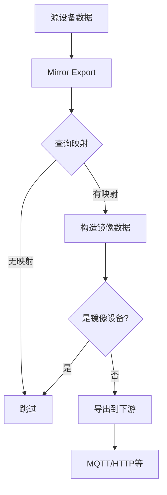
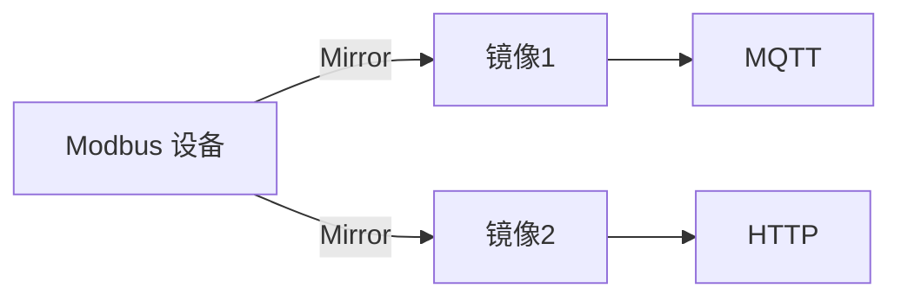
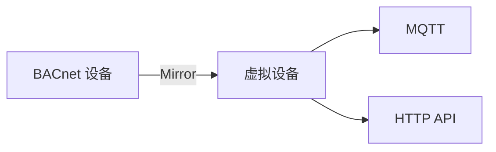
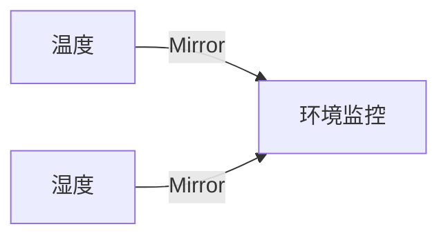

# Mirror 数据镜像

Mirror 是 driver-box 提供的数据镜像功能，将一个源设备的数据实时镜像到多个镜像设备，支持双向数据同步。

## 概览

### 架构设计

Mirror 功能由两个组件协同工作：

- **Mirror 插件** - 维护映射表，实现数据镜像和双向同步
- **Mirror Export** - 监听设备事件，自动创建和管理镜像设备



### 核心特性

- **一对多镜像** - 一个源设备的数据可镜像到多个镜像设备
- **双向同步** - 支持读取和写入操作
- **自动创建** - 基于配置自动创建镜像设备
- **防循环依赖** - 防止镜像循环
- **分组优化** - 写操作时自动合并同源设备的多个点位

## 快速开始

### 1. 配置镜像设备

在源设备模型中添加镜像配置：

```json
{
  "name": "temperature_sensor",
  "driverKey": "modbus_tcp",
  "attributes": {
    "mirror_tpl": {
      "modelKey": "virtual_device",
      "driverKey": "",
      "description": "温度传感器镜像",
      "points": [
        {
          "name": "mirror_temp",
          "rawDevice": "${deviceId}",
          "rawPoint": "temperature"
        }
      ]
    }
  }
}
```

**配置说明**：

| 字段 | 说明 |
|------|------|
| modelKey | 镜像设备模型库键名 |
| points | 点位映射配置 |
| rawDevice | 源设备 ID（使用 `${deviceId}` 引用当前设备） |
| rawPoint | 源点位名称 |

### 2. 配置导出规则

为镜像设备配置导出规则：

```json
{
  "deviceModels": [
    {
      "name": "virtual_device",
      "devices": [
        {
          "id": "mirror_device_001",
          "connectionKey": "broker1",
          "exportTopic": "/driverbox/data/${deviceId}"
        }
      ]
    }
  ]
}
```

## 工作原理

### Mirror 插件

Mirror 插件通过维护双向映射表实现数据镜像：

```go
// 镜像映射：镜像设备ID → {镜像点位 → 源设备信息}
mirrors map[string]map[string]rawDevice

// 原始映射：源设备ID → {源点位 → [镜像设备数据]}
rawMapping map[string]map[string][]plugin.DeviceData
```

**数据流向**：



**写入流程**：



### Mirror Export

Mirror Export 监听设备事件：

- **DeviceAdded** - 自动创建镜像设备
- **Exporting** - 数据镜像转换  
- **DeviceOnline** - 同步在线状态

**设备创建流程**：



**数据镜像流程**：



**镜像设备命名**：
- 设备ID：`mirror_{源设备ID}`
- 模型名：`{源模型}_mirror_{源设备ID}`

## 使用场景

### 1. 数据分发

将同一设备数据分发给多个下游系统：



### 2. 协议转换

不同协议系统共享同一数据源：



### 3. 设备聚合

多个物理设备聚合为逻辑设备：



## 完整示例

### 示例：温湿度传感器数据镜像

**源设备配置**：`res/library/driver/temp_humidity_sensor.json`

```json
{
  "name": "temp_humidity_sensor",
  "driverKey": "modbus_tcp",
  "attributes": {
    "mirror_tpl": {
      "modelKey": "virtual_sensor",
      "points": [
        {
          "name": "env_temp",
          "rawDevice": "${deviceId}",
          "rawPoint": "temperature"
        },
        {
          "name": "env_humidity",
          "rawDevice": "${deviceId}",
          "rawPoint": "humidity"
        }
      ]
    }
  },
  "devicePoints": [
    {
      "name": "temperature",
      "rawType": "Float32",
      "readWrite": "R"
    },
    {
      "name": "humidity",
      "rawType": "UInt16",
      "readWrite": "R"
    }
  ]
}
```

**生成的镜像设备**：

```
设备ID: mirror_sensor_001
模型名称: temp_humidity_sensor_mirror_sensor_001
点位:
  - env_temp → sensor_001.temperature
  - env_humidity → sensor_001.humidity
```

**MQTT 导出配置**：`res/driver/mqtt/config.json`

```json
{
  "connections": {
    "mqtt_broker": {
      "broker": "tcp://localhost:1883"
    }
  },
  "deviceModels": [
    {
      "name": "virtual_sensor",
      "devices": [
        {
          "id": "mirror_sensor_001",
          "connectionKey": "mqtt_broker",
          "exportTopic": "/environment/sensor001"
        }
      ]
    }
  ]
}
```

