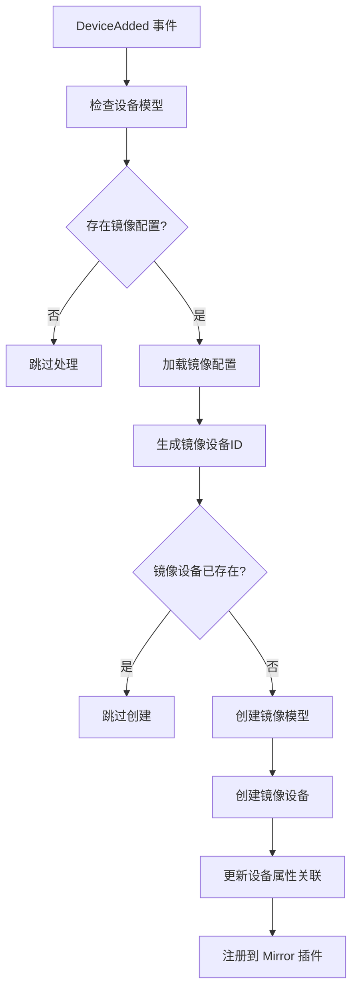
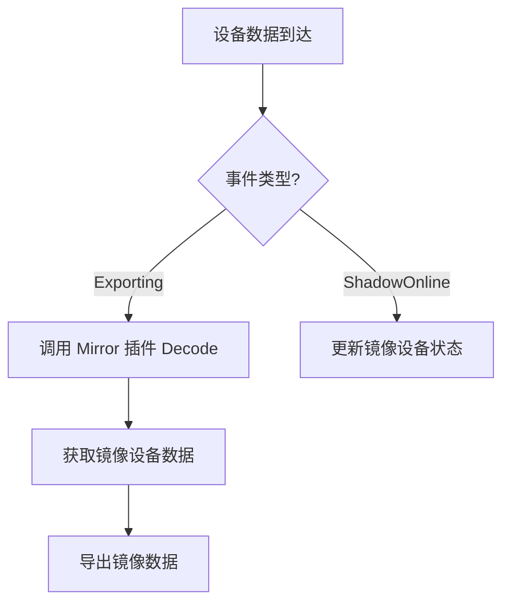
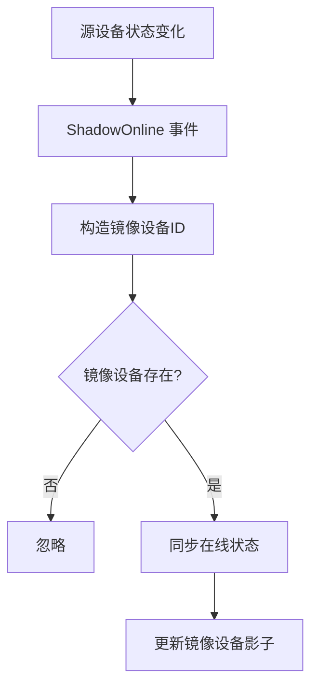

# Mirror Export

Mirror Export 是 Mirror 插件的配套组件，提供设备自动镜像创建和管理功能。它监听设备添加事件，根据模型配置自动创建镜像设备，实现数据的透明复制和分发。

## 特性

- 自动镜像设备创建
- 模型配置驱动的镜像规则
- 双向数据同步支持
- 设备属性自动关联
- 事件驱动的镜像管理
- 与 Mirror 插件无缝集成

## 配置说明

Mirror Export 通过环境变量控制启用状态：

```bash
# 启用/禁用镜像导出
export EXPORT_MIRROR_ENABLED="true"
```

### 环境变量

| 参数 | 类型 | 默认值 | 说明 |
|------|------|--------|------|
| EXPORT_MIRROR_ENABLED | string | `true` | 设置为 `false` 禁用镜像功能 |

## 镜像配置

Mirror Export 需要从设备模型的属性中读取镜像配置：

### 配置方式 1: 直接配置
在设备模型属性的 `mirror_tpl` 字段中直接定义：

```json
{
  "name": "temperature_sensor",
  "attributes": {
    "mirror_tpl": {
      "modelKey": "virtual_device",
      "description": "温度传感器的镜像设备",
      "driverKey": "",
      "points": [
        {
          "name": "mirror_temp",
          "rawDevice": "${deviceId}",
          "rawPoint": "temperature"
        }
      ]
    }
  }
}
```

### 配置方式 2: 模板引用
通过 `mirror_tpl_key` 引用模型库中的镜像模板：

```json
{
  "name": "temperature_sensor",
  "attributes": {
    "mirror_tpl_key": "standard_mirror_template"
  }
}
```

### 镜像配置结构

```go
type autoMirrorConfig struct {
    ModelKey    string              `json:"modelKey"`    // 镜像设备模型库键名
    Description string              `json:"description"` // 镜像设备描述
    DriverKey   string              `json:"driverKey"`   // 设备驱动键名
    Points      []map[string]string `json:"points"`      // 点位映射配置
}
```

#### 点位映射配置

每个镜像点位需要指定：
- `name`: 镜像点位名称（必需）
- `rawDevice`: 源设备 ID（通常使用 `${deviceId}` 变量）
- `rawPoint`: 源点位名称（必需）
- 其他 Mirror 点位扩展属性

## 运行原理

### 自动镜像创建流程



### 数据处理流程

#### 数据导出拦截


#### 设备状态同步


## 设备生命周期管理

### 镜像设备命名规则
- **设备 ID**: `mirror_{源设备ID}`
- **模型名称**: `{源模型名称}_mirror_{源设备ID}`

### 设备属性关联
Mirror Export 在源设备上设置关联属性：

```go
// 源设备属性
properties[PropertyKeyAutoMirrorTo] = "mirror_device_id"
properties[PropertyKeyAutoMirrorFrom] = "original_device_id"
```

### 属性常量
```go
const (
    PropertyKeyAutoMirrorFrom string = "autoMirrorFrom"
    PropertyKeyAutoMirrorTo   string = "autoMirrorTo"
)
```

## 事件处理

### DeviceAdded 事件
触发自动镜像设备创建：

1. 验证设备模型存在性
2. 提取镜像配置
3. 生成镜像设备规格
4. 创建镜像模型和点位
5. 注册到 CoreCache 和 Mirror 插件

### Exporting 事件
拦截并处理数据导出：

1. 接收源设备数据
2. 调用 `MirrorPlugin.Decode()` 进行镜像映射
3. 导出镜像设备数据到下游系统

### ShadowOnline 事件
同步设备在线状态：

1. 接收源设备状态变化
2. 查找对应的镜像设备
3. 更新镜像设备的在线状态

## 点位映射机制

### 映射配置示例

**源设备模型**：
```json
{
  "name": "sensor_v1",
  "devicePoints": [
    {"name": "temperature", "rawType": "Float32"},
    {"name": "humidity", "rawType": "UInt16"}
  ]
}
```

**镜像配置**：
```json
{
  "modelKey": "virtual_device",
  "points": [
    {
      "name": "room_temp",
      "rawDevice": "${deviceId}",
      "rawPoint": "temperature",
      "rawType": "Float32"
    },
    {
      "name": "room_humidity",
      "rawDevice": "${deviceId}",
      "rawPoint": "humidity",
      "rawType": "UInt16"
    }
  ]
}
```

**生成的镜像模型**：
```json
{
  "name": "sensor_v1_mirror_device_001",
  "devicePoints": [
    {
      "name": "room_temp",
      "rawType": "Float32",
      "rawDevice": "device_001",
      "rawPoint": "temperature"
    },
    {
      "name": "room_humidity", 
      "rawType": "UInt16",
      "rawDevice": "device_001",
      "rawPoint": "humidity"
    }
  ]
}
```

## 使用场景

### 1. 数据分发
将同一设备数据提供给多个下游系统：
```
源设备 → Mirror Export → 镜像设备 1 → 系统 A
                    ↘ 镜像设备 2 → 系统 B
                    ↘ 镜像设备 3 → 系统 C
```

### 2. 协议转换
不同协议系统共享数据源：
```
Modbus 设备 → Mirror Export → 虚拟设备 → MQTT 发布
                          ↘ HTTP API 暴露
```

### 3. 数据聚合
多个物理设备聚合为逻辑设备：
```
温度设备 → Mirror Export → 环境监控设备
湿度设备 ↗              （包含温湿度）
```

### 4. 测试环境
生产数据镜像到测试环境：
```
生产设备 → Mirror Export → 测试设备
```

## 错误处理

| 错误场景 | 处理方式 | 说明 |
|----------|----------|------|
| 镜像配置不存在 | 静默跳过 | 设备正常添加，不创建镜像 |
| 模型加载失败 | 记录错误 | 检查 ModelKey 正确性 |
| 设备已存在 | 静默跳过 | 避免重复创建 |
| Mirror 插件未就绪 | 记录错误 | 镜像功能暂时不可用 |
| 点位映射错误 | 记录错误 | 检查点位配置完整性 |

## 最佳实践

### 1. 命名规范
- 镜像设备 ID 使用清晰的命名规则
- 模型名称包含源模型信息便于追溯
- 点位名称体现映射关系

### 2. 配置管理
- 使用模板引用减少重复配置
- 合理规划镜像层级避免循环依赖
- 定期清理无用的镜像配置

### 3. 性能考虑
- 避免过多的镜像层级
- 监控镜像设备数量增长
- 合理设置镜像点位数量

### 4. 运维监控
- 监控镜像设备创建成功率
- 跟踪镜像数据流状态
- 设置镜像健康度告警

## 注意事项

- Mirror Export 依赖 Mirror 插件，需要确保插件正常加载
- 镜像设备 ID 冲突会导致创建失败
- 不支持镜像设备的再次镜像（避免循环依赖）
- 设备删除时需要手动清理对应的镜像设备
- 环境变量修改需要重启生效

## 扩展建议

- 支持镜像设备模板管理
- 添加镜像关系可视化
- 实现镜像设备批量管理
- 支持条件化镜像创建
- 添加镜像性能监控

## 相关代码

- 主实现：`exports/mirror/internal/export.go`
- 数据模型：`exports/mirror/internal/model.go`
- Mirror 插件：`plugins/mirror/`
- 事件定义：`pkg/event/event.go`
- 模型库：`pkg/library/`