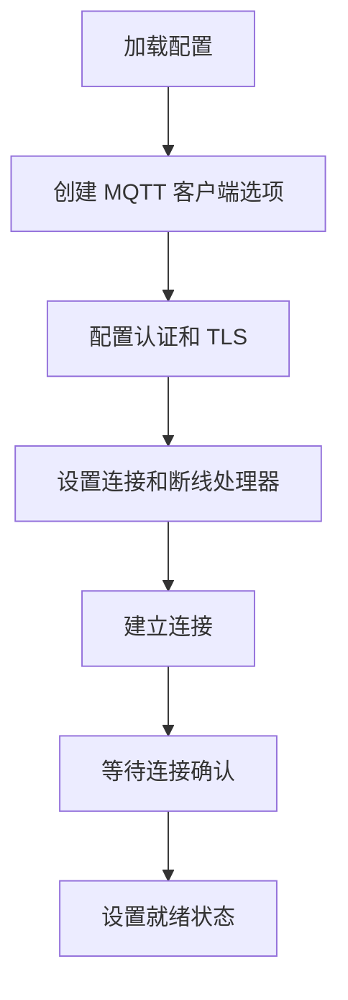
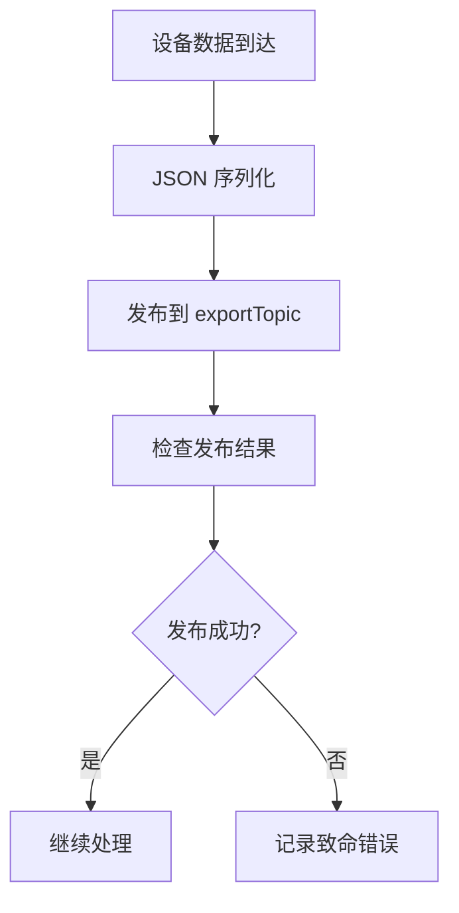
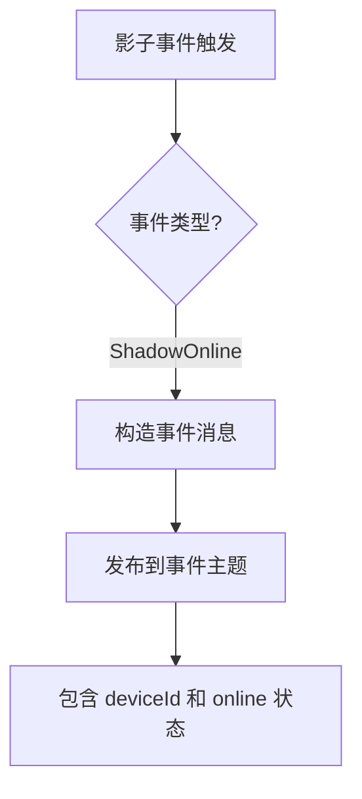

# MQTT Export

MQTT Export 插件将设备数据发布到 MQTT Broker，实现与物联网平台的实时数据同步和设备状态事件上报。

## 特性

- 基于 Eclipse Paho MQTT 客户端
- 支持 QoS 0 消息发布（最多一次送达）
- TLS/SSL 加密连接支持
- 用户名密码认证
- 设备影子在线状态事件上报
- 自动重连和连接状态管理
- 异步消息发布

## 配置说明

在 `config.json` 的 `exports` 部分配置：

```json
{
  "name": "mqtt",
  "enable": true,
  "config": {
    "broker": "tcp://localhost:1883",
    "username": "",
    "password": "",
    "client_id": "driver-box-001",
    "exportTopic": "/driverbox/data"
  }
}
```

### 配置参数说明

| 参数 | 类型 | 必填 | 说明 |
|------|------|------|------|
| broker | string | 是 | MQTT Broker 地址，支持 `tcp://host:port` 或 `ssl://host:port` |
| username | string | 否 | 认证用户名，为空表示匿名连接 |
| password | string | 否 | 认证密码 |
| client_id | string | 是 | 客户端标识符，需保证唯一性 |
| exportTopic | string | 是 | 设备数据发布主题路径 |

## 运行原理

### 初始化流程



### 数据导出流程



### 事件处理流程



### 消息格式

#### 设备数据消息
发布到 `exportTopic`：

```json
{
  "id": "device-001",
  "values": [
    {
      "pointName": "temperature",
      "value": 25.5
    },
    {
      "pointName": "humidity", 
      "value": 60
    }
  ]
}
```

#### 设备影子事件消息
发布到 `/driverbox/event/{client_id}`：

```json
{
  "deviceId": "device-001",
  "online": true
}
```

### 连接管理

- **连接超时**: 5 秒超时控制
- **TLS 配置**: 当使用 `ssl://` 协议时自动启用 TLS，跳过证书验证
- **断线处理**: 连接丢失时记录致命错误（可能需要改进为自动重连）
- **就绪状态**: 连接成功后 `IsReady()` 返回 `true`

## 事件支持

MQTT Export 实现了 `OnEvent` 接口，目前支持：

- **ShadowOnline**: 设备影子在线状态变化事件
  - 参数：`key` = 设备 ID，`eventValue` = 布尔值在线状态
  - 动作：发布设备在线状态变更消息

## 错误处理

- 连接失败时返回错误
- 发布失败时调用 `log.Fatal`（生产环境应考虑更优雅的错误处理）
- 连接丢失时记录致命错误

## 性能考虑

- 使用异步消息发布，不阻塞数据采集流程
- QoS 0 提供最佳性能但可能丢失消息
- 适合高频数据上报场景

## 安全建议

- 生产环境应配置有效的 TLS 证书验证
- 使用强密码认证
- 合理规划 Topic 层级结构
- 考虑使用 QoS 1 或 QoS 2 确保重要消息送达

## 注意事项

- 当前实现使用 `log.Fatal` 处理错误，可能导致程序退出
- 连接丢失后不会自动重连（需要改进）
- TLS 配置跳过证书验证，不适合生产环境
- ClientID 必须唯一，避免连接冲突
- 确保网络和防火墙允许到 Broker 的连接

