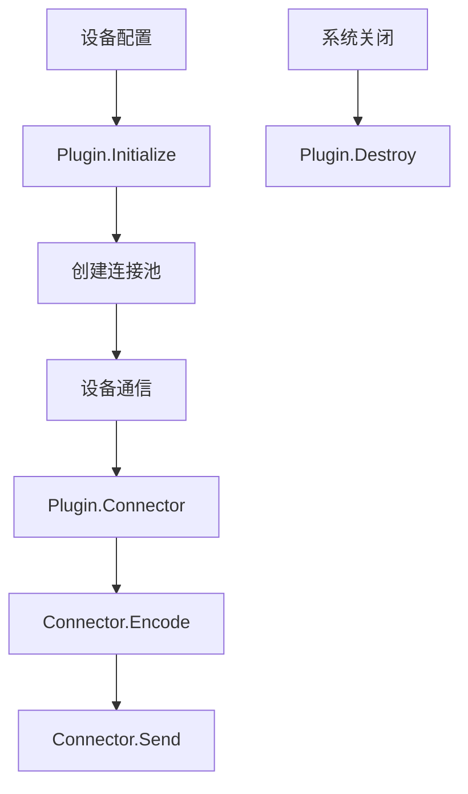

import { Tabs, TabItem } from '@astrojs/starlight/components';
import { Aside } from '@astrojs/starlight/components';

# 插件二次开发指南

本文档详细介绍如何为driver-box开发自定义协议插件，实现对各种设备通信协议的支持。

driver-box采用插件化架构，允许开发者轻松扩展新的协议支持。每个协议对应一个插件，插件需要实现标准的`Plugin`接口。

## 插件开发概述

### 什么是插件？
插件是driver-box的核心扩展机制，负责：
- **协议解析**：将通用设备操作转换为特定协议格式
- **通信管理**：管理与设备的连接和通信
- **数据处理**：处理设备数据的编码、解码和转换
- **生命周期管理**：处理插件的初始化、运行和销毁

### 插件架构


## 开发环境准备

### 前置要求
- Go 1.18+
- 熟悉Go语言和面向对象编程
- 了解目标设备的通信协议
- 掌握基本的并发编程概念

### 项目结构
```
plugins/
├── your_protocol/              # 协议名称目录
│   ├── plugin.go               # 插件入口文件
│   └── internal/               # 内部实现
│       ├── plugin.go           # Plugin接口实现
│       ├── connector.go        # Connector接口实现
│       ├── model.go           # 数据模型定义
│       └── xxx.go             # 其他辅助文件
```

## 实现Plugin接口

### 基础插件结构

<Tabs>
<TabItem label="plugin.go" icon="seti:go">
```go
package your_protocol

import (
	"github.com/ibuilding-x/driver-box/driverbox"
	"github.com/ibuilding-x/driver-box/plugins/your_protocol/internal"
)

// EnablePlugin 启用插件（必须导出此函数）
func EnablePlugin() {
	driverbox.EnablePlugin(internal.ProtocolName, new(internal.Plugin))
}
```
</TabItem>

<TabItem label="internal/plugin.go" icon="seti:go">
```go
package internal

import (
	"errors"
	"sync"
	"time"

	"github.com/ibuilding-x/driver-box/driverbox"
	"github.com/ibuilding-x/driver-box/driverbox/plugin"
	"github.com/ibuilding-x/driver-box/pkg/config"
	"go.uber.org/zap"
)

// 协议名称常量
const ProtocolName = "your_protocol"

// Plugin 插件主结构
 type Plugin struct {
	connPool map[string]*connector // 连接池
	config   config.DeviceConfig
	mutex    sync.RWMutex
}

// Initialize 初始化插件
func (p *Plugin) Initialize(c config.DeviceConfig) {
	p.config = c
	p.connPool = make(map[string]*connector)
	
	// 初始化所有连接
	p.initConnections(c)
	
	driverbox.Log().Info("plugin initialized", 
		zap.String("protocol", ProtocolName),
		zap.Int("connections", len(c.Connections)))
}

// Connector 获取设备连接器
func (p *Plugin) Connector(deviceId string) (plugin.Connector, error) {
	p.mutex.RLock()
	defer p.mutex.RUnlock()
	
	// 根据设备ID找到对应的连接
	device, ok := driverbox.CoreCache().GetDevice(deviceId)
	if !ok {
		return nil, errors.New("device not found")
	}
	
	conn, ok := p.connPool[device.ConnectionKey]
	if !ok {
		return nil, errors.New("connection not found")
	}
	
	return conn, nil
}

// Destroy 销毁插件
func (p *Plugin) Destroy() error {
	p.mutex.Lock()
	defer p.mutex.Unlock()
	
	// 关闭所有连接
	for key, conn := range p.connPool {
		if err := conn.Release(); err != nil {
			driverbox.Log().Error("release connector failed", 
				zap.String("connection", key), 
				zap.Error(err))
		}
	}
	
	p.connPool = nil
	driverbox.Log().Info("plugin destroyed", zap.String("protocol", ProtocolName))
	return nil
}
```
</TabItem>
</Tabs>

## 实现Connector接口

Connector负责管理单个设备的通信连接：

<Tabs>
<TabItem label="internal/connector.go" icon="seti:go">
```go
package internal

import (
	"errors"
	"time"

	"github.com/ibuilding-x/driver-box/driverbox/plugin"
	"go.uber.org/zap"
)

// connector 连接器实现
 type connector struct {
	plugin      *Plugin
	config      *ConnectionConfig
	client      interface{}           // 协议客户端实例
	lastActive  time.Time
	mutex       sync.RWMutex
	closed      bool
	deviceId    string
}

// Encode 编码设备操作
func (c *connector) Encode(deviceId string, mode plugin.EncodeMode, values ...plugin.PointData) (interface{}, error) {
	if c.closed {
		return nil, errors.New("connector is closed")
	}
	
	c.mutex.Lock()
	defer c.mutex.Unlock()
	
	switch mode {
	case plugin.ReadMode:
		return c.encodeRead(deviceId, values)
	case plugin.WriteMode:
		return c.encodeWrite(deviceId, values)
	default:
		return nil, errors.New("unsupported encode mode")
	}
}

// Send 发送数据到设备
func (c *connector) Send(data interface{}) error {
	if c.closed {
		return errors.New("connector is closed")
	}
	
	c.mutex.Lock()
	defer c.mutex.Unlock()
	
	// 实现具体的发送逻辑
	// 例如：序列化数据并通过网络发送
	if err := c.sendData(data); err != nil {
		c.lastActive = time.Now() // 更新最后活跃时间
		return err
	}
	
	c.lastActive = time.Now()
	return nil
}

// Release 释放资源
func (c *connector) Release() error {
	c.mutex.Lock()
	defer c.mutex.Unlock()
	
	if c.closed {
		return nil
	}
	
	c.closed = true
	
	// 关闭底层连接
	if c.client != nil {
		// 根据具体协议关闭客户端
		// 例如：c.client.Close()
	}
	
	driverbox.Log().Info("connector released", 
		zap.String("device", c.deviceId))
	return nil
}

// 编码读取操作
func (c *connector) encodeRead(deviceId string, values []plugin.PointData) (interface{}, error) {
	// 根据协议规范构建读取请求
	// 这里需要根据具体的协议格式来实现
	request := map[string]interface{}{
		"device_id": deviceId,
		"operation": "read",
		"points":    values,
	}
	return request, nil
}

// 编码写入操作
func (c *connector) encodeWrite(deviceId string, values []plugin.PointData) (interface{}, error) {
	// 根据协议规范构建写入请求
	request := map[string]interface{}{
		"device_id": deviceId,
		"operation": "write",
		"points":    values,
	}
	return request, nil
}

// 发送数据的具体实现
func (c *connector) sendData(data interface{}) error {
	// 实现具体的网络发送逻辑
	// 例如使用TCP/UDP/HTTP等协议发送数据
	// 这里只是示例，需要根据具体协议实现
	
	driverbox.Log().Debug("sending data", 
		zap.String("device", c.deviceId),
		zap.Any("data", data))
	
	// TODO: 实现实际的发送逻辑
	// 例如：
	// if tcpConn, ok := c.client.(*net.TCPConn); ok {
	//     _, err := tcpConn.Write(serializedData)
	//     return err
	// }
	
	return nil
}
```
</TabItem>
</Tabs>

## 配置管理

### 连接配置定义

<Tabs>
<TabItem label="internal/model.go" icon="seti:go">
```go
package internal

import "encoding/json"

// ConnectionConfig 连接配置
 type ConnectionConfig struct {
	Host           string        `json:"host"`           // 主机地址
	Port           int           `json:"port"`           // 端口
	Timeout        time.Duration `json:"timeout"`        // 超时时间
	ConnectionKey  string        `json:"connectionKey"`  // 连接标识
	Enable         bool          `json:"enable"`         // 是否启用
	// 协议特定的配置项
	CustomParam1   string        `json:"customParam1"`   // 自定义参数1
	CustomParam2   int           `json:"customParam2"`   // 自定义参数2
}

// UnmarshalJSON 自定义JSON反序列化
func (c *ConnectionConfig) UnmarshalJSON(data []byte) error {
	// 可以在这里添加配置验证逻辑
	return json.Unmarshal(data, c)
}
```
</TabItem>
</Tabs>

## 错误处理

### 标准错误定义
```go
var (
	// ErrConnectionFailed 连接失败
	ErrConnectionFailed = errors.New("connection failed")
	// ErrDeviceNotFound 设备未找到
	ErrDeviceNotFound = errors.New("device not found")
	// ErrInvalidResponse 无效的响应
	ErrInvalidResponse = errors.New("invalid response")
	// ErrTimeout 操作超时
	ErrTimeout = errors.New("operation timeout")
)
```

### 日志记录最佳实践
```go
// 使用driverbox的统一日志系统
driverbox.Log().Info("operation successful", 
    zap.String("protocol", ProtocolName),
    zap.String("device", deviceId),
    zap.Duration("duration", duration))

driverbox.Log().Error("operation failed", 
    zap.String("protocol", ProtocolName),
    zap.String("device", deviceId),
    zap.Error(err))
```

## 测试插件

### 单元测试示例
```go
package internal_test

import (
	"testing"
	"time"

	"github.com/ibuilding-x/driver-box/driverbox/plugin"
	"github.com/ibuilding-x/driver-box/plugins/your_protocol/internal"
	"github.com/stretchr/testify/assert"
)

func TestPlugin_Initialize(t *testing.T) {
	plugin := &internal.Plugin{}
	config := createTestConfig() // 创建测试配置
	
	plugin.Initialize(config)
	assert.NotNil(t, plugin.connPool)
}

func TestConnector_Encode(t *testing.T) {
	conn := &internal.connector{}
	values := []plugin.PointData{
		{PointName: "temperature", Value: "25.5"},
	}
	
	result, err := conn.Encode("test_device", plugin.ReadMode, values...)
	assert.NoError(t, err)
	assert.NotNil(t, result)
}
```

### 集成测试
创建测试配置文件 `test_config.json`：
```json
{
  "deviceModels": [
    {
      "name": "测试设备",
      "devices": [
        {
          "id": "test-device-001",
          "connectionKey": "test-connection"
        }
      ]
    }
  ],
  "connections": {
    "test-connection": {
      "host": "localhost",
      "port": 8080,
      "timeout": 5000,
      "enable": true
    }
  },
  "protocolName": "your_protocol"
}
```

## 调试技巧

<Aside type="tip" title="调试建议">
- 使用driver-box的日志系统记录详细的调试信息
- 在关键函数中添加性能监控
- 使用Go的pprof工具分析性能瓶颈
- 模拟设备响应进行离线测试
</Aside>

### 常见调试方法
1. **日志调试**：在关键路径添加详细日志
2. **模拟测试**：创建模拟设备和服务器
3. **协议分析**：使用Wireshark等工具分析协议
4. **断点调试**：使用IDE进行断点调试

## 最佳实践

### 性能优化
- **连接复用**：使用连接池避免频繁建立连接
- **并发控制**：合理使用goroutine和channel
- **内存管理**：及时释放不再使用的资源
- **超时控制**：为所有IO操作设置合理的超时

### 代码质量
- **错误处理**：妥善处理所有可能的错误情况
- **资源管理**：确保资源的正确释放
- **接口隔离**：遵循单一职责原则
- **测试覆盖**：为关键逻辑编写充分的测试

### 安全性考虑
- **输入验证**：严格验证所有外部输入
- **访问控制**：实现适当的认证和授权
- **数据加密**：敏感数据需要加密传输
- **异常防护**：防止恶意输入导致的安全漏洞

## 发布插件

### 插件注册
确保在插件包中导出 `EnablePlugin` 函数：
```go
// 在 plugin.go 中
func EnablePlugin() {
    driverbox.EnablePlugin(internal.ProtocolName, new(internal.Plugin))
}
```

### 在主程序中启用
在 `main.go` 或相关配置中启用新插件：
```go
import _ "github.com/ibuilding-x/driver-box/plugins/your_protocol"
```

## 下一步

- [插件配置详解](/driver-box/plugins/configuration/) - 深入了解插件配置选项
- [设备模型库](/driver-box/library/models/) - 学习如何使用设备模型
- [API开发指南](/driver-box/developer/api/) - 开发自定义导出功能
- [贡献指南](/driver-box/contributing/) - 将您的插件贡献给社区
