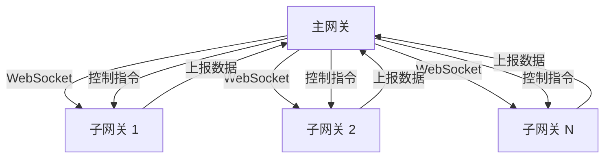

# Gateway 插件

Gateway 插件是 driver-box 的核心插件，用于连接和管理子网关设备，实现主网关与子网关之间的数据同步和设备管理。

## 特性

- 基于 WebSocket 的长连接通信
- 自动重连机制
- 双向数据同步（模型、设备、影子数据）
- 远程控制指令下发
- 心跳保活机制

## 连接配置

连接配置位于 `config.json` 的 `connections` 字段下：

```json
{
  "plugin": "driverbox",
  "connections": {
    "gateway-1": {
      "ip": "192.168.1.100",
      "timeout": "5s",
      "reconnect_interval": "30s"
    }
  }
}
```

### 配置参数说明

| 参数 | 类型 | 必填 | 说明 |
|------|------|------|------|
| ip | string | 是 | 子网关 IP 地址 |
| timeout | string | 否 | 连接超时时间，默认 `5s` |
| reconnect_interval | string | 否 | 重连间隔时间，默认 `30s` |

## 运行原理

### 连接架构



### 通信流程

#### 1. 连接建立
- 主网关主动向子网关发起 WebSocket 连接
- 连接 URL: `ws://{子网关IP}:{主网关HTTP端口}/gateway`
- 支持连接超时和自动重连

#### 2. 注册认证
- 连接成功后发送注册消息
- 子网关验证并回复注册响应
- 注册成功后更新网关设备状态

#### 3. 数据同步

##### 模型同步 (WSForSyncModels)
- 子网关向主网关同步设备模型定义
- 主网关将模型存储到 CoreCache

##### 设备同步 (WSForSyncDevices)
- 子网关向主网关同步设备实例信息
- 主网关合并本地配置（描述、属性等）
- 更新设备连接键为子网关 IP

##### 影子同步 (WSForSyncShadow)
- 子网关向主网关同步设备影子数据
- 主网关更新设备点位状态

#### 4. 数据上报 (WSForReport)
- 子网关上报设备采集数据
- 主网关解析后导出到上层系统

#### 5. 控制指令 (WSForControl)
- 主网关向子网关下发写操作指令
- 子网关执行后返回控制响应

#### 6. 心跳保活
- 定期发送 Ping 消息
- 子网关回复 Pong 响应
- 维持连接活跃状态

### 消息类型

| 消息类型 | 方向 | 说明 |
|----------|------|------|
| WSForRegister | 主→子 | 注册请求 |
| WSForRegisterRes | 子→主 | 注册响应 |
| WSForUnregister | 主→子 | 注销请求 |
| WSForUnregisterRes | 子→主 | 注销响应 |
| WSForPing | 主→子 | 心跳请求 |
| WSForPong | 子→主 | 心跳响应 |
| WSForSyncModels | 子→主 | 模型同步 |
| WSForSyncModelsRes | 主→子 | 模型同步响应 |
| WSForSyncDevices | 子→主 | 设备同步 |
| WSForSyncDevicesRes | 主→子 | 设备同步响应 |
| WSForSyncShadow | 子→主 | 影子同步 |
| WSForSyncShadowRes | 主→子 | 影子同步响应 |
| WSForReport | 子→主 | 数据上报 |
| WSForControl | 主→子 | 控制指令 |
| WSForControlRes | 子→主 | 控制响应 |

## 重连机制

- 连接断开后自动重连
- 重连间隔可配置
- 支持优雅关闭（Destroy 时停止重连）
- 连接状态通过设备影子维护

## 使用场景

1. **分布式部署**: 主网关管理多个子网关
2. **边缘计算**: 子网关就近采集，主网关统一管控
3. **网络隔离**: 子网关部署在不同网络区域
4. **负载分担**: 多子网关分担设备接入压力

## 注意事项

- 子网关需要运行对应的 driver-box 实例
- IP 地址必须可达且防火墙允许 WebSocket 连接
- 建议配置合理的重连间隔避免频繁连接
- 控制指令仅处理 WriteMode，ReadMode 会被过滤
- 连接键会被替换为子网关 IP 地址

## 相关代码

- 插件入口：`plugins/gateway/plugin.go`
- 核心实现：`plugins/gateway/internal/gwplugin.go`
- 连接器：`plugins/gateway/internal/connector.go`