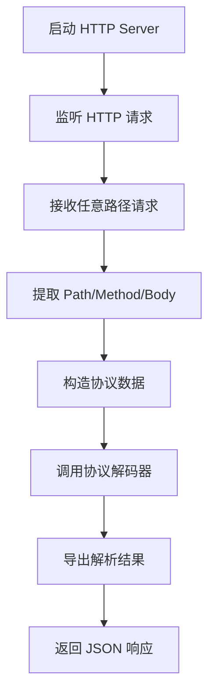

# HTTP Server 插件

HTTP Server 插件提供 HTTP 服务端功能，监听指定端口接收 HTTP 请求，提取请求路径、方法和 Body 数据，并通过协议解码器解析后导出。

## 特性

- 基于 Gin 框架实现高性能 HTTP 服务
- 支持任意 HTTP 方法和路径
- 自动提取请求 Body 进行协议解析
- 返回标准 JSON 响应格式

## 连接配置

连接配置位于 `config.json` 的 `connections` 字段下：

```json
{
  "plugin": "http_server",
  "connections": {
    "http-server-1": {
      "host": "0.0.0.0",
      "port": 8080,
      "protocolKey": "custom-protocol"
    }
  }
}
```

### 配置参数说明

| 参数 | 类型 | 必填 | 说明 |
|------|------|------|------|
| host | string | 是 | 监听主机地址，`0.0.0.0` 表示监听所有接口 |
| port | uint16 | 是 | 监听端口号 |
| protocolKey | string | 否 | 协议解码器键名，用于解析 HTTP 请求数据 |

## 运行原理

### 数据流程



### 处理流程

1. **服务器启动**：使用 Gin 框架启动 HTTP 服务
2. **请求接收**：注册 NoRoute 处理器接收所有未定义路由的请求
3. **数据提取**：从 HTTP 请求中提取 URL 路径、请求方法和 Body 内容
4. **协议封装**：将提取的数据封装为 `protoData` 结构
5. **协议解码**：通过协议解码器解析数据为结构化设备数据
6. **数据导出**：将解析结果发送到导出系统
7. **响应返回**：向客户端返回标准 JSON 响应

## 请求数据处理

HTTP Server 插件会捕获所有 HTTP 请求的以下信息：

- **Path**: 请求的 URL 路径
- **Method**: HTTP 请求方法（GET、POST 等）
- **Body**: 请求体内容（完整字符串）

这些信息会被组合成 JSON 格式传递给协议解码器：

```json
{
  "path": "/api/data",
  "method": "POST",
  "body": "原始请求体内容"
}
```

## 响应格式

成功响应：
```json
{
  "code": 0,
  "message": "ok"
}
```

错误响应：
```json
{
  "code": -1,
  "message": "错误信息"
}
```

## 注意事项

- HTTP Server 插件不支持数据写入操作（Send/Encode）
- 使用 NoRoute 捕获所有未定义路由，适合接收任意格式的 HTTP 数据
- 需要确保配置的端口未被占用
- 建议设置合适的 `protocolKey` 以使用正确的协议解码器
- 适用于接收第三方系统推送的数据或 Webhook 场景

## 相关代码

- 插件入口：`plugins/httpserver/plugin.go`
- 核心实现：`plugins/httpserver/internal/plugin.go`
- 连接器：`plugins/httpserver/internal/connector.go`