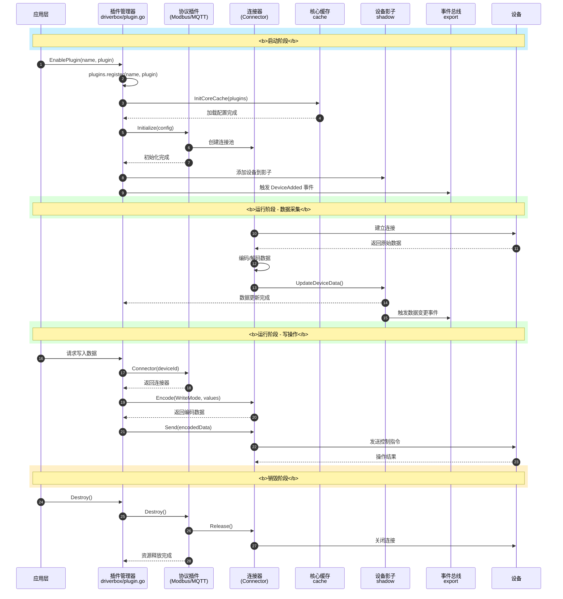
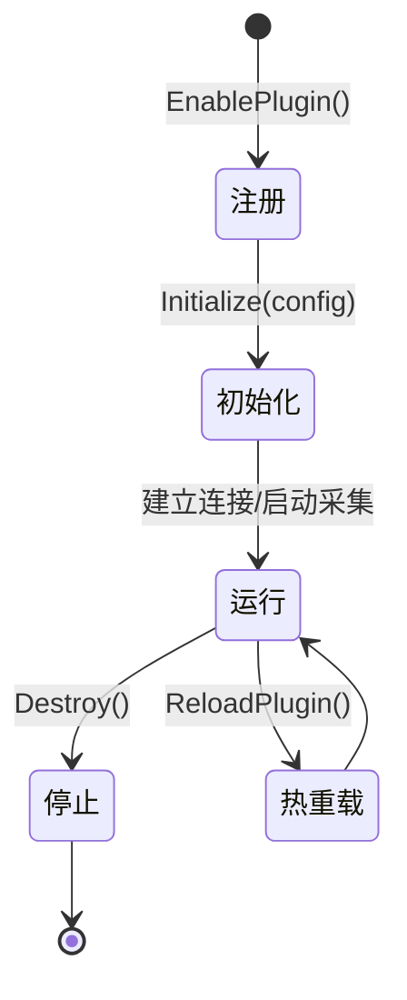
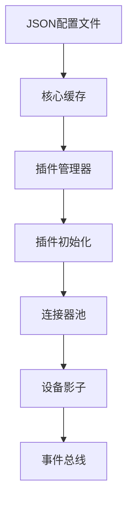

import { Aside } from '@astrojs/starlight/components';

Plugin 是 driver-box 架构的核心，通过标准化的接口设计实现设备协议的无限扩展能力。本文档详细介绍插件系统的设计原理、接口定义和使用方法。

## 设计理念

driver-box 采用**微内核+插件**的架构设计：

- **微内核**：提供基础功能（设备影子、核心缓存、事件总线）
- **插件层**：实现具体协议逻辑（Modbus、MQTT、HTTP等）
- **松耦合**：插件之间独立，通过标准接口与内核交互

## 核心架构



## 插件生命周期

插件从注册到销毁经历完整的生命周期：



### 生命周期详解

1. **注册阶段**：通过 `EnablePlugin()` 向插件管理器注册
2. **初始化阶段**：系统调用 `Initialize(config)` 加载配置
3. **运行阶段**：插件建立连接、启动数据采集任务
4. **热重载**：配置变更时调用 `ReloadPlugin()` 无缝重启
5. **销毁阶段**：调用 `Destroy()` 释放所有资源

## 核心接口设计

### Plugin 接口

所有插件必须实现 `Plugin` 接口 ([`driverbox/plugin/plugin.go:26`](https://github.com/ibuilding-x/driver-box/blob/main/driverbox/plugin/plugin.go:26))：

```go title="driverbox/plugin/plugin.go"
type Plugin interface {
    // Initialize 初始化插件
    // 参数 c: 设备配置信息，包含连接参数、设备列表等
    Initialize(c config.DeviceConfig)

    // Connector 获取指定设备的连接器
    // 参数 deviceId: 设备唯一标识符
    // 返回: 连接器实例，不支持时返回 NotSupportGetConnector 错误
    Connector(deviceId string) (connector Connector, err error)

    // Destroy 销毁插件并释放资源
    // 返回: 销毁过程中的错误
    Destroy() error
}
```

### Connector 接口

连接器负责与单个设备进行实际的通信操作 ([`driverbox/plugin/plugin.go:64`](https://github.com/ibuilding-x/driver-box/blob/main/driverbox/plugin/plugin.go:64))：

```go title="driverbox/plugin/plugin.go"
type Connector interface {
    // Encode 编码设备操作指令
    // 参数 deviceId: 设备ID, mode: 读/写模式, values: 点位数据
    // 返回: 编码后的数据，不支持时返回 NotSupportEncode 错误
    Encode(deviceId string, mode EncodeMode, values ...PointData) (
        res interface{}, err error)

    // Send 发送编码后的数据到设备
    // 参数 data: 通过 Encode 方法编码后的数据
    // 返回: 发送过程中的错误
    Send(data interface{}) (err error)

    // Release 释放连接器占用的资源
    // 返回: 释放过程中的错误
    Release() (err error)
}
```

### 数据结构

**EncodeMode 编码模式** ([`driverbox/plugin/model.go:11`](https://github.com/ibuilding-x/driver-box/blob/main/driverbox/plugin/model.go:11))：

```go title="driverbox/plugin/model.go"
type EncodeMode string

const (
    ReadMode  EncodeMode = "read"  // 读模式，从设备读取数据
    WriteMode EncodeMode = "write" // 写模式，向设备写入数据
)
```

**PointData 点位数据** ([`driverbox/plugin/model.go:26`](https://github.com/ibuilding-x/driver-box/blob/main/driverbox/plugin/model.go:26))：

```go title="driverbox/plugin/model.go"
type PointData struct {
    PointName string      `json:"name"`  // 点位名称
    Value     interface{} `json:"value"` // 点位值
}
```

**DeviceData 设备数据** ([`driverbox/plugin/model.go:36`](https://github.com/ibuilding-x/driver-box/blob/main/driverbox/plugin/model.go:36))：

```go title="driverbox/plugin/model.go"
type DeviceData struct {
    ID         string        `json:"id"`     // 设备唯一标识
    Values     []PointData    `json:"values"` // 点位值数组
    Events     []event.Data   `json:"events"` // 事件数组
    ExportType ExportType     `json:"exportType"` // 导出类型
}
```

**ExportType 导出类型**：

```go title="driverbox/plugin/model.go"
type ExportType string

const (
    RealTimeExport ExportType = "realTimeExport" // 实时上报类型
)
```

## 插件管理器实现

插件管理器位于 [`driverbox/plugin.go`](https://github.com/ibuilding-x/driver-box/blob/main/driverbox/plugin.go)，负责插件的注册、加载和销毁。

### 插件注册

```go title="driverbox/plugin.go"
// EnablePlugin 注册插件到系统
// name: 插件名称（建议使用协议名称）
// plugin: 实现了 Plugin 接口的插件实例
func EnablePlugin(name string, plugin plugin.Plugin) {
    plugins.register(name, plugin)
}
```

**使用示例**（参考 [`plugins/modbus/plugin.go`](https://github.com/ibuilding-x/driver-box/blob/main/plugins/modbus/plugin.go)）：

```go title="plugins/modbus/plugin.go"
package modbus

import (
    "github.com/ibuilding-x/driver-box/driverbox"
    "github.com/ibuilding-x/driver-box/plugins/modbus/internal"
)

func EnablePlugin() {
    driverbox.EnablePlugin(internal.ProtocolName, new(internal.Plugin))
}
```

### 插件加载

`loadPlugins()` 函数负责加载并启动所有已注册的插件：

```go title="driverbox/plugin.go"
func loadPlugins() error {
    // 1. 卸载旧的驱动库
    library.Driver().UnloadDeviceDrivers()
    library.Protocol().UnloadDeviceDrivers()

    // 2. 初始化核心缓存
    _, err := cache.InitCoreCache(plugins.plugins)
    if err != nil {
        return err
    }

    // 3. 初始化设备影子服务
    initDeviceShadow()

    // 4. 启动所有插件
    for key, p := range plugins.plugins {
        p.Initialize(cache.GetConfig(key))
    }

    // 5. 触发设备添加事件
    for _, device := range cache.Get().Devices() {
        export.TriggerEvents(event.DeviceAdded, device.ID, nil)
    }

    return nil
}
```

### 插件销毁

```go title="driverbox/plugin.go"
func destroyPlugins() {
    for key, p := range plugins.plugins {
        err := p.Destroy()
        if err != nil {
            Log().Error("stop plugin error", zap.String("plugin", key), zap.Error(err))
        }
    }
}
```

### 插件热重载

```go title="driverbox/plugin.go"
// ReloadPlugin 重启指定名称的插件
func ReloadPlugin(pluginName string) {
    cfg := cache.GetConfig(pluginName)
    p := plugins.plugins[pluginName]
    p.Destroy()
    p.Initialize(cfg)
}

// ReloadPlugins 重启所有插件
func ReloadPlugins() {
    for name := range plugins.plugins {
        ReloadPlugin(name)
    }
}
```

## 插件实现示例

### Modbus 插件

Modbus 插件是典型的协议插件实现 ([`plugins/modbus/internal/plugin.go`](https://github.com/ibuilding-x/driver-box/blob/main/plugins/modbus/internal/plugin.go))：

```go title="plugins/modbus/internal/plugin.go"
type Plugin struct {
    connPool map[string]*connector // 连接器池
    config   config.DeviceConfig   // 配置信息
}

// Initialize 初始化插件
func (p *Plugin) Initialize(c config.DeviceConfig) {
    p.config = c
    p.initNetworks(c) // 初始化连接池和采集任务
}

// Connector 获取设备连接器
func (p *Plugin) Connector(deviceId string) (conn plugin.Connector, err error) {
    device, ok := driverbox.CoreCache().GetDevice(deviceId)
    if !ok {
        return nil, errors.New("not found device")
    }
    c, ok := p.connPool[device.ConnectionKey]
    if !ok {
        return nil, errors.New("not found connection")
    }
    return c, nil
}

// Destroy 销毁插件
func (p *Plugin) Destroy() error {
    for _, conn := range p.connPool {
        conn.Close()
    }
    return nil
}
```

**Modbus 连接器** ([`plugins/modbus/internal/connector.go`](https://github.com/ibuilding-x/driver-box/blob/main/plugins/modbus/internal/connector.go))：

```go title="plugins/modbus/internal/connector.go"
type connector struct {
    config        *ConnectionConfig
    plugin        *Plugin
    client        *modbus.ModbusClient
    devices       map[uint8]*slaveDevice
    collectTask   *crontab.Future
    // ... 其他字段
}

// Encode 编码点位数据为 Modbus 协议帧
func (c *connector) Encode(deviceId string, mode plugin.EncodeMode,
    values ...plugin.PointData) (interface{}, error) {
    // 实现 Modbus 协议编码逻辑
}

// Send 发送编码后的数据
func (c *connector) Send(data interface{}) error {
    // 实现 Modbus 协议发送逻辑
}

// Release 释放连接器资源
func (c *connector) Release() error {
    // 关闭连接、停止采集任务等
}
```

### MQTT 插件

MQTT 插件实现了发布/订阅协议 ([`plugins/mqtt/internal/plugin.go`](https://github.com/ibuilding-x/driver-box/blob/main/plugins/mqtt/internal/plugin.go))：

```go title="plugins/mqtt/internal/plugin.go"
type Plugin struct {
    connectors map[string]*connector
}

// Initialize 初始化连接池
func (p *Plugin) Initialize(c config.DeviceConfig) {
    go func() {
        p.initConnPool(c)
    }()
}

// Connector 获取 MQTT 连接器
func (p *Plugin) Connector(deviceId string) (plugin.Connector, error) {
    device, ok := driverbox.CoreCache().GetDevice(deviceId)
    if !ok {
        return nil, errors.New("not found device")
    }
    c, ok := p.connectors[device.ConnectionKey]
    if !ok {
        return nil, errors.New("not found connection")
    }
    return c, nil
}

// Destroy 销毁插件
func (p *Plugin) Destroy() error {
    for _, conn := range p.connectors {
        go conn.client.Disconnect(0)
    }
    return nil
}
```

## 配置加载流程

插件配置的加载过程如下：



配置加载的关键步骤：

1. **配置扫描**：扫描 `res/driver/` 目录下的所有配置文件
2. **核心缓存**：解析配置并存储到核心缓存中
3. **插件初始化**：调用插件的 `Initialize()` 方法传递配置
4. **连接器创建**：根据配置创建连接器实例
5. **设备影子注册**：将设备注册到影子服务中

## 内置插件列表

| 插件名称 | 协议类型 | 状态 | 描述 | 目录 |
|----------|----------|------|------|------|
| modbus | 工业协议 | ✅ 稳定 | Modbus RTU/TCP | `plugins/modbus/` |
| mqtt | 物联网协议 | ✅ 稳定 | MQTT 3.1.1/5.0 | `plugins/mqtt/` |
| httpclient | Web协议 | ✅ 稳定 | HTTP客户端 | `plugins/httpclient/` |
| httpserver | Web协议 | ✅ 稳定 | HTTP服务端 | `plugins/httpserver/` |
| websocket | Web协议 | ✅ 稳定 | WebSocket | `plugins/websocket/` |
| tcpserver | 网络协议 | ✅ 稳定 | TCP服务端 | `plugins/tcpserver/` |
| bacnet | 楼控协议 | ✅ 稳定 | BACnet | `plugins/bacnet/` |
| dlt645 | 电表协议 | ✅ 稳定 | DL/T645 | `plugins/dlt645/` |
| gateway | 网关协议 | ✅ 稳定 | 通用网关 | `plugins/gateway/` |
| mirror | 数据复制 | ✅ 稳定 | 数据镜像 | `plugins/mirror/` |

## 错误处理

插件接口定义了标准错误类型 ([`driverbox/plugin/plugin.go:12`](https://github.com/ibuilding-x/driver-box/blob/main/driverbox/plugin/plugin.go:12))：

```go title="driverbox/plugin/plugin.go"
var (
    NotSupportGetConnector = errors.New("the protocol does not support getting connector")
    NotSupportEncode      = errors.New("the protocol adapter does not support encode functions")
    NotSupportDecode      = errors.New("the protocol adapter does not support decode functions")
)
```

**错误处理最佳实践**：

```go
// 1. 检查是否支持连接器
conn, err := plugin.Connector(deviceId)
if errors.Is(err, plugin.NotSupportGetConnector) {
    log.Info("协议不支持连接器模式")
} else if err != nil {
    log.Error("获取连接器失败", zap.Error(err))
    return
}

// 2. 检查是否支持编码
data, err := conn.Encode(deviceId, plugin.ReadMode, points...)
if errors.Is(err, plugin.NotSupportEncode) {
    log.Info("协议不支持编码")
} else if err != nil {
    log.Error("编码失败", zap.Error(err))
    return
}
```

## 最佳实践

<Aside type="tip" title="单一职责原则">
每个插件只负责一种协议的实现，保持插件职责清晰、独立。
</Aside>

<Aside type="note" title="资源管理">
在 Destroy() 方法中正确释放所有资源，包括连接、协程、定时任务等。
</Aside>

<Aside type="caution" title="并发安全">
使用互斥锁保护共享状态，确保并发访问的安全性。
</Aside>

<Aside type="danger" title="错误处理">
实现完善的错误处理机制，包括重试、降级和恢复策略。
</Aside>

### 设计原则

1. **接口优先**：基于标准接口开发，确保插件可替换性
2. **配置驱动**：通过配置文件控制插件行为，避免硬编码
3. **资源隔离**：每个连接器独立管理资源，故障隔离
4. **日志记录**：记录关键操作和错误，便于排查问题

### 性能优化

1. **连接复用**：连接器池管理，避免频繁创建销毁
2. **批量操作**：支持批量读写，减少通信次数
3. **异步处理**：非阻塞 I/O，提高并发性能
4. **定时采集**：使用定时任务进行数据采集，避免轮询

## 相关文档

- [**核心缓存**](/concepts/corecache/) - 了解配置管理和数据缓存
- [**设备影子**](/concepts/device-shadow/) - 了解设备数据存储和管理
- [**导出系统**](/concepts/export-system/) - 了解数据导出机制
- [**配置化接入**](/concepts/configuration-driven/) - 了解配置文件结构
- [**架构设计**](/concepts/architecture/) - 了解整体架构设计