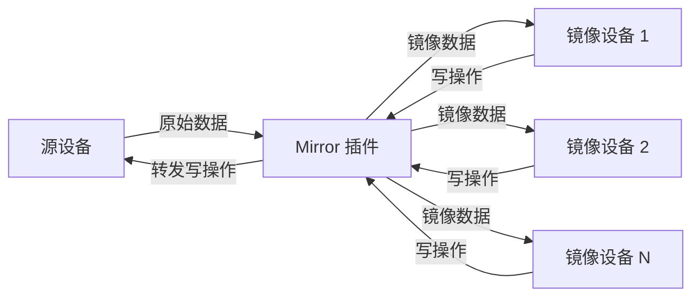

# Mirror 插件

Mirror 插件提供设备数据镜像功能，可以将一个源设备的数据映射到一个或多个镜像设备，实现数据的复制和分发。

## 特性

- 支持一对多数据镜像
- 双向数据同步（读/写）
- 避免镜像循环依赖
- 自动点位分组优化

## 配置说明

Mirror 插件不需要连接配置（`connections`），直接在设备模型中配置镜像关系。

### 点位配置

镜像点位需要通过字段扩展指定源设备和源点位：

```json
{
  "name": "mirror_temperature",
  "fieldExtend": {
    "rawDevice": "source-device-001",
    "rawPoint": "temperature"
  }
}
```

### 字段扩展说明

| 字段 | 类型 | 必填 | 说明 |
|------|------|------|------|
| rawDevice | string | 是 | 源设备 ID |
| rawPoint | string | 是 | 源点位名称 |

## 运行原理

### 数据映射关系



### 映射表结构

1. **镜像映射 (mirrors)**: `镜像设备ID → {镜像点位 → 源设备信息}`
2. **原始映射 (rawMapping)**: `源设备ID → {源点位 → [镜像设备数据]}`

### 数据流向

#### 读取流程（源设备 → 镜像设备）
1. 源设备数据通过 ExportTo 进入 Mirror 插件
2. 根据 `rawMapping` 查找对应的镜像设备
3. 将数据复制到所有关联的镜像设备
4. 镜像设备数据继续导出到其他系统

#### 写入流程（镜像设备 → 源设备）
1. 向镜像设备写入数据时，Mirror 插件拦截操作
2. 根据 `mirrors` 映射找到对应的源设备点位
3. 将多个镜像点位按源设备分组
4. 转发写操作到源设备

### 点位分组优化

写入操作时，Mirror 插件会自动将同一源设备的多个点位操作合并，减少通信次数：

```
镜像设备 A: point1 → 源设备 X: pointA
镜像设备 A: point2 → 源设备 X: pointB
镜像设备 B: point3 → 源设备 X: pointA

↓ 分组结果

源设备 X: [pointA, pointB] (来自多个镜像点位)
```

## 注意事项

- Mirror 设备模型中只能包含一个设备实例
- 镜像点位必须配置 `rawDevice` 和 `rawPoint` 字段
- 不支持镜像循环依赖（镜像设备不能再次被镜像）
- 适用于数据分发、设备聚合、协议转换等场景
- 写操作性能取决于源设备的响应速度

## 使用场景

1. **数据分发**: 将同一设备数据分发给多个下游系统
2. **设备聚合**: 多个物理设备数据聚合到逻辑设备
3. **协议转换**: 不同协议的设备数据共享同一数据源
4. **数据备份**: 重要设备数据的多重镜像备份

## 相关代码

- 插件入口：`plugins/mirror/plugin.go`
- 连接器：`plugins/mirror/connector.go`
- 数据模型：`plugins/mirror/model.go`