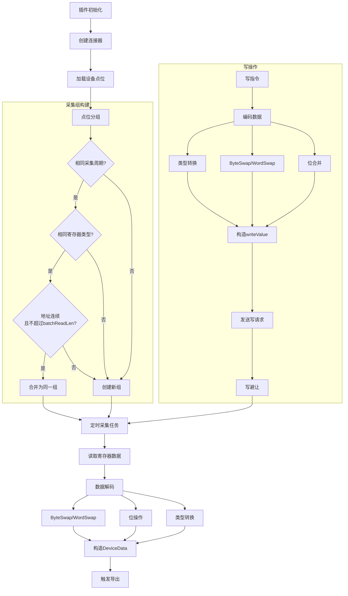

# Modbus 插件

Modbus 插件实现了 Modbus RTU 和 Modbus TCP 协议，支持从 Modbus 从站设备采集数据和写入控制命令。

## 功能特性

- **Modbus RTU**：串口通讯（支持波特率、数据位、校验位、停止位配置）
- **Modbus TCP**：TCP/IP 网络通讯
- **功能码支持**：0x01（读线圈）、0x02（读离散输入）、0x03（读保持寄存器）、0x04（读输入寄存器）、0x05/0x0F（写线圈）、0x06/0x10（写保持寄存器）
- **批量读取**：自动将相同采集频率和连续地址的点位合并读取
- **批量写入**：支持批量写入连续地址的保持寄存器
- **数据类型**：支持 Bool、String、Uint16/Int16、Uint32/Int32、Uint64/Int64、Float32/Float64
- **字节交换**：支持字节交换（ByteSwap）和字交换（WordSwap）
- **位操作**：支持寄存器中的位读写
- **读写避让**：写操作时读任务自动避让，避免冲突
- **超时处理**：连续超时后自动增加采集间隔，最大不超过 1 分钟
- **虚拟模式**：支持虚拟模式（测试用）

## 连接配置

连接配置位于 `config.json` 的 `connections` 字段下：

```json
{
  "plugin": "modbus",
  "connections": {
    "modbus-tcp-1": {
      "address": "192.168.1.100:502",
      "mode": "tcp",
      "timeout": 1000,
      "retry": 3,
      "minInterval": 100,
      "batchReadLen": 32
    }
  }
}
```

### Modbus TCP 配置示例

| 参数 | 值 |
|------|------|
| address | 192.168.1.100:502 |
| mode | tcp |
| timeout | 1000 |
| retry | 3 |
| minInterval | 100 |
| batchReadLen | 32 |

### Modbus RTU 配置示例

| 参数 | 值 |
|------|------|
| address | /dev/ttyUSB0 |
| mode | rtu |
| baudRate | 9600 |
| dataBits | 8 |
| parity | 0 |
| stopBits | 1 |
| timeout | 1000 |
| retry | 3 |
| minInterval | 100 |
| batchReadLen | 32 |

### 配置参数说明

| 参数 | 类型 | 默认值 | 说明 |
|------|------|--------|------|
| address | string | - | TCP 模式为 `IP:PORT`，RTU 模式为串口路径 |
| mode | string | - | 连接模式：`tcp` 或 `rtu` |
| baudRate | uint | 9600 | 波特率（RTU 模式） |
| dataBits | uint | 8 | 数据位（RTU 模式） |
| parity | uint | 0 | 校验位：0(无)、1(奇)、2(偶) |
| stopBits | uint | 1 | 停止位（RTU 模式） |
| timeout | uint16 | 1000 | 超时时间（毫秒） |
| retry | int | 3 | 重试次数 |
| minInterval | uint16 | 100 | 最小采集间隔（毫秒） |
| batchReadLen | uint16 | 32 | 批量读取寄存器最大数量 |
| batchWriteLen | uint16 | 120 | 批量写入寄存器最大长度 |
| virtual | bool | false | 是否启用虚拟模式（测试用） |

## 点位配置

点位配置基于通用点位定义，并添加 Modbus 协议扩展参数。

### 通用点位参数

点位的基础参数（如 `name`、`description`、`valueType`、`readWrite` 等）请参考[设备配置指南](/driver-box/guides/device-config/#点位point)。

### Modbus 扩展参数

在通用点位基础上，Modbus 插件支持以下扩展参数：

```json
{
  "name": "temperature",
  "startAddress": "40001",
  "primaryTable": "HOLDING_REGISTER",
  "rawType": "Float32",
  "duration": "5s",
  "byteSwap": false,
  "wordSwap": false
}
```

| 参数 | 类型 | 必填 | 说明 |
|------|------|------|------|
| startAddress | string | 是 | 寄存器地址（支持十进制、十六进制 `0x`、Modbus 标准格式如 `40001`） |
| primaryTable | string | 是 | 寄存器类型 |
| rawType | string | 是 | 原始数据类型 |
| duration | string | 否 | 采集周期，默认 `1s` |
| byteSwap | bool | 否 | 是否字节交换 |
| wordSwap | bool | 否 | 是否字交换（32 位及以上数据类型） |
| bit | uint8 | 否 | 位偏移（仅位操作） |
| bitLen | uint8 | 否 | 位长度（仅位操作） |
| multiWrite | bool | 否 | 是否强制使用多寄存器写接口 |

### 设备属性说明

Modbus 设备需要在 `properties` 中配置从站 ID：

| 属性 | 类型 | 必填 | 说明 |
|------|------|------|------|
| unitID | string | 是 | 从站 ID |

### 寄存器类型（primaryTable）

| 值 | 说明 | 代码 |
|----|------|------|
| COIL | 线圈（读写） | 0x01/0x05/0x0F |
| DISCRETE_INPUT | 离散输入（只读） | 0x02 |
| INPUT_REGISTER | 输入寄存器（只读） | 0x04 |
| HOLDING_REGISTER | 保持寄存器（读写） | 0x03/0x06/0x10 |

### 原始数据类型（rawType）

| rawType | 说明 | 寄存器数量 |
|---------|------|------------|
| Bool | 布尔值 | 1（COIL/DISCRETE_INPUT） |
| Uint8 | 无符号 8 位整数 | - |
| Uint16 | 无符号 16 位整数 | 1 |
| Uint32 | 无符号 32 位整数 | 2 |
| Uint64 | 无符号 64 位整数 | 4 |
| Int8 | 有符号 8 位整数 | - |
| Int16 | 有符号 16 位整数 | 1 |
| Int32 | 有符号 32 位整数 | 2 |
| Int64 | 有符号 64 位整数 | 4 |
| Float32 | 单精度浮点数 | 2 |
| Float64 | 双精度浮点数 | 4 |
| String | 字符串 | 自定义（默认 1） |

### 地址格式说明

支持多种地址格式：

- **十进制**：`100` 或 `100d` - 直接作为寄存器地址
- **十六进制**：`0x64` - 十六进制地址
- **Modbus 标准格式**：
  - `00001-09999` → `COIL`，地址 `0-9998`
  - `10001-19999` → `DISCRETE_INPUT`，地址 `0-9998`
  - `30001-39999` → `INPUT_REGISTER`，地址 `0-9998`
  - `40001-49999` → `HOLDING_REGISTER`，地址 `0-9998`

## 批量采集

插件自动将相同采集频率、相同寄存器类型、连续地址的点位合并为一个采集组：

- 相同 `duration` 的点位分为一组
- 相同 `primaryTable` 的点位才能同组
- 地址区间长度不超过 `batchReadLen` 时合并，超过则拆分为新组
- 减少通讯次数，提高采集效率

## 写操作

- 支持单寄存器写和多寄存器写
- 写操作时，读任务自动避让（通过 `writeSemaphore` 信号量控制）
- 写操作后 `minInterval` 时间内，读任务继续避让
- 支持位操作：写入时自动合并同地址的位操作
- 失败自动重试，次数由 `retry` 参数控制

## 虚拟模式

启用 `virtual` 或全局虚拟模式时：

- 不实际连接设备
- 使用 Lua 脚本模拟读写
- 用于测试配置和协议

## 运行原理

### 数据流程



### 采集组构建

插件根据以下规则将点位分组：

1. **相同采集周期**：`duration` 相同的点位分为一组
2. **相同寄存器类型**：`primaryTable` 相同的点位才能同组
3. **地址连续**：地址区间不超过 `batchReadLen` 时合并为同一组
4. **超限拆分**：超过 `batchReadLen` 时拆分为新组

示例：

```
点位A: address=100, duration=1s, HOLDING_REGISTER
点位B: address=101, duration=1s, HOLDING_REGISTER  → 同一组
点位C: address=102, duration=5s, HOLDING_REGISTER  → 新组（周期不同）
点位D: address=100, duration=1s, INPUT_REGISTER    → 新组（类型不同）
```

### 写操作避让

- 写操作通过 `writeSemaphore` 信号量控制
- 写操作执行时，读任务自动等待
- 写操作后 `minInterval` 时间内，读任务继续避让
- 确保读写不冲突

## 默认值

以下参数未配置时使用默认值：

- `minInterval`：100 毫秒
- `retry`：3 次
- `timeout`：1000 毫秒
- `batchReadLen`：32 个
- `duration`：`1s`

## 相关代码

- 插件入口：`plugins/modbus/plugin.go`
- 核心实现：`plugins/modbus/internal/plugin.go`
- 连接器：`plugins/modbus/internal/connector.go`
- 数据模型：`plugins/modbus/internal/model.go`
