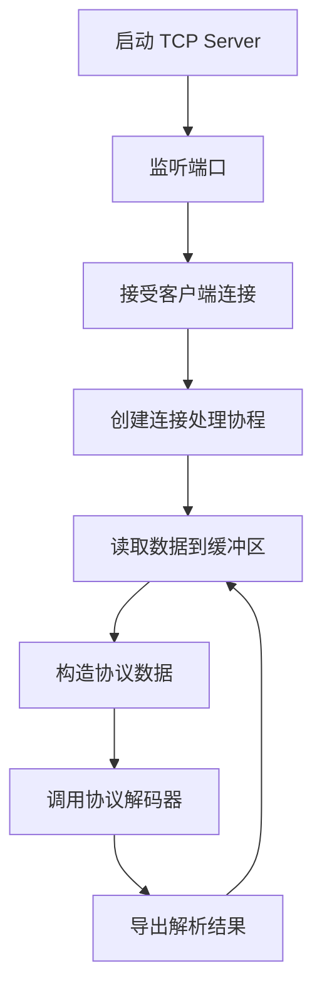

---
title: TCP Server 插件
--- 

# TCP Server 插件

TCP Server 插件提供 TCP 服务端功能，监听指定端口接收客户端连接和数据，并通过协议解码器解析数据后导出。

## 特性

- 支持多连接并发处理
- 可配置缓冲区大小
- 基于协议解码器自动解析数据
- 支持自定义脚本目录

## 连接配置

连接配置位于 `config.json` 的 `connections` 字段下：

```json
{
  "plugin": "tcp_server",
  "connections": {
    "tcp-server-1": {
      "host": "0.0.0.0",
      "port": 8080,
      "buffSize": 1024,
      "protocolKey": "custom-protocol"
    }
  }
}
```

### 配置参数说明

| 参数 | 类型 | 必填 | 说明 |
|------|------|------|------|
| host | string | 是 | 监听主机地址，`0.0.0.0` 表示监听所有接口 |
| port | uint16 | 是 | 监听端口号 |
| buffSize | uint | 否 | 接收缓冲区大小，默认 1024 字节 |
| protocolKey | string | 否 | 协议解码器键名，用于解析接收到的数据 |

## 运行原理

### 数据流程



### 处理流程

1. **服务器启动**：为每个连接配置启动 TCP 监听服务
2. **连接接收**：循环接受客户端 TCP 连接
3. **并发处理**：为每个客户端连接创建独立协程处理
4. **数据读取**：从连接中读取数据到指定大小的缓冲区
5. **协议解码**：将原始数据通过协议解码器解析为结构化数据
6. **数据导出**：将解析后的数据发送到导出系统

## 注意事项

- TCP Server 插件不支持数据写入操作（Send/Encode）
- 每个客户端连接都在独立协程中处理，支持高并发
- 缓冲区大小应根据实际数据量合理配置
- 需要确保配置的端口未被占用
- 建议设置合适的 `protocolKey` 以使用正确的协议解码器

## 相关代码

- 插件入口：`plugins/tcpserver/plugin.go`
- 核心实现：`plugins/tcpserver/internal/plugin.go`
- 连接器：`plugins/tcpserver/internal/connector.go`