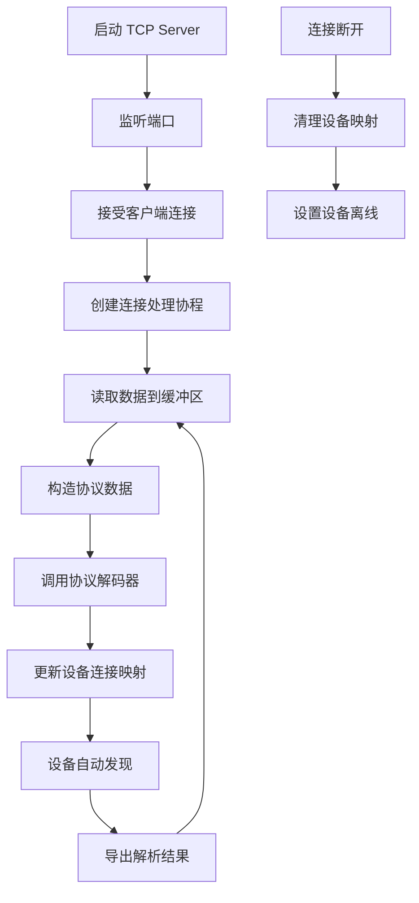

# TCP Server 插件

TCP Server 插件提供 TCP 服务端功能，监听指定端口接收客户端连接和数据，并通过协议解码器解析数据后导出。支持双向通信，可主动下发数据到设备。

## 特性

- 支持多连接并发处理
- 可配置缓冲区大小和读取超时
- 基于协议解码器自动解析数据
- 支持设备自动发现
- **支持双向通信**：可主动发送数据到设备
- **设备连接管理**：自动维护设备与连接的映射关系
- **设备离线检测**：连接断开时自动设置设备离线

## 连接配置

连接配置位于 `config.json` 的 `connections` 字段下：

```json
{
  "plugin": "tcp_server",
  "connections": {
    "tcp-server-1": {
      "host": "0.0.0.0",
      "port": 8080,
      "buffSize": 1024,
      "readTimeout": 30,
      "enable": true,
      "protocolKey": "custom-protocol",
      "discover": true
    }
  }
}
```

### 配置参数说明

| 参数 | 类型 | 必填 | 说明 |
|------|------|------|------|
| host | string | 是 | 监听主机地址，`0.0.0.0` 表示监听所有接口 |
| port | uint16 | 是 | 监听端口号 |
| buffSize | uint | 否 | 接收缓冲区大小，默认 1024 字节 |
| readTimeout | int | 否 | 读取超时时间（秒），默认 30 秒 |
| enable | bool | 否 | 是否启用，默认 true |
| protocolKey | string | 是 | 协议解码器键名，用于解析接收到的数据 |
| discover | bool | 否 | 是否启用设备自动发现，默认 false |

## 运行原理

### 数据流程


```mermaid
graph TD
    A[启动 TCP Server] --> B[监听端口]
    B --> C[接受客户端连接]
    C --> D[创建连接处理协程]

    D --> E[读取数据到缓冲区]
    E --> F[构造协议数据]
    F --> G[调用协议解码器]
    G --> H[更新设备连接映射]
    H --> I[设备自动发现]
    I --> J[导出解析结果]

    J --> E

    K[连接断开] --> L[清理设备映射]
    L --> M[设置设备离线]
```

### 处理流程

1. **服务器启动**：为每个连接配置启动 TCP 监听服务
2. **连接接收**：循环接受客户端 TCP 连接
3. **并发处理**：为每个客户端连接创建独立协程处理
4. **数据读取**：从连接中读取数据到指定大小的缓冲区
5. **协议解码**：将原始数据通过协议解码器解析为结构化数据
6. **设备映射**：自动维护设备ID与连接的映射关系
7. **数据导出**：将解析后的数据发送到导出系统
8. **离线检测**：连接断开时自动设置设备离线状态

## 双向通信

### 上行数据（设备 → 服务器）

设备发送数据到服务器，服务器通过 Lua 脚本解码后导出。

**Lua decode 函数输入：**

```json
{
  "remoteAddr": "192.168.1.100:12345",
  "event": "read",
  "raw": "<以 Go string 保存的原始字节>"
}
```

**Lua decode 函数输出：**

```json
[
  {
    "id": "device001",
    "values": [
      {"name": "temperature", "value": 25.5},
      {"name": "humidity", "value": 60}
    ],
    "events": []
  }
]
```

### 下行数据（服务器 → 设备）

#### 方式一：通过 Lua 脚本编码后发送

`plugin.Connector` 由运行中的 TCP Server 插件实例提供；拿到连接器后可按以下方式编码并发送：

```go
var connector plugin.Connector // 由上层调用 Plugin.Connector(deviceId) 获取

encoded, err := connector.Encode("device001", plugin.WriteMode,
    plugin.PointData{PointName: "power_limit", Value: 10.0})
if err != nil {
    return err
}

return connector.Send(encoded)
```

**Lua encode 函数签名：**

```lua
function encode(deviceId, mode, points)
    -- deviceId: 设备ID
    -- mode: 操作模式 ("read" 或 "write")
    -- points: 点位数据数组 [{name="xxx", value=xxx}, ...]

    -- 返回编码后的原始数据
    return encoded_data
end
```

#### 方式二：直接发送原始数据

```go
// connector 是 plugin.Connector；TCP Server 扩展能力通过接口断言获取
tcpConn, ok := connector.(tcpserver.Connector)
if !ok {
    return errors.New("not a TCP Server connector")
}

data := []byte{0xAA, 0xF5, 0x00, 0x08, 0x00, 0x01, 0x00, 0x00}
return tcpConn.SendToDevice("device001", data)
```

### 主动发送 API

| 方法 | 说明 | 示例 |
|------|------|------|
| `SendToDevice(deviceId, data)` | 发送原始数据到指定设备 | `tcpConn.SendToDevice("device001", data)` |
| `SendToAll(data)` | 广播原始数据到所有设备 | `tcpConn.SendToAll(data)` |
| `GetConnectedDevices()` | 获取所有已连接设备列表 | `devices := tcpConn.GetConnectedDevices()` |
| `IsDeviceConnected(deviceId)` | 检查设备是否已连接 | `online := tcpConn.IsDeviceConnected("device001")` |

## 使用示例

### 示例1：充电桩与 EMS 通信（使用 deviceKey 匹配）

**场景说明：**
- 充电桩上报数据中有桩编码和枪号
- 配置中每个枪是独立的设备（如 "PILE001_gun1", "PILE001_gun2"）
- Lua 脚本组合桩编码和枪号生成完整的设备 ID，通过 device_key 匹配

**设备配置 (`res/driver/tcp_server/config.json`)：**

```json
{
  "pluginName": "tcp_server",
  "connections": {
    "ems-server": {
      "host": "0.0.0.0",
      "port": 5000,
      "buffSize": 1024,
      "readTimeout": 120,
      "protocolKey": "charging_pile_protocol",
      "discover": true
    }
  },
  "deviceModels": [
    {
      "name": "charging_pile",
      "devices": [
        {
          "id": "PILE001_gun1",
          "description": "充电桩1枪1",
          "connectionKey": "ems-server",
          "properties": {
            "device_key": "PILE001_gun1"
          }
        },
        {
          "id": "PILE001_gun2",
          "description": "充电桩1枪2",
          "connectionKey": "ems-server",
          "properties": {
            "device_key": "PILE001_gun2"
          }
        },
        {
          "id": "PILE002_gun1",
          "description": "充电桩2枪1",
          "connectionKey": "ems-server",
          "properties": {
            "device_key": "PILE002_gun1"
          }
        }
      ]
    }
  ]
}
```

**Lua 协议脚本 (`charging_pile_protocol.lua`)：**

```lua
-- 解码充电桩上报数据
function decode(raw)
    local data = json.decode(raw)
    local raw_data = data["raw"]

    -- 解析二进制协议
    local cmd = string.byte(raw_data, 7)

    if cmd == 2 then  -- 充电状态上报
        -- 从原始数据中提取桩编码（设备标识）
        local pile_id = string.sub(raw_data, 8, 39):gsub("%z+$", "")

        -- 提取枪号
        local gun_no = string.byte(raw_data, 40)

        -- 组合成完整的设备标识
        local device_key = pile_id .. "_gun" .. gun_no

        -- 构建设备数据
        local device = {
            id = device_key,  -- 组合完整的 deviceId
            values = {
                -- 返回 device_key 用于匹配
                {name = "device_key", value = device_key},
                -- 其他数据点...
                {name = "status", value = parse_status(raw_data)},
                {name = "voltage", value = parse_voltage(raw_data)},
                {name = "current", value = parse_current(raw_data)},
                {name = "power", value = parse_power(raw_data)}
            }
        }
        return json.encode({device})
    end

    return "[]"
end

-- 编码下发命令
function encode(deviceId, mode, points)
    -- 构建限功率命令 (CMD=1)
    local packet = string.char(0xAA, 0xF5)  -- 起始域
    -- ... 构建完整数据包
    return packet
end
```

**设备匹配逻辑：**

1. tcpserver 插件首先尝试使用返回的 `id` 匹配配置中的设备
2. 如果 `id` 匹配失败，会从 `values` 中提取 `device_key`
3. 使用 `device_key` 匹配 Properties 中的 `device_key` 字段
4. 找到匹配的设备后建立连接映射

**匹配示例：**

```
Lua 返回：
{
  id: "PILE001_gun1",
  values: [
    {name: "device_key", value: "PILE001_gun1"},
    {name: "status", value: "charging"}
  ]
}

配置中的设备：
PILE001_gun1: {device_key: "PILE001_gun1"}
PILE001_gun2: {device_key: "PILE001_gun2"}

匹配过程：
1. 尝试匹配 id = "PILE001_gun1" → 找到配置中的设备 → 匹配成功

如果 id 匹配失败：
1. 提取 device_key = "PILE001_gun1"
2. 遍历配置中的设备
3. 查找 Properties.device_key = "PILE001_gun1" 的设备
4. 找到 "PILE001_gun1" → 匹配成功
```

**主动下发限功率命令：**

```go
// connector 是 plugin.Connector，由上层通过 Plugin.Connector(deviceId) 获取

// 方式1：通过 Lua 编码
encoded, err := connector.Encode("PILE001_gun1", plugin.WriteMode,
    plugin.PointData{PointName: "gun1_real_time_limit", Value: 10.0})
if err == nil {
    err = connector.Send(encoded)
}

// 方式2：直接发送
if tcpConn, ok := connector.(tcpserver.Connector); ok {
    return tcpConn.SendToDevice("PILE001_gun1", buildPowerLimitCommand(10.0))
}
```

### 示例2：自定义心跳响应

```go
// 在数据处理逻辑中检测到心跳包后
func handleHeartbeat(connector tcpserver.Connector, deviceId string, heartbeatReq []byte) {
    // 构建心跳响应
    response := buildHeartbeatResponse(heartbeatReq)

    // 主动发送响应
    err := connector.SendToDevice(deviceId, response)
    if err != nil {
        log.Printf("heartbeat response failed: %v", err)
    }
}
```

### 示例3：广播时间同步

```go
// connector 是 plugin.Connector，任取当前连接下的设备 ID 即可
tcpConn, ok := connector.(tcpserver.Connector)
if !ok {
    return
}

// 构建时间同步命令
timeSyncCmd := buildTimeSyncCommand(time.Now())

// 广播到所有设备
sent, err := tcpConn.SendToAll(timeSyncCmd)
if err != nil {
    log.Printf("time sync broadcast failed: %v", err)
} else {
    log.Printf("time sync sent to %d devices", sent)
}
```

### 示例4：设备状态监控

```go
// connector 是 plugin.Connector
tcpConn, ok := connector.(tcpserver.Connector)
if !ok {
    return
}

// 获取所有已连接设备
devices := tcpConn.GetConnectedDevices()
log.Printf("connected devices: %v", devices)

// 检查特定设备是否在线
if tcpConn.IsDeviceConnected("device001") {
    log.Println("device001 is online, sending command...")
    tcpConn.SendToDevice("device001", []byte("QUERY STATUS"))
} else {
    log.Println("device001 is offline")
}
```

## 设备离线检测

当 TCP 连接断开时，插件会自动：

1. 清理设备与连接的映射关系
2. 将设备设置为离线状态
3. 触发设备离线事件

```go
// 连接断开时的处理逻辑
func (c *connector) cleanupConn(conn net.Conn) {
    // 获取该连接关联的所有设备
    devices, _ := c.connMappingDevice.LoadAndDelete(conn)

    // 遍历设备，清理映射并设置离线
    for _, device := range devices.([]string) {
        deleted := c.deviceMappingConn.CompareAndDelete(device, conn)
        if deleted {
            driverbox.Shadow().SetOffline(device)
        }
    }
}
```

## 注意事项

- 每个客户端连接都在独立协程中处理，支持高并发
- 缓冲区大小应根据实际数据量合理配置
- 读取超时可防止僵尸连接，建议根据业务场景合理设置
- 需要确保配置的端口未被占用
- 建议设置合适的 `protocolKey` 以使用正确的协议解码器
- 主动发送前请确保设备已连接（可使用 `IsDeviceConnected` 检查）

## 相关代码

- 插件入口：`plugins/tcpserver/plugin.go`
- 核心实现：`plugins/tcpserver/internal/plugin.go`
- 连接器：`plugins/tcpserver/internal/connector.go`
- 测试用例：`plugins/tcpserver/internal/connector_test.go`

## 测试

可运行以下命令验证插件：

```bash
go test ./plugins/tcpserver/...
```
